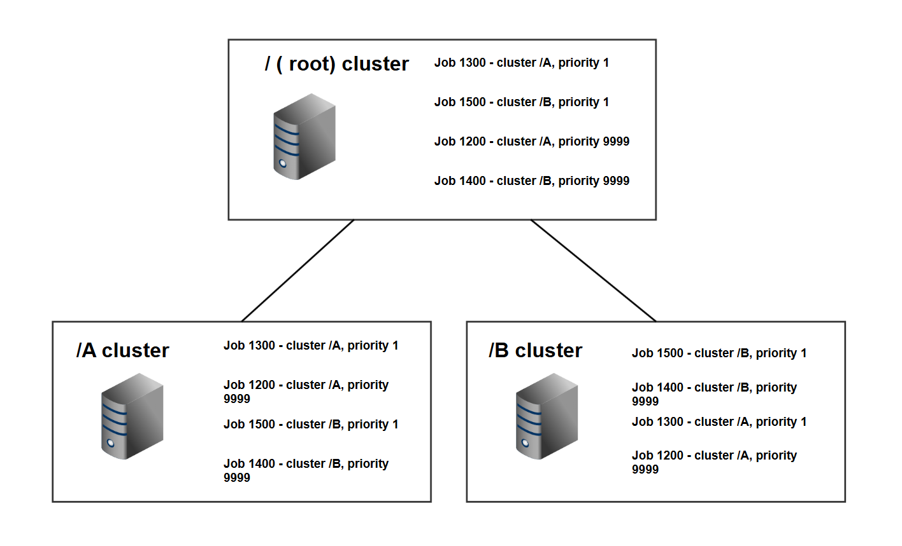

# Clustering
A diagram showing how the same 4 jobs have their priority sorted differently
depending on which cluster the job and worker are each in.

## Workers in the / cluster (also known as the 'root')
Jobs are sorted by

1. priority
2. then by job id (first come, first served - FCFS)

## Workers in cluster /A
1. Jobs in cluster /A are considered first, sorted by
	* priority
	* then by job id - FCFS
2. Cluster /B jobs are considered next, sorted by:
	* priority
	* then by job id - FCFS

## Workers in cluster /B
1. Jobs in cluster /B are considered first, sorted by
	* priority
	* then by job id - FCFS
2. Cluster /A jobs are considered next, sorted by:
	* priority
	* then by job id - FCFS

