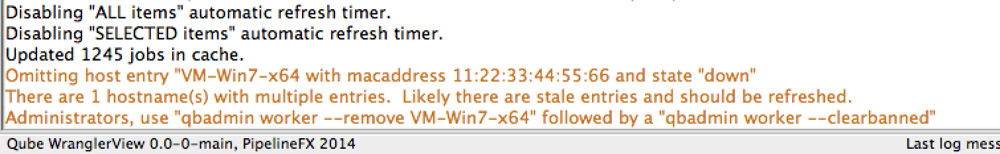
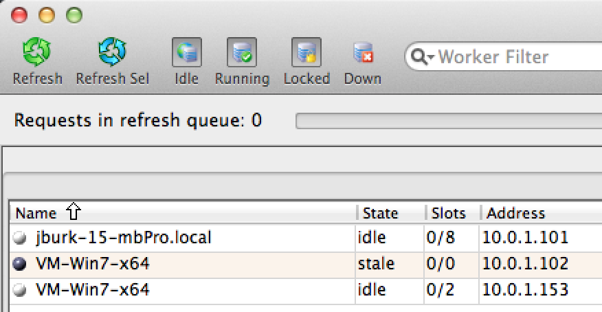
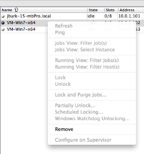
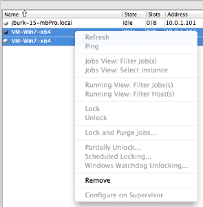

# Workers in a "stale" state

:::danger
This page is deprecated and requires replacement
:::

## The problem, and how it happens
If you've ever retired the Qube! worker off of an older machine and re-used the hostname on a newer machines, you've most likely ended up with 2 worker records in the database with the same hostname, but different MAC addresses.  The newer (and running) worker will be in an active state, while the worker entry for the older (retired) worker will forever be in a down state, but not be visible in the WranglerView Worker view.  

They will be visible in the output from the command-line utility qbhosts:

```
VM-Win7-x64 00:FF:A0:7D:4C:A8 10.0.1.153 active 0/2 /model
VM-Win7-x64 11:22:33:44:55:66 10.0.1.102 down   0/2 /model
```

Since Qube! uses the worker MAC address as the primary identifier, it's possible to have more than 1 worker appear in the list with the same hostname, but they will each have a different MAC address.  This can be problematic for actions that take the worker's hostname to specify which worker to perform the action on.

In previous versions of WranglerView, these duplicate (and most likely decommissioned) host entries were filtered out of the worker list displayed in the WranglerView Worker View, and would result in a warning message printed to the WranglerView log pane such as:



This made it very difficult for the user to actually remove these workers from the database, and the Qube! administrator was forced to run a command-line utility to remove these workers.

:::warning
These workers are most likely old database records for decommissioned hardware, and should be removed from Qube! at the first opportunity.
:::

## Stale workers
WranglerView will now show these workers in a new "Stale" state with a light tan highlight. 



The context menu for these hosts will only have the 'Remove' option enabled, all other options will be greyed out. 



If you select multiple workers, and at least 1 worker is in a "stale" state, all options other than 'Remove' will be disabled.


