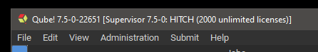
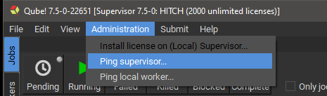
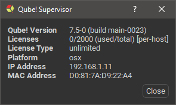
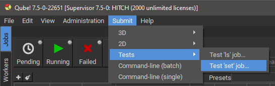
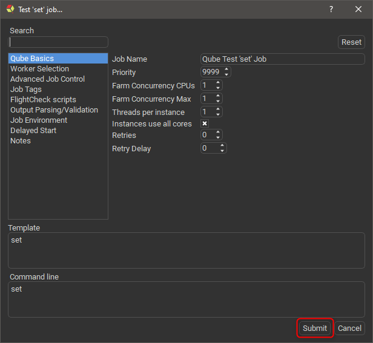
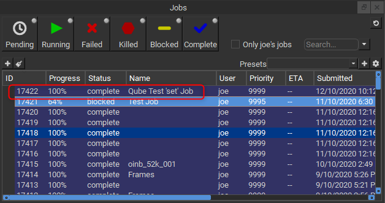

# Basic Installation Verification

## Verify Supervisor installation

On the supervisor, start the Qube! US. It should connect to the
supervisor service and show the supervisor hostname and license count in
the UI title bar:

If you see 0 licenses you will need to install the licenses on the
supervisor. See  if you have a license key to install.

### Test the supervisor connectivity

Use the Qube! UI Administration menu to test the supervisor's network
connectivity from the worker machine:

It should bring up a dialog:

If you see this, your supervisor is up and running and responding to
requests.

## Verify Worker installation:

The simplest test possible is to submit a job that simply runs the
"set" command, which does nothing but print out the operating
system's environment variables. You can see what it's expected to do
by opening a cmd prompt on Windows or a Terminal on OS X and simply
typing `set` and hitting \<`Enter`\>.

Start the Qube! UI, and select the Submit-\>Tests-\>Test 'set' job
menu item.\

Then, just click "Submit":\

Go to the Jobs Panel in the Qube! UI, and you should see the job in the
list (it will be named "Qube Test 'set' Job"). After a short period
of time you should see the job in a "Complete" state.\

Note that the ID of your job will be different from the screenshot
above.
