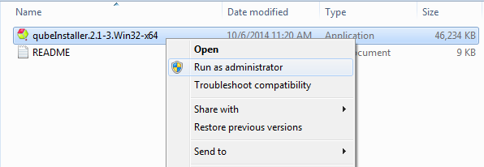
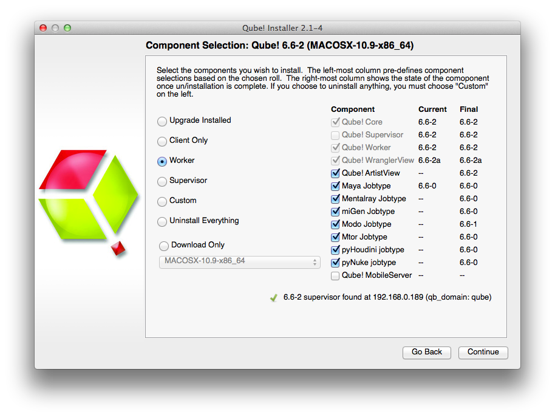

# Installing Qube!

:::info

The goal of this section is to get you to install and run Qube! as
quickly as possible.

:::

## A Qube! farm has 3 main components:

1.  The Qube! **clients**, machines that submit jobs. Typically these
    are artists or end-users workstations.

2.  The Qube! **workers**, machines that run jobs. A client can also be
    a worker.

3.  The Qube! **supervisor**, which controls what jobs are sent to which
    workers.

You will install a Supervisor, a Worker and a Client, and then submit a
job from the Client to the Supervisor, which will hand it off to the
Worker. All three of these roles can be played by the same machine, so
if you want to investigate Qube! on a single laptop, you can do that. Or
if your ambitions are larger, you can do that from here as well.
Whatever your final goal, to install and start using Qube!, follow these
steps.

## Before You Begin

-   The installer is designed to be run on a machine with a working
    internet connection, and we suggest saving the downloaded components
    to a network drive.

-   You must have administration privileges to install the software.

    -   For Windows users, you may want to right-click \> "Run
        as Administrator" or just log in as the Administrator.

    -   For Linux users, you must run as root or a sudoer.

    -   macOS users will be prompted to enter an admin password before
        installation begins.

-   Once components have been downloaded, the installer can be run again
    on other machines without accessing the internet by pointing it to
    the download location used by the previous install session.

Python3 Required!

:::tip

Python3 (3.6 to 3.8) is a prerequisite now for all installations.
You need to have it installed on each system, prior to running the
QubeInstaller.

:::

## Linux Prerequisites

On linux, several packages must be present before Qube can be installed,
and some pre-configuration is needed.

:::info

Install whatever version **yum** will find in the base repository for
your version of CentOS/RHEL

:::

:::note

QubeInstaller requires the Qt5Core DSO to be available on the system.
Check that you have the "qt5-qtbase" package installed, especially if you are
attempting to run it on a "minimal" or "server" OS installation.

:::

### Linux Supervisor prerequisites:

-   **install**

    -   python3

    -   xinetd

    -   qt5-qtbase

-   **disable**:

    -   firewall

    -   SElinux

### Linux Worker prerequisites:

-   **install**

    -   python3 (if using any Python-based jobtypes, such as the
        built-in pyCmdrange and pyCmdline)

    -   xinetd

    -   qt5-qtbase

-   **disable**

    -   firewall

    -   SElinux

### Linux Client prerequisites:

-   \< none \>

#### Install and Go

:::info

#### Manually Installing the Qube! 8 Supervisor on Windows
If you intend to manually install a Qube! 8 supervisor on Windows rather
than using the Qube Installer, please refer to the Installing Qube! Manually page for instructions
on running the "supe_postinstall.bat" script after installation in
order to initialize the databases; this step is normally performed by
the Qube Installer wizard, as Windows security policies prohibit certain
operations from being performed by an MSI installer directly.

:::

Follow these steps:

1. [Download the Install Wizard](#download-wizard)
2. [Launch the Install Wizard](#launch-wizard)
3. [Install the Supervisor](#install-the-supervisor)
4. [Install a Worker & Client](#install-worker-client)
5. [Submit Test Jobs](#submit-test-jobs)

That's it! After you've got this far, you [submit jobs](../category/submitting-jobs-1) can for hero applications
such as Maya, 3dsMax, Nuke, and many others.

<!--
This is a normal sentence, and **this part is larger**.
-->

**Additional Possibilities**

Alternatively, you can continue with Qube! administration tasks. The Administrator's Guide explains how to keep building up your Qube! installation, including:

- Installing Licenses
- Adding Additional Workers
- Adding Additional Clients
- Tuning Qube! for Optimal Performance

## Download the Install Wizard {#download-wizard}

The Qube! Install Wizard can be [downladed](https://www.pipelinefx.com/downloadversions/) from the PipelineFX website.

## Launch the Install Wizard {#launch-wizard}

**Windows**

Extract the contents of the installer zip file. Go into the folder
created, right mouse click on the installer file, and run as
administrator.

**macOS**

Double-click on the dmg file that you downloaded. You should see this:

Then double-click on the qubeInstaller icon.

**Linux**

For Linux, the steps are:

$ cd /path/to/downloaded/installer
$ tar xvzf qubeInstaller.CentOS_6.5.x86_64.tgz	# Note: of course the file name may differ depending on your Linux distribution
$ cd qubeInstaller-2.1-2.CentOS_6.5.x86			# move into the directory that was just created
$ sudo ./qubeInstaller.2.1-2.CentOS_6.5			# run the installer with sudo or as root

**All OSs**

In all cases, you will now see the opening screen, followed by a license
agreement, which you should read and accept before continuing. Note:
Depending on your OS, the installer screens may look slightly different,
but the content will be exactly the same.

You will then see a screen which is asking where the packages to be
installed will come from. The default is to download them from the
PipelineFX repository, and you should leave this screen at its default
and hit 'Continue'. You will then be asked for a location to download
the software to. You can choose anywhere, but in general you will want
these packages stored in a location that is visible to all machines on
the network. For simple installs or evaluations, you can just choose
your local Downloads directory, as shown here.

At this point you are ready to install one of the Qube! components. If
this is your first install, keep reading and install a Supervisor.
Otherwise, skip that and move to installing a Worker and Client, below

## Install the Supervisor {#install-the-supervisor}

The Supervisor controls and monitors the jobs that the Clients send to
the Workers. There should be only one Supervisor on your network. For
evaluation purposes, the Supervisor can be almost any machine, but for
production use you should refer to the Supervisor guidelines on the
page.

If you have been following the installer steps above, you should now be
looking at the Component Selection page, shown below. Click on
'Supervisor' as shown here:

The install wizard will look to make sure there isn't already a
Supervisor installed on this network / subnet, and then it will allow
you to click through to install the Supervisor. First it will download
the additional components, and then it will install them. You should end
up with this screen:

You can launch the QubeUI from here if you like, but let's
keep going and finish the install. So click through to the end and exit
the install wizard. But continue following the instructions on this
page. If you are installing on Windows, at this point you will see a
desktop icon for QubeUI.

:::warning

**Windows: Visual C++ Runtime Error dialog when installing Supervisor**

When installing the supervisor on a Windows system, you may see an ERROR
dialog like the following pop up, close to the end of the installation.

This dialog *can safely be dismissed* by clicking its "OK" button.

:::

## Install a Worker & Client {#install-worker-client}

What's the difference between a Worker and a Client?

A **Worker** is going to render frames or run simulations or do whatever
tasks you want to submit. You want one of those on every machine that you
expect to be able to pick up and execute a task.

A **Client** is a machine or interface that a person submits jobs from.
Installing a Client really just means installing the User UI, which is a
simpler version of the QubeUI. In that sense, it is optional -
users can also submit from, and monitor their jobs from, the QubeUI.

User's desktop machines tend to be both Workers and Clients, so in that
case you would install both. In a larger installation, there would be a
lot of Workers and relatively fewer Clients. There is more detail on
the page.

To do the install, we are assuming you already have a Supervisor
installed on the network/subnet. You can install the Worker and Client
on a different computer, or if you want to do a simple evaluation of
Qube!, on the same one you just used for the Supervisor. If it is a
different computer, it can have a different OS from the Supervisor - but
if it does, you will need to go back to and download the appropriate
installer for the Worker/Client OS.

For the purposes of this Quickstart, we are going to install both Worker
and Client at the same time on the same machine. again, and click
through to the Component Selection screen. This time, select Worker, and
then **also** click on the checkbox labeled "Qube! UI":

Next, you will be asked which 'mode' to run the Worker in, with a
dialog like this:

For now, choose the default, which is Desktop User mode. There is an
explanation of what this means, and what mode you might want in various
environments,

Again, the installer will download the selected components, and then
install them. When this completes, you will see buttons allowing you to
submit some test jobs. We'll do that in the next section. So keep
reading\...

## Submit Basic Test Jobs {#submit-test-jobs}

We assume you have a dialogue box on your screen similar to the above.
To verify that the Qube! Supervisor is running and that the Worker and
Supervisor can see each other, click on "Submit basic test job". You
should see it change to "Pending" and then "Running" and finally
"Success!"

Now click on "Submit file read test job". This will pop up a dialogue
box. You should choose a file that is accessible to both Worker and
Supervisor, typically on a mounted network drive. If you are testing
Qube! such that the Worker and the Supervisor are on the same machine,
then you can choose a local file.

You should then seen the same "Pending", "Running" and "Success!"
messages.

:::warning

**If the job fails**

By default, jobs run as user 'qubeproxy'. If the 'Read Test Job'
fails, it is likely to be because you chose a file or directory path
that is not accessible to the qubeproxy user. You can verify this is the
problem by looking at the output of the job in the QubeUI.
\<need a link to a page that deals with this\>

:::

At this point exit the installer and launch the QubeUI.

Let's use this to launch a quick commandline job, just to see how this
works. From the menu bar, choose Submit -\> Cmdline Job.

You'll get this UI. Fill in the command with something like the command
shown (**Linux & macOS**):

For **Windows**, the commands could be this:

Then click on Submit. You should see your
job pick up, run and complete. The output from the commands you typed in
the box will be in the right pane, under Job Logs / Stdout Log. Notice
that the job runs as the user you are logged in as, while the test jobs
you submitted from the installer were run as root (except on Windows,
where they will still run as the person using the installer).

At this point, your supervisor and worker are up and going. You can
install more workers and/or clients by using the installer again, or by using
the kickstart files. You can find help with submitting specific kinds of jobs, for
example Maya or After Effects, in the section.

## Licensing

Instructions for installing licenses are on the [License Installation](/administrators-guide/additional-install-information/License+Installation) page.
