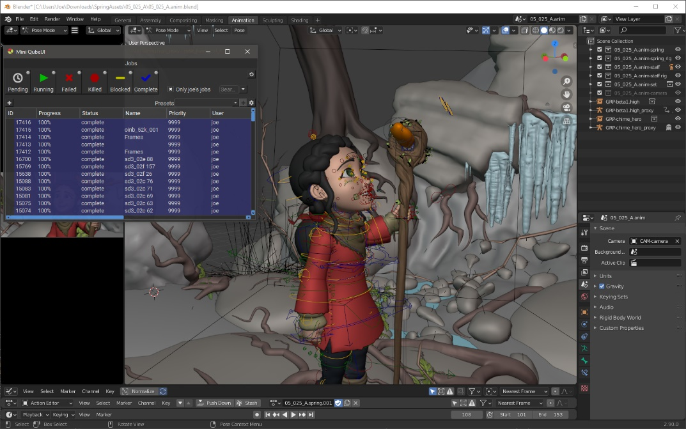

# Mini Jobs View

## The Qube! UI Mini Jobs View

The Qube! UI includes a light weight view that you can open from within
any application, as long as the Qube! UI is running in the background.
You can use a keyboard shortcut to have a sneaky peak at the status of
your jobs without breaking your creative flow. The keyboard shortcut can
be set in the UI section of the Qube! UI preferences. Use the same
shortcut to open and close the Mini Jobs view. Configure the view and
commit the shortcut to motor memory.

