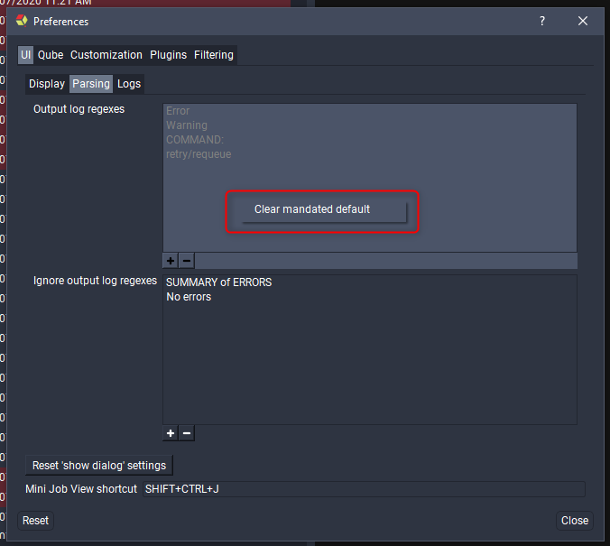

# Preferences

## Centralized Preferences

The Qube! UI stores most preferences in a centralized database on the
supervisor. This can be used by Qube! administrators to set defaults or
enforce preference values at the studio level. Right-clicking on any
value in the preferences dialog will bring up the option to save
\'Studio Defaults\' and either make the default overridable or mandated.
Each user\'s preferences value will set to this default unless they have
already chosen a value for this preference and the default is
overridable.

## Mandate a preference value

**Right-click on any preference\'s value, then select Save
default-\>Studio Defaults-\>Mandated.**\

## Remove a mandated preference value

**To remove a mandated default simply right-click on the value and click
\"Clear mandated default\".**\

## Using system environment variables to override preferences

While using the centralized preferences system is the best way to
configure user preference values, you can also override preference
values by setting environment variables. Each supported preference has
an associated preference key that you can set an environment variable
for, see the preferences details table below. All preferences can be set
but some have complex formatting and it\'s recommended not to set them
as incorrect values can lead to errors within the Qube! UI, if you still
want to set them please send an email to  for details - alternatively
you can look in the preferences database on the supervisor for
formatting examples.

## The Qube! UI preferences

| **Page** | **Preference** | **Comment** | **Default** | **Environment Variable** |
| --- | --- | --- | --- | --- |
| UI      | Reset show dialog     | Show confirmation dialogs that have been hidden      |             |             |
| UI      | Mini joblist Shortcut     | System wide keyboard    | CTR L+SHIFT+J       | QUBEUI_UI_MINIUI_SHORTCUT     |
| UI -> Display | Font size | The size of the font to use in the UI. | 9 | QUBEUI_UI_FONT_SIZE |
| UI -> Display | Buttons use theme hue | If true the status buttons will be colored to match the status color from the current theme. | FALSE | QUBEUI_UI_STATUS_BUTTONS_USE_THEME_HUE |
| UI -> Display | Status button icon size | The size of the status buttons' icons in pixels. | 26 | QUBEUI_UI_STATUS_BUTTON_ICON_SIZE |
| UI -> Display | Show status labels | Show text labels on the status buttons. | FALSE | QUBEUI_UI_STATUS_BUTTON_SHOW_LABELS |
| UI -> Display | Show status icons | Show icons on the status buttons. | TRUE | QUBEUI_UI_STATUS_BUTTON_SHOW_ICONS |
| UI -> Display | View job list as a subjob tree | Organize jobs under their parent jobs. | FALSE | QUBEUI_UI_JOB_LIST_AS_TREE |
| UI -> Display | Panel tab position | The location of the tabs when two or more panels are grouped together. | Top | QUBEUI_UI_PANEL_TAB_POSITION |
| UI -> Parsing | Output log regexes | The regular expressions used to create bookmarks in log text fields. | Error Warning COMMAND: retry/requeue | Enquire through support@pipelinefx.com |
| UI -> Parsing | Ignore output log regexes | Regular expressions used to ignore false positive matches of output log regexes. | SUMMARY of ERRORS No errors | Enquire through support@pipelinefx.com |
| UI -> Logs | Log files to keep (requires restart) | The number of qubeUI.log files to keep in your home directory before deleting the oldest. | 3 | QUBEUI_UI_LOGFILE_COUNT |
| UI -> Logs | Max log file size (requires restart) | The size in MB of the log file to use before starting a new log file. | 3 | QUBEUI_UI_MAX_LOGFILE_SIZE |
| Qube -> Supervisor | Supervisor override | Override the supervisor to connect to (requires restart). |   | Enquire through support@pipelinefx.com |
| Qube -> Supervisor | Supervisor timeout | Override the supervisor timeout. | 60 | QUBEUI_QUBE_SUPERVISOR_TIMEOUT |
| Qube -> Log updating | Automatically refresh logs | Refresh stdout and stderr logs automatically. | FALSE | QUBEUI_QUBE_AUTO_REFRESH_LOGS |
| Qube -> Log updating | Logs refresh interval | Refresh interval in minutes. | 1 | QUBEUI_QUBE_AUTO_REFRESH_LOG_INTERVAL |
| Qube -> Optimize updates | Job limit (n days) | Limit the number of jobs to those updated in the past N days. A value of 0 means no limit. | 0 | QUBEUI_UI_JOB_LIMIT_N_DAYS |
| Qube -> Optimize updates | Job limit (n jobs) | Limit the number of jobs to the latest N jobs. A value of 0 means no limit. | 0 | QUBEUI_UI_JOB_LIMIT_N_JOBS |
| Qube -> Optimize updates | Limit jobs by last updated | When using the job limits above choose whether to base the search on the latest jobs or when the jobs were last updated.  | FALSE | QUBEUI_UI_JOB_LIMIT_LAST_UPDATE |
| Qube -> Advanced | Exclude database (job) columns | Exclude job database table columns from being pulled from the supervisor on first load or refresh\Do not do this unless you know what you are doing or under guidance from PFX support.  Columns that can be excluded include: cluster, priority, name, label, cpus, max_cpus, data, restrictions, requirements, reservations, hosts, omithosts, groups, omitgroups, env, prototype, path, timesubmit, timestart, timecomplete, prod_show, prod_shot, prod_seq, prod_client, prod_dept, prod_custom1, prod_custom2, prod_custom3, prod_custom4, prod_custom5 | | Enquire through support@pipelinefx.com |
| Qube -> Advanced |  Filter database (job) columns | Apply global, server side, job list filters. Provide column, comparator and value fields. Do not do this unless you know what you are doing or under guidance from PFX support. |   | Enquire through support@pipelinefx.com |
| Customization | External viewers | Configure external applications to load job output from the job list context menus. |   | Enquire through support@pipelinefx.com |
| Customization | Viewer path remapping | Specify directory path conversions in job output paths (used by the preview and thumbnail panels). |   | Enquire through support@pipelinefx.com |
| Plugin -> General | Additional plugin hierarchies (requires restart) | A list of directories to read additional plugins from. |   | Enquire through support@pipelinefx.com |
| Plugin -> Submission | Additional submission plugin paths (requires restart) | A list of directories to read additional submission plugins from. |   | Enquire through support@pipelinefx.com |
| Plugin -> Submission | Remember the values from the last submission | Remember previous values or clear to defaults values in the submission dialog each time it opens. | FALSE | QUBEUI_UI_SUBMISSION_REMEMBER_LAST_JOB |
| Plugin -> Submission | Enabled submission plugins | Enable/disable submission plugins to enable. |   | Enquire through support@pipelinefx.com |
| Plugin -> Context Menus | Enabled job plugins | Enable/disable job list context menu plugins. |   | Enquire through support@pipelinefx.com |
| Plugin -> Context Menus | Enabled worker plugins | Enable/disable worker list context menu plugins. |   | Enquire through support@pipelinefx.com |
| Plugin -> Context Menus | Enabled frame plugins | Enable/disable frame list context menu plugins. |   | Enquire through support@pipelinefx.com |
| Plugin -> Context Menus | Enabled instance plugins | Enable/disable instance list context menu plugins. |   | Enquire through support@pipelinefx.com |
| Plugin -> Panels | Enabled panel plugins | Enable/disable panel plugins. |   | Enquire through support@pipelinefx.com |
| Filter | Column contains | Comparison string to use in list filters for when a match contains the given value. | \:\= | QUBEUI_UI_FILTER_COLUMN_EQUAL_TO |
| Filter | Column is | Comparison string to use in list filters for when a match is the given value. | \:\=\= | QUBEUI_UI_FILTER_COLUMN_EXACT_EQUAL_TO |
| Filter | Column greater than | Comparison string to use in list filters for when a match is greater than the given value. | \:\> | QUBEUI_UI_FILTER_COLUMN_GREATER_THAN |
| Filter | Column greater or equal to | Comparison string to use in list filters for when a match is greater than or equal to the given value. | \:\>\= | QUBEUI_UI_FILTER_COLUMN_GREATER_OR_EQUAL_TO |
| Filter | Column less than | Comparison string to use in list filters for when a match is less than the given value. | \:\< | QUBEUI_UI_FILTER_COLUMN_LESS_THAN |
| Filter | Column less or equal to | Comparison string to use in list filters for when a match is less than or equal to the given value. | \:\<\= | QUBEUI_UI_FILTER_COLUMN_LESS_OR_EQUAL_TO |
| Filter | Term separator | String to use to separate filter terms, spaces are ignored. | \, (it's a comma) | QUBEUI_UI_FILTER_TERM_SEPARATOR |
