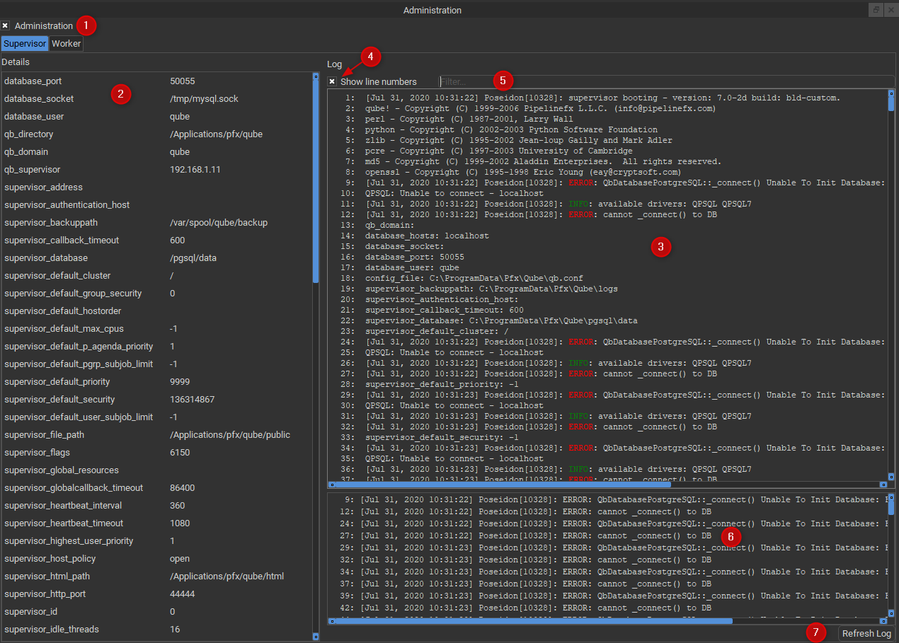

# Administration Panel

## The Qube! UI Administration Panel

If you are a Qube! administrator then the Administration Panel will be
available in the View-\>Panels menu. Unlike other Qube! UI panels the
Administration Panel needs to be enabled to start loading data, do this
with the button shown as 1 in the screen below.

The Administration Panel allows you to view supervisor configuration (2)
and log (3). If the current machine is Qube! worker you can also view
its configuration and log in the Worker tab.

Like the Stdout and Stderr Panels the logs in the Administration Panel
use a bookmarking system to make it easier to find the information you need.
Line numbers can be toggled on and off using the checkbox shown at 4. You
can filter the log (5), this works like a 'grep -i' where only the lines
matching the case-insensitive filter term are displayed in the log window
(3). Using the bookmark list (6) you can jump directly to line containing
pre-defined text, you can configure the bookmark texts using the Qube!
UI preferences, UI-\>Parsing tab.

The logs are not automatically updated, to refresh the log use the
button shown at 7 below.

