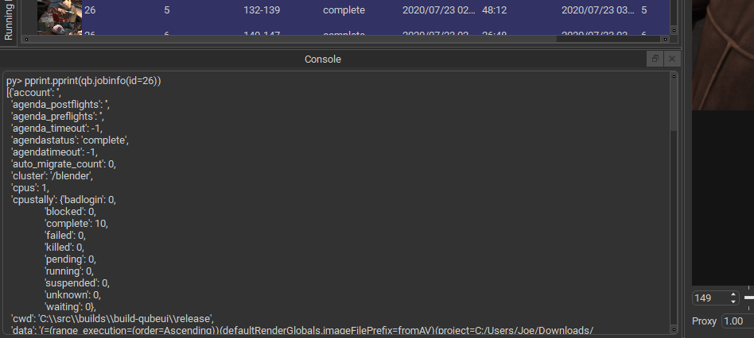
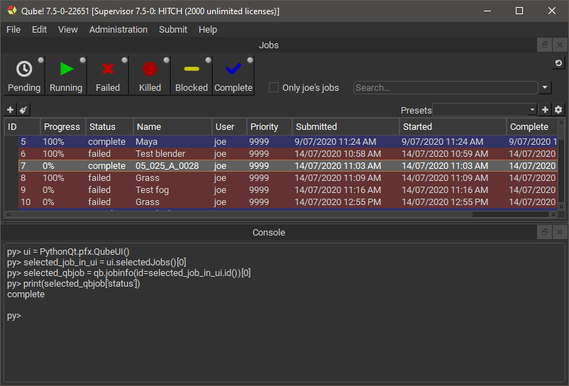

# Console Panel

## The Qube! UI Console Panel

The Console panel can be used to enter Python code directly inside the
Qube! UI. For advanced users, sometimes it's easier to interact with
the Qube! API directly than perform repetitive actions inside a GUI.

Naturally you have access to Python 3 itself along with the Python
modules you have installed, or created. Note that not all Python modules
may be compatible.\

There is also limited support for interacting with and getting
information from the Qube! UI itself. Future versions of Qube! UI will
add further support for accessing information and interacting with Qube!
UI.\

