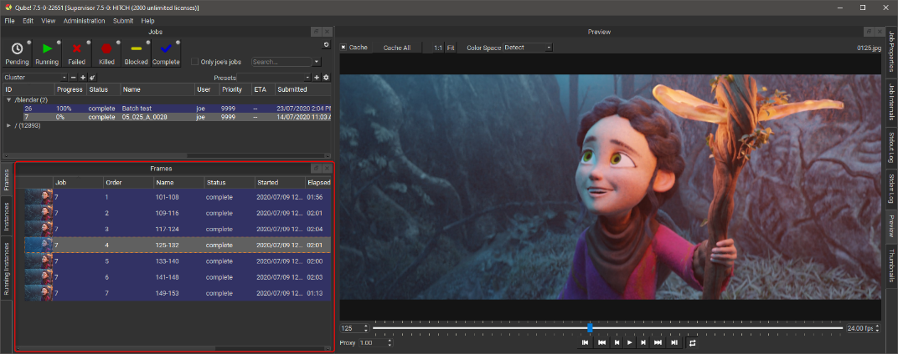

# Frames Panel

## The Qube! UI Frames Panel

If you have a job selected in any then that job's frames will be
listed in the Frames Panel. In order to reduce load on the supervisor
the Frames Panel does not update automatically. To update the Frames
Panel double click on the job in any [Jobs Panel](Jobs+Panel).

Selecting a frame in the Frames Panel affects other panels. For
example the will seek to the selected frame.\

Right-clicking on an instance allows you to perform the following
actions.

-   **Select worker**: Display the Workers Panel and select the worker
    than rendered this Frame.

-   **Complete**: Change the state of this frame to "complete," even
    if it has not yet run.

-   **Retry**: Re-render the selected frame(s)

-   **Block**: Set the frame's state to "blocked".  This will prevent
    the frame from being rendering until it (or the job) is manually
    unblocked.

-   **Unblock**: Remove the block from the frame, setting it back to a
    pending state.

-   **Kill**: Stop this from immediately and set the state to
    "killed".
