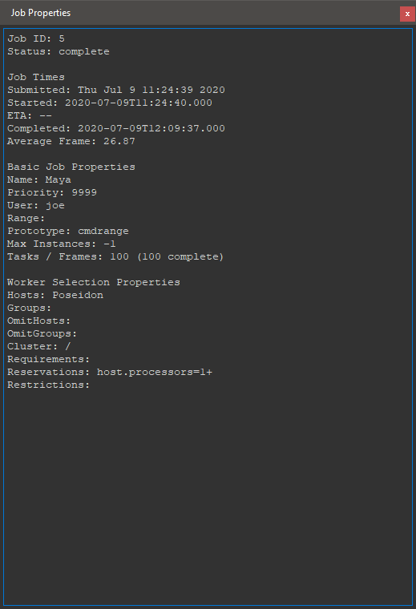
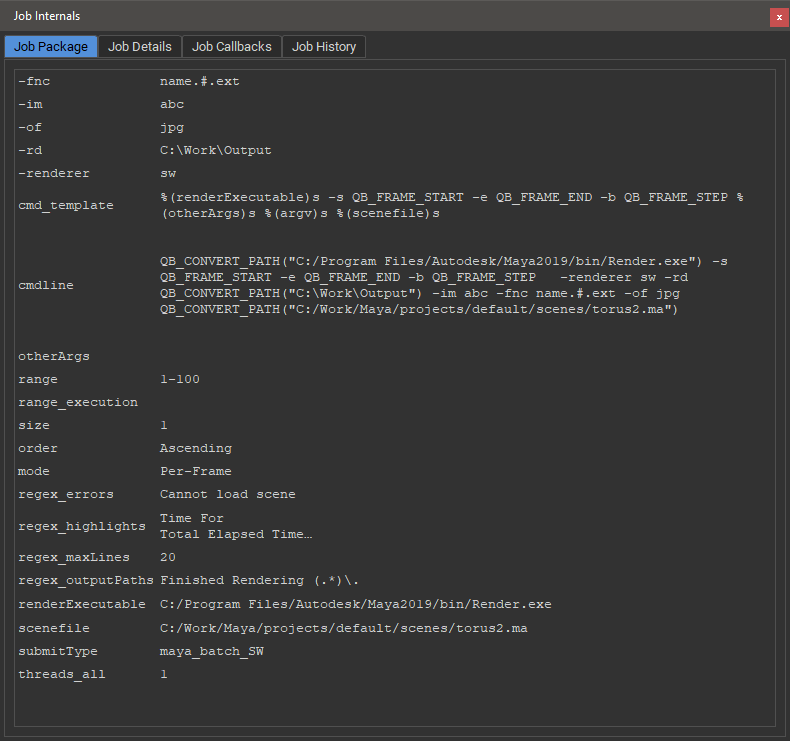
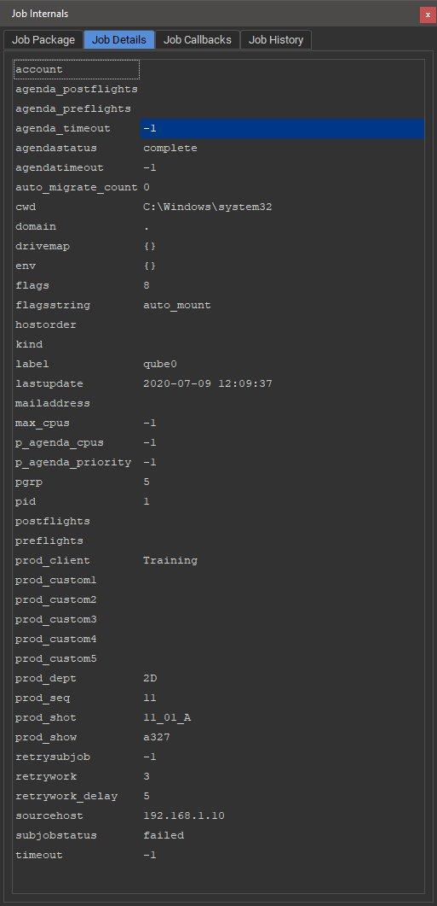
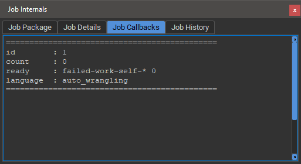
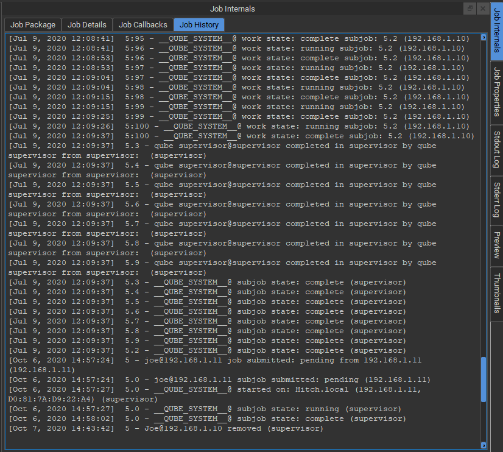

# Job Properties and Job Internals Panels

## Job Properties Panel

The Job Properties Panel shows basic information about a job on the
Qube! farm, such as the example below.

## Job Internals Panel

The Job Internals Panel provides more detailed information about a job.
It is separated into four tabs, Job Package, Job Details, Job Callbacks
and Job History.

### Job Package tab

View the in the Job Package Tab.

### Job Details tab

The Job Details tab shows Qube! job submission information associated
with the selected job. Check here for things like the render's working
directory, drive mapping or meta data provided on submission.

### Job Callbacks tab

The Job Callbacks tab shows, well, the job callbacks **need link**.

### Job History tab

View the history of the job on the Qube! farm in the Job History tab.

