# Jobs Panel

## The Qube! UI Job Panel

*The Jobs Panel allows you to view and manage lists of jobs submitted to
the Qube! farm. Selecting a job in a Jobs Panel will load related data
into the other panels. For example the job rendering process's output
will be displayed in the Stdout Log panel and any completed frames in
the Preview and Thumbnail panels.*

*Right-clicking on selected job(s) allows you to perform the following
actions.*

-   **Copy IDs to clipboard**: Place the selected job ids in your
    copy/paste clipboard.

-   **Filter by PGRP:** Display only jobs that belong to the selected
    job's PGRP.

-   **Interrupt**: Stop the job immediately, and sets the status back to
    pending.  This is typically used when a high priority job is starved
    for resources - manually interrupting a lower priority job will free
    up those resources to allow the high priority job to start.  The
    lower priority job will start up again as soon as workers become
    available.

-   **Modify Job**: Change modifiable job properties.

-   **Open log directory**: Open the directory containing the job logs
    for this job. This is only relevant if you're on the worker running
    the job or supervisor.

-   **Prioritize**: Change the priority of the selected job.

-   **Remove**: Stops the job immediately (if running), and permanently
    removes the job from the qube database.  This cannot be undone.

-   **Shove**: Force the supervisor to reevaluate this job for dispatch.
    This is a good way to start a job that is stuck in the "pending"
    state, even though all of its requirements can be met.

-   **Create a zip file of the log directory**: Zip the log directory
    and open the containing folder.

-   **Block** (Finish Current): Stops this job after the currently
    rendering frame(s) complete.  The job will remain in a "blocked"
    state until it is manually unblocked.

-   **Block** (Purge): Stops this job immediately and sets the job state
    to "blocked".  The job will not run again until it is manually
    unblocked.

-   **Unblock**: Remove the "blocked" state from the job.  All frames
    that have not completed will go back to a "pending" state.  Those
    that have completed or failed will remain completed or failed.

-   **Kill Job**: Stops this job immediately and sets the state to
    "killed".  A job that is killed cannot be continued - it can only
    be retried, resubmitted, or removed.

-   **Preempt Job**: Preempt the selected job.

-   **Resubmit Job**: Submit a new job with the selected job's
    parameters. A submission dialog is opened so you can modify the job
    before submission.

-   **Retry** **Failed Frames**: Re-render all frames marked as failed

-   **Retry** **Job**: Start this job over, using the same job id.  All
    frames will be re-rendered, regardless of whether or not they had
    previously completed.

-   **Browse Job Output Dir(s)**: Open a file browser for each output
    dir in this job.

## Filtering Jobs

For large Qube! farms it can be cumbersome to scroll through tens of
thousands of jobs to find that one job you're looking for so the Jobs
panels has several filter tools to cut down the number of jobs in the
list. Several or all filter tools can be applied at once and work as an
AND, that is, for a job to be displayed in the list it must pass all
filters.

### Filter by job status

The simplest but least powerful way to cut down the number of jobs in
your job list is to use the status toggles. If a status toggle button
has a green light lit in the upper right corner it means that the job
list will display jobs matching that status. An exception to this is
that when no lights are lit all jobs are displayed, you can think of
this as no status filter is applied. Selecting multiple status filters
acts as an OR, for example selecting both Pending and Running shows jobs
that are Pending OR Running.

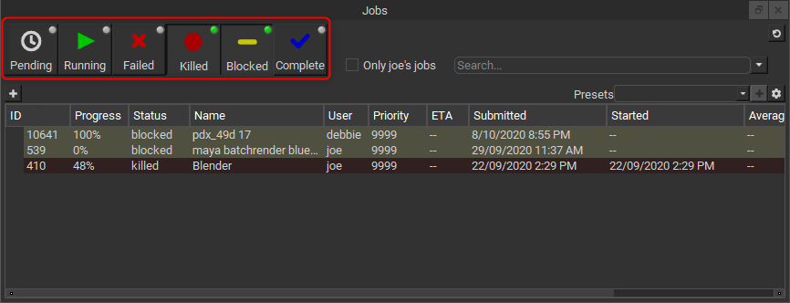

### Filter by current user

Checking on the 'Only YOUR_USERNAME's jobs' checkbox will show only
your jobs and is a great way to cut down the number of jobs in the
list.

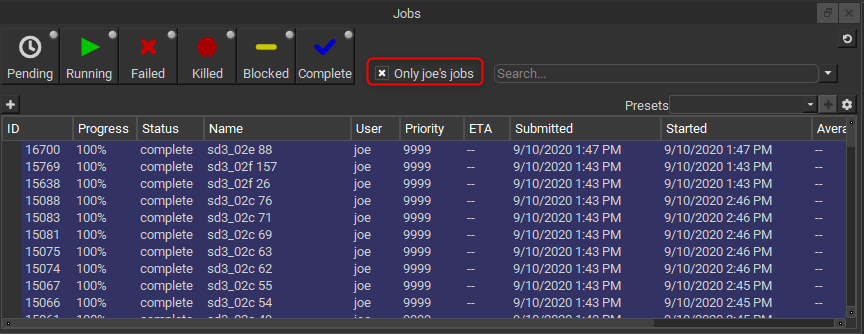

### Filter by text

The most powerful way to cut down the size of you job list is to use
the text based filter field. To filter on any job data visible in the
list just start typing\...

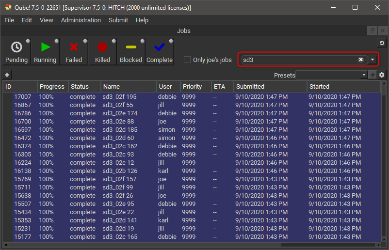

You can several text filters by separating them by commas (',').
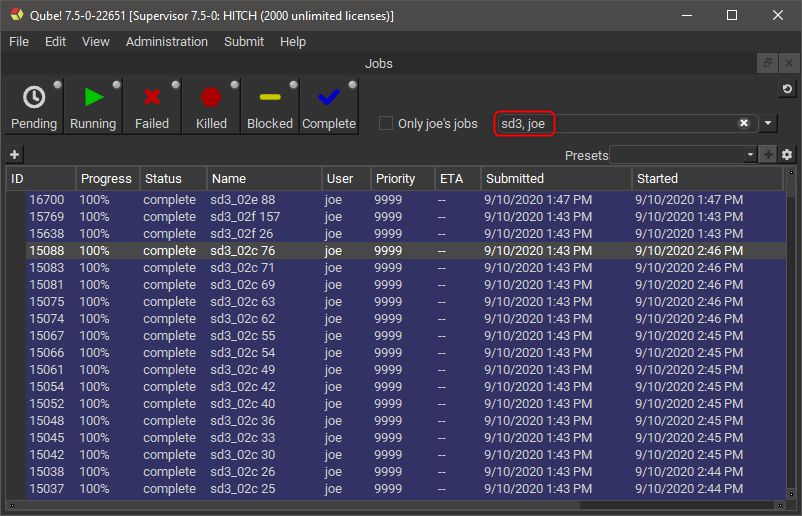

If you want to be more explicit you can specify the column to search
on.
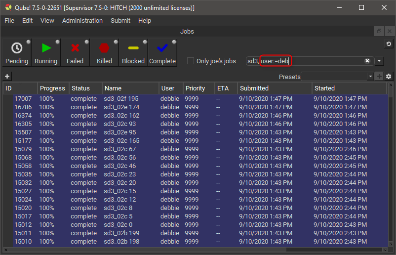

You can even use comparisons.
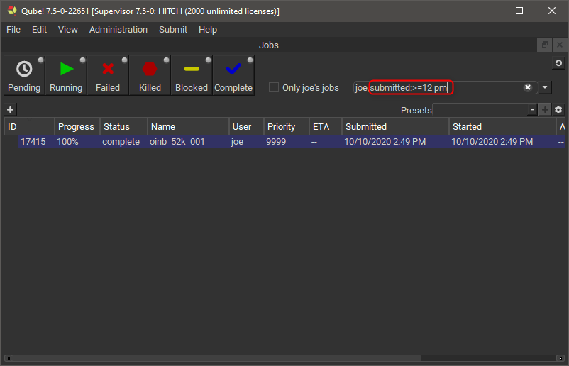

The comparison operators are configurable in the Filtering tab of Qube!
UI's preferences in case they clash with your job data, but the
defaults are:


|  **Comparison**           |  **Default operator**  |
| ---                       | ---                    |                               
|  Contains                 |  :=                    |
|  Is equal to              |  :==                   |
|  Greater than             |  :\>                   |
|  Greater than or equal to |  :\>=                  |
|  Less than                |  :\<                   |
|  Less than or equal to    |  :\<=                  |
|  Term separator           |  ,                     |
                               

### Advanced filtering

If you're not one for typing out filter terms yourself you can make
use of the Advanced Filter tool, this is also a good way to learn or
check syntax. To open the Advanced Filter tool click on the little down
arrow to the right of the filter search field.

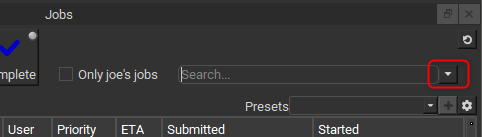

The Advanced Filter tool allows you to chain filters together
graphically, here's an example.

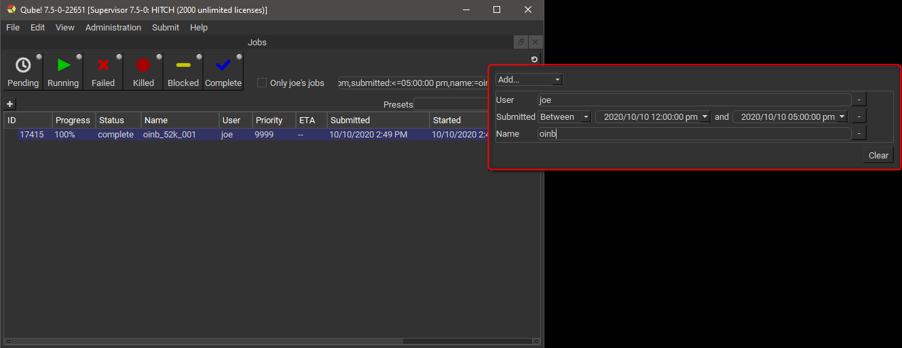

You can see that by adding filters in the Advanced Filter tool that it
fills the filter search field with the specified filter terms, you can
edit them there or in the tool itself. Note that altering the filter
search field will clear the Advanced Filter tool, future version will
allow edits in the text field to be applied to the tool.

## Organizing Jobs

### Job tree structuring

In addition to the several filter tools, the Qube! UI gives you a
powerful way to organize your job lists. When working with files on disk
it is time consuming to look through a directory that has thousands of
files in it. It is common to avoid this by setting up a directory
structure that organizes the files in such a way that each directory has
a manageable number of files in it. Generally the deeper the directory
structure the fewer files each directory has in it. A good directory
structure is a balance between the depth and breadth of the files and
directories contained within it. You can organize jobs in the Qube! UI
in a way similar to files in a directory structure, thankfully the UI
automates the placement of the jobs, you just need to tell it the
structure.

To specify the job structure's levels click the little plus button
under the Pending status filter toggle. A selector will appear allowing
you to choose how to split up the jobs under this level, we call this a
Level Function, it might sound odd now but will make sense later when we
go to add our own custom ones.

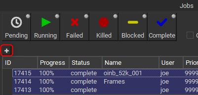

Just keep adding levels to organize the jobs in the way that makes
sense to your workflow, don't worry you don't need to find the perfect
hierarchy, you can make many structures (and even view them next to each
other). Here's an example using the prod_show, prod_seq, prod_shot job
meta fields.

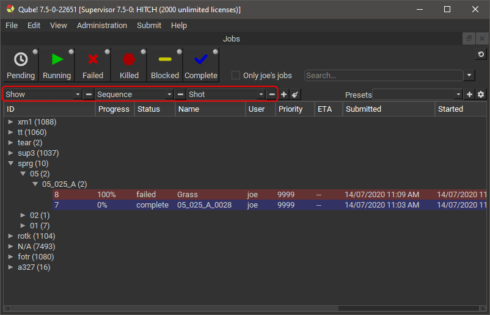

Or by status and user.

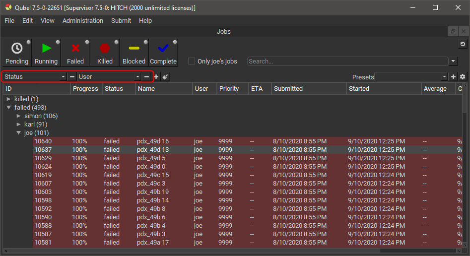

The Qube! UI's filtering and structuring work hand in hand to zero in
on what you're after in quickly, so you can get back to doing your real
job.

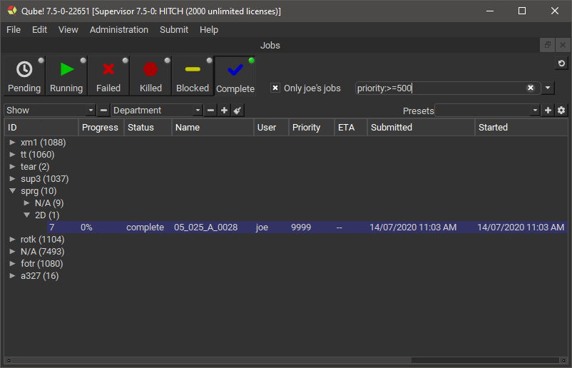

### Presets

You can save your tree structures and quickly switch between them using
presets, here's how.

1.  Create your job tree structure.\
    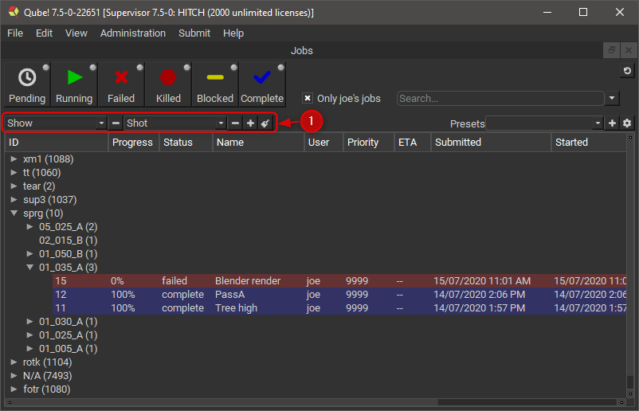

2.  Click the plus button next to the Presets selector.\
    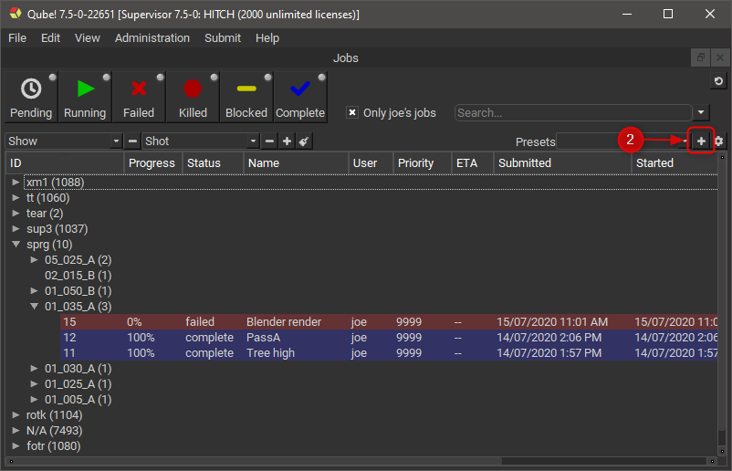

3.  Enter a name for the preset in the dialog that opens.\
    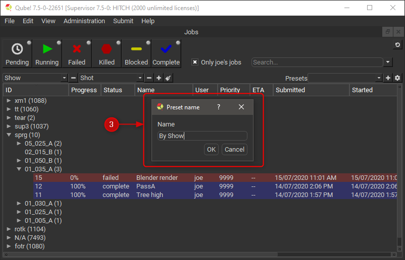

4.  Use the preset selector to switch between your saved presets.\
    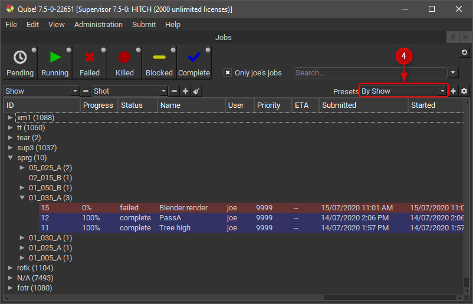

### Remove Presets

To remove a preset.

1.  Click on the little gear icon to the right of the Presets selector.\
    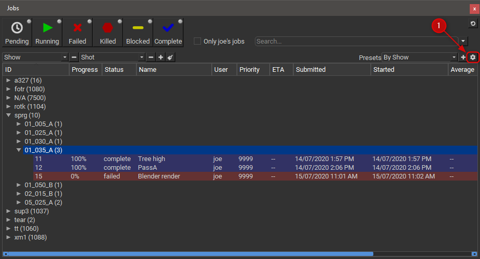

2.  In the dialog that appears select the preset(s) you want to remove.

3.  Click the '-' button.\
    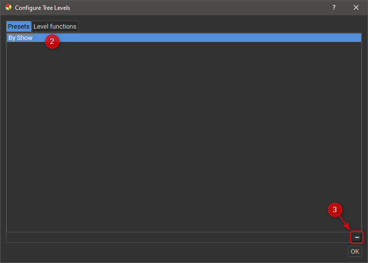

### Advanced job tree structuring 

It is possible to write your own Level Functions using Python, but
first some definitions so we're on the same page.

#### Level Function

Level Functions define the job tree structure. As a typical tree
structure, a Level Function may have a parent and/or children. Each
Level Function is given jobs that match its parent and in turn hand down
jobs that match itself to its children. If there is no parent, that is
the Level Function is the root of the structure, then it processes all
jobs. If there is no child Level Function then all jobs that match the
Level Function become its children.

The function of a Level Function sorts jobs into different groups. The
function runs on a per job basis (so be aware of performance issues) it
is passed a single job at a time and returns the name of the group(s) it
belongs to. By returning a list or tuple of strings a single job can
appear in several groups. Group names are not set or stored anywhere,
they are generated by the Level Functions themselves.

There are many built-in Level Functions, but you can also make your own
custom levels using Python.

#### Level

A Level is what the Qube! UI calls the 'groups' referred to in the
above Level Function definition.

#### Level name

A Level name is the text that is displayed in the tree structure at the
Levels (branches of the tree). Level names are generated by the Level
Function.

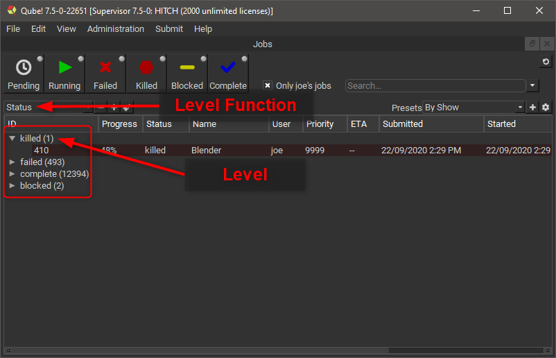

The Level Functions used within a particular structure act like ANDs,
that is, for a job to be a leaf under a series of Level Functions it has
to match all of them.

#### Creating a custom Level Function

As mentioned above, you can create your own custom Level Functions
using Python.

1.  Click on the gear icon to the right of the Presets selector.\
    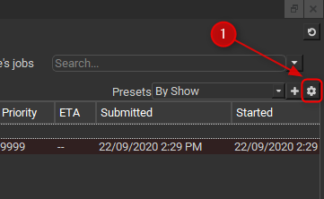

2.  In the dialog that appears select the "Level functions" tab.

3.  Add a new Level Function using the plus button a the bottom of the
    Level Function list.

4.  Double click on the new level function and give it a name, for this
    example call it "Submit Type".

5.  You will notice that in the code editor on the right a basic example
    of a Level Function is automatically filled.\
    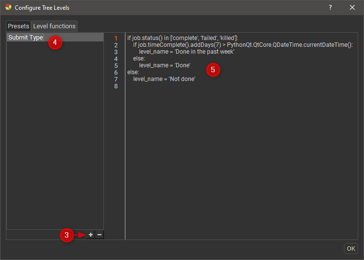

6.  The Qube! UI pre-defines a variable ***job*** which you use to set
    another pre-defined variable **level_name**, you set it to either
    a string or list/tuple of strings.

7.  Copy/paste the following text into the code editor.

```py showLineNumbers
if 'submitType' in job.packages().keys():              # If the job has a submitType value in it's package
    level_name = job.packages()['submitType'].value()  # then set the level_name to the value of the submitType
else:
    level_name = 'Unknown'                             # otherwise just set the level_name to Unknown
```

8.  Close the dialog and add a Level to the job list.

9.  Using the Level Function selector choose your new level.

10.  Enjoy the fruits of your labor.\
    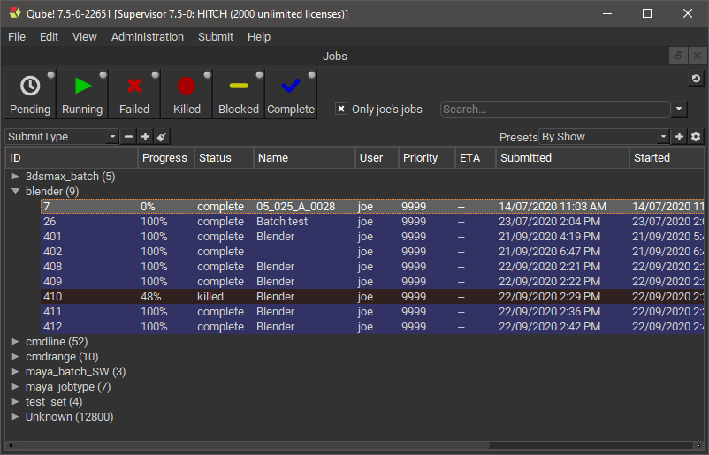

## Using several Jobs Panels simultaneously

The Qube! UI allows you to add several more Jobs Panels so you can work
with the jobs in different tree structures simultaneously.

1.  Add a new Jobs panel by selecting the menu View-\>Panels-\>Add
    custom view-\>Jobs.
    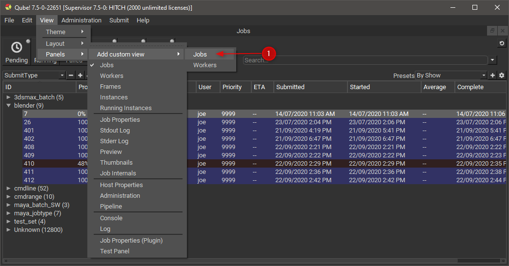

2.  Give the new Jobs Panel a name, for this example call it "My
    running jobs".

3.  In the new Jobs Panel turn on the "Running" filter.

4.  Select "Only YOUR_USERNAME's jobs".
    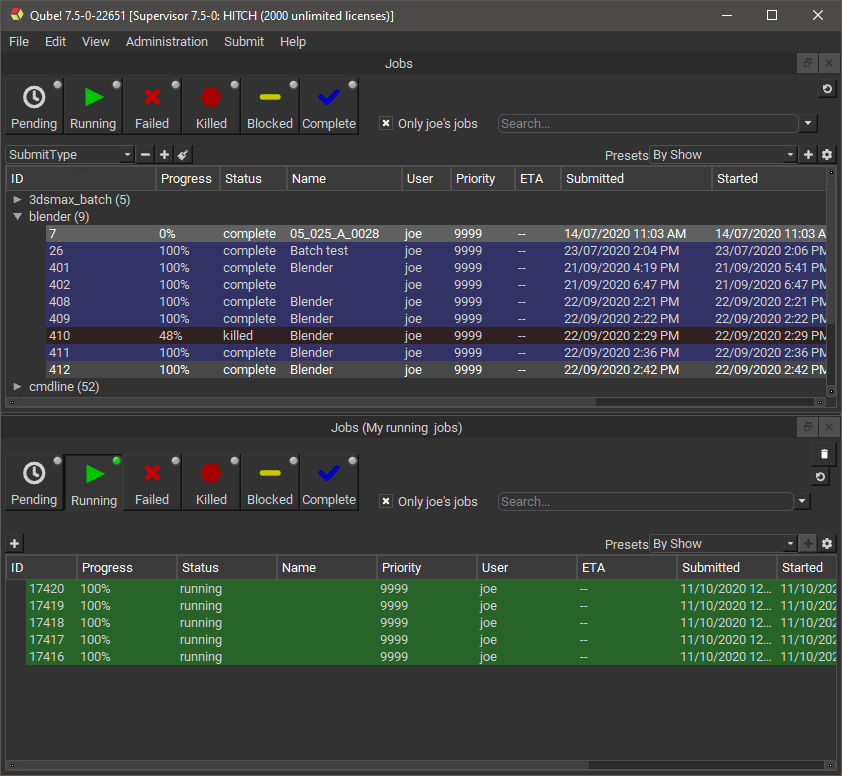
