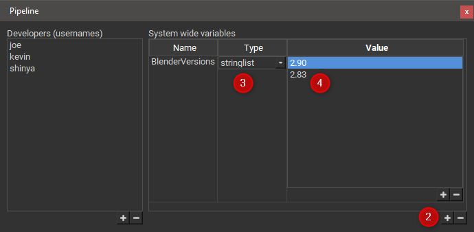
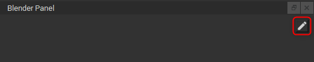
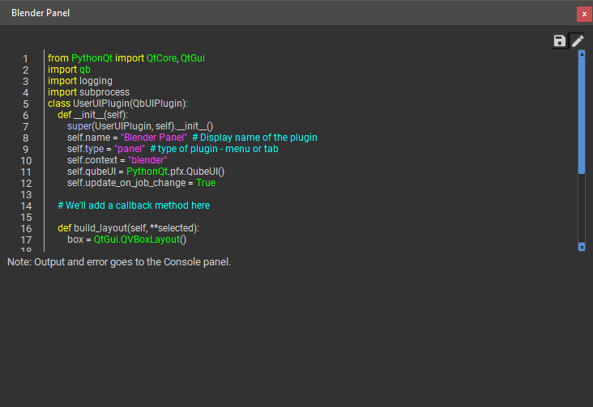
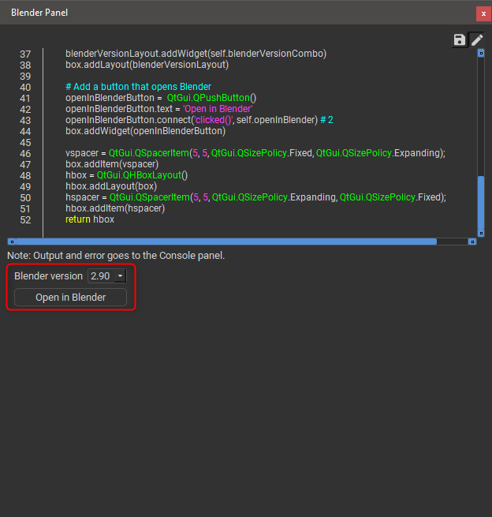

# Panel Plugins

## Qube! UI Panel Plugins

The Qube! UI allows you to write your own panels, these are known as
Panel Plugins. When you first install the Qube! UI there are two example
Panel Plugins, a 'Job Properties' plugin that gives you a nicer to
look at version of the built-in . Also a 'Test Panel' that
demonstrates the use of buttons and retrieving selected values from the
various Qube! UI lists.

## A Python Plugin Example

To create your own Panel Plugin you need to have access to the
plugins/panels directory in the Qube! UI installation folder. We're
going to create a panel that will open a selected job's Blender file in
a specific version of Blender. Note that if you don't have Blender or
Blender jobs then don't worry just replace anything to do with Blender
with the application you want to open.

Using the [Pipeline Panel](Pipeline+Panel)
we can add system-wide Pipeline Variables. We're going to add one to keep
track of the versions of Blender we have installed on the users' workstations,
note that these Pipeline Variables are set for everyone, not just you.

1.  Open the Pipeline Panel.

2.  Add a new Pipeline Variable and name it BlenderVersions in the
    dialog that appears.

3.  Choose 'stringlist' for the type.

4.  Add a couple of version numbers to the list, I have 2.83 and 2.90
    installed so I'll add them.



It's easiest to start with an existing panel plugin so you can make a
copy of either of the two built-in examples, but for now just create a
new .py python file and enter the following text:

```py {16,21} showLineNumbers
from PythonQt import QtCore, QtGui
import qb
import logging
import subprocess

class UserUIPlugin(QbUIPlugin):

    def __init__(self):
        super(UserUIPlugin, self).__init__()
        self.name = "Blender Panel"  # Display name of the plugin
        self.type = "panel"  # type of plugin - menu or tab
        self.context = "blender"
        self.qubeUI = PythonQt.pfx.QubeUI()
        self.update_on_job_change = True

    # We'll add a callback method here

    def build_layout(self, **selected):
        box = QtGui.QVBoxLayout()

        # We'll add UI code here

        vspacer = QtGui.QSpacerItem(5, 5, QtGui.QSizePolicy.Fixed, QtGui.QSizePolicy.Expanding);
        box.addItem(vspacer)
        hbox = QtGui.QHBoxLayout()
        hbox.addLayout(box)
        hspacer = QtGui.QSpacerItem(5, 5, QtGui.QSizePolicy.Expanding, QtGui.QSizePolicy.Fixed);
        hbox.addItem(hspacer)
        return hbox
```

Save the file in the plugins/panels directory where the QubeUI
executable sits on your platform. Make sure that you have write access
to the file and open (or restart) the Qube! UI. You should see your new
Panel Plugin, drag it somewhere sensible. If you're a you should also
see a pencil button in the top right, this allows you to edit the plugin
inline.



Click it now and you should be looking at something like this.\


Go to line 21, it should be a comment. Replace the comment with the
following code.

```py {10,11,19} showLineNumbers
            # Make a new horizontal layout for our Blender version label and version combo.
            blenderVersionLayout = QtGui.QHBoxLayout()

            # Add a label for our version selector
            blenderVersionLabel = QtGui.QLabel("Blender version")
            blenderVersionLayout.addWidget(blenderVersionLabel)

            # Add a combo box and fill it with the contents of our pipeline variable
            self.blenderVersionCombo = QtGui.QComboBox()
            blenderVersions = self.qubeUI.pipelineVariable('BlenderVersions') # 1
            self.blenderVersionCombo.addItems(blenderVersions) # 2
            self.blenderVersionCombo.setFixedWidth(50)
            blenderVersionLayout.addWidget(self.blenderVersionCombo)
            box.addLayout(blenderVersionLayout)

            # Add a button that opens Blender
            openInBlenderButton =  QtGui.QPushButton()
            openInBlenderButton.text = 'Open in Blender'
            openInBlenderButton.connect('clicked()', self.openInBlender) # 3
            box.addWidget(openInBlenderButton)
```

1.  Here we access our  to give us a list of supported Blender versions.

2.  We add the Blender versions to the version selector combo.

3.  We connect a slot, we have yet to write, to the openInBlender
    button's clicked() signal.

Line 16 should be another comment, we'll replace that with the callback
method code below.

```py {3,6-8} showLineNumbers
# The openInBlenderButton's callback (slot) 
def openInBlender(self):
    jobs = self.qubeUI.selectedJobs() # 1
    for job in jobs:
        blender_version = self.blenderVersionCombo.currentText
        blender_path = f'C:/Program Files/Blender Foundation/Blender {blender_version}/blender.exe') # 2
        blender_scene_path = job.packages()['sceneFile'].value() # 3
        subprocess.call([blender_path, blender_scene_path]) # 4
```

1.  Here we get the selected jobs from the Qube! UI as a list of Job
    objects.

2.  We build the path to Blender using the currently selected blender
    version.

3.  We use the job object to access the job's package and pull out the
    Blender scene file.

4.  Finally we launch Blender with the scene file as the argument.

If you don't type anything for around 3 seconds your Panel Plugin
should look something like this with our label, combo box and button all
visible.\


Save the plugin using the save button (the floppy disk button next to
the pencil) and close the editor by clicking the pencil button. Select a
Blender job in the a job list and click the "Open in Blender" button,
if all went well the scene related to that job should open with the
chosen version of Blender.
