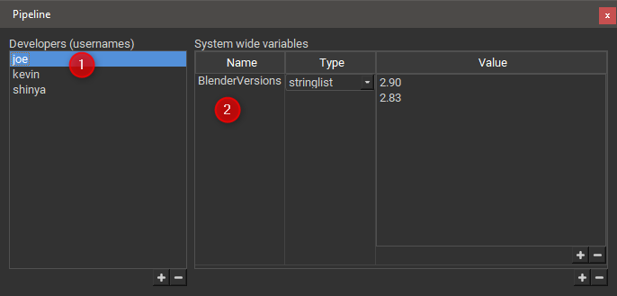

# Pipeline Panel

## The Qube! UI Pipeline Panel

If you are a Qube! administrator you will have access to the Pipeline
panel in the View-\>panels menu, the Pipeline panel allows you to do two
things.

1.  Define pipeline developers. A pipeline developer has additional
    rights in the Qube! UI, for example they can edit panel plugins.

2.  Define pipeline (system-wide) variables. A system-wide variable can
    be used (read-only) in plugins and inside the [Console Panel](./Console+Panel).
	The example below shows a string list variable 'BlenderVersions', this can be used,
    for example, by a Blender submission script to give the user a
    choice of which Blender version to use for the render. When you
    install a new version of Blender, instead of modifying the
    submission plugin just add the new version number to the variable,
    if you uninstall a version on your workers just remove it here. See Panel
	Plugins for a more interesting use of the 'BlenderVersions' variable.

