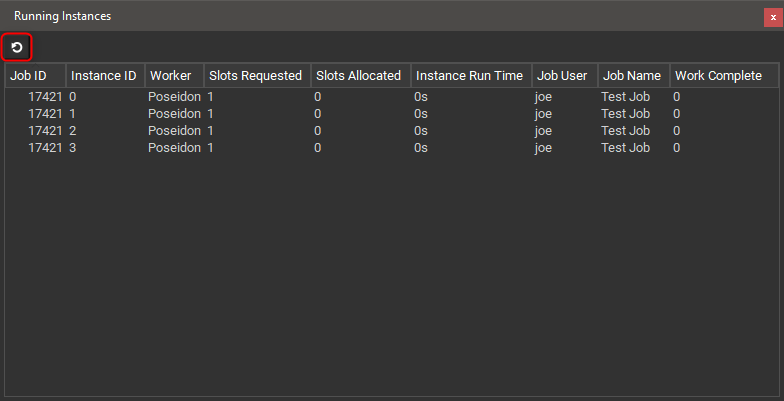

# Running Instances Panel

## The Qube! UI Running Instances Panel

The Running Instances Panel displays all the instances that are
currently running on the farm. This gives an isolated overview of what
the farm is currently working on. The Running Instances Panel doesn't
refresh automatically, to view an updated list click the refresh button
as shown below.

Apart from only showing the running instances the panel works like the
[Instances Panel](Instances+Panel) so refer to that for more information.
