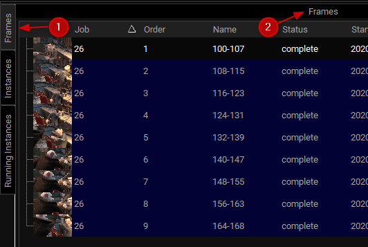

# Panels

Working with your Qube! render farm in the new UI is done using various
panel interfaces. Most people won't use all the built-in panels so you
can hide away anything you don't use by clicking the panel's 'X'
button, or deselecting it in the View-\>Panels menu. You can move the
panels around to suit your workflow, it's also possible to float them.
The UI remembers your previous panel layout when you start it again
later, floating panels don't open by default but remain floating when
you enable them from the View-\>Panels menu.

When dropping a panel on top of another, a tabbed panel is created as
show below as 1. It is then possible to either move the tabbed panel as
a group by dragging from the panel's title bar, shown as 2, or you can
move an individual panel out of a group by dragging from its tab, shown
as 1.

Save your favorite and switch between them to best suit your task at
hand.

The Qube! UI ships with the following built-in panels:

- [Jobs Panel](users-guide/qube-ui/panels/Jobs+Panel)
- [Workers Panel](users-guide/qube-ui/panels/Workers+Panel)
- [Frames Panel](users-guide/qube-ui/panels/Frames+Panel)
- [Instances Panel](users-guide/qube-ui/panels/Instances+Panel)
- [Running Instances Panel](users-guide/qube-ui/panels/Running+Instances+Panel)
- [Job Properties and Job Internals Panels](users-guide/qube-ui/panels/Job+Properties+and+Job+Internals+Panels)
- [Stdout and Stderr Panels](users-guide/qube-ui/panels/Stdout+and+Stderr+Panels)
- [Preview Panel](users-guide/qube-ui/panels/Preview+Panel)
- [Thumbnails Panel](users-guide/qube-ui/panels/Thumbnails+Panel)
- [Host Properties Panel](users-guide/qube-ui/panels/Host+Properties+Panel)
- [Administration Panel](users-guide/qube-ui/panels/Administration+Panel)
- [Pipeline Panel](users-guide/qube-ui/panels/Pipeline+Panel)
- [Console Panel](users-guide/qube-ui/panels/Console+Panel)
- [Log Panel](users-guide/qube-ui/panels/Log+Panel)
- [Panel Plugins](users-guide/qube-ui/panels/Panel+Plugins)
