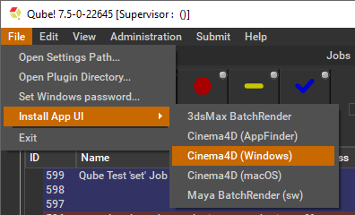
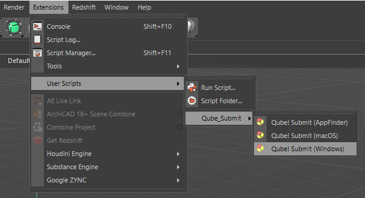
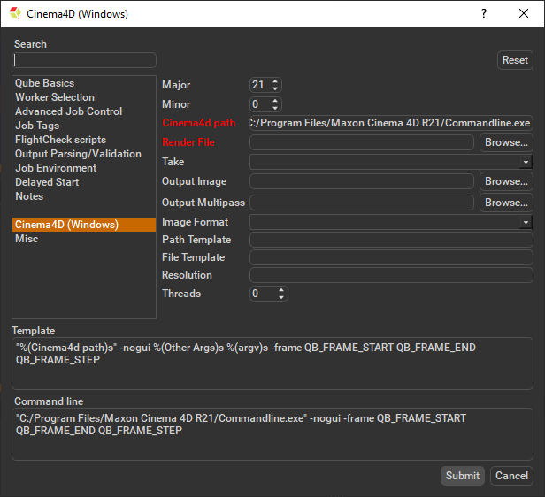
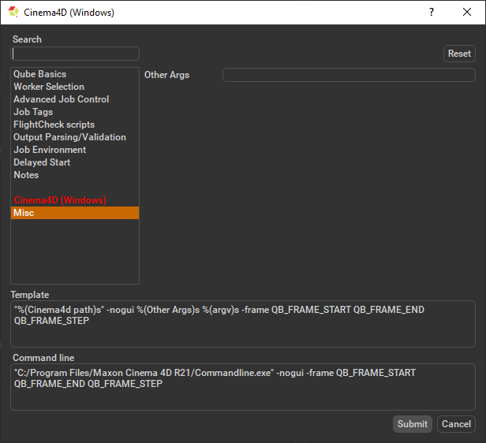

# Cinema4D Windows Submission

## Step by step instructions for submitting Cinema4D Windows jobs with Qube!

### Install the Qube! Submission UI into Cinema4D

**(First Time Only)**

If you want the submission menu inside of Cinema4D (recommended) then
install the InApp plugins via the QubeUI application as shown here. To
do this, launch the QubeUI:

-   **Windows**: Double-click the color desktop icon

-   **macOS**: Find the color icon in Applications/pfx/qubeui and
    double-click on it

Then navigate to the File menu, choose "Install App UI" and choose the
Cinema4D (Windows) option. This will install the Cinema4d (Windows)
submission UI only. You will need to do this on every workstation that
you intend to submit Cinema jobs from.

### Launch a Qube! submission UI

Once installed you should be able to locate the "Qube!" menu in
Cinema4D's menu bar via Extensions -\> User Scripts -\> Qube_Submit -\>
Qube! Submit (Windows).

AppFinder vs macOS vs Windows

:::info

What's the difference?

**Qube! Submit (AppFinder)** uses information from the worker to
determine if it is running Windows or macOS, and then use the render
executable specific to that platform.

**Qube! Submit (macOS)** assumes the targeted workers are running macOS.

**Qube! Submit (Windows)** assumes the targeted workers are running
Windows.

:::

### Job Submission Details

Parameters Specific to Cinema4d (Windows)

:::info

Not all sections need to be filled in in order to render only the fields
marked in red are required

:::

In progress, check back soon.

**Other Args**

Location to add additional args to the command line.

### Submit

Click 'Submit'

For further details on the submission UI see below.

