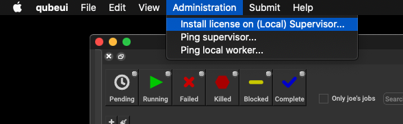
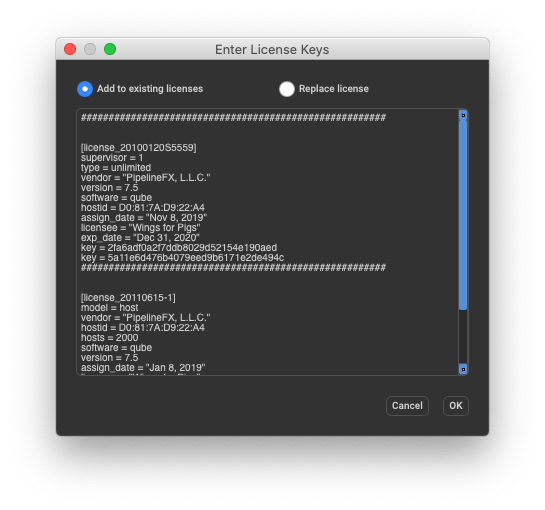
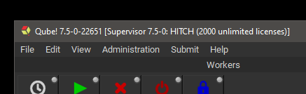

# License Installation

## Qube! has both Supervisor and Worker license keys

You'll have only one supervisor key, but can have any number of worker
keys.

## Qube! has a single license file for all license keys

Qube! has license keys for both the Supervisor and the Workers, but the
keys for both are installed on the supervisor.

-   you can have only a single supervisor license key in your license
    file.

-   you can have any number of worker license keys in your license file,
    they will be added together.

## Without a license file, the supervisor will not dispatch jobs

:::info
Prior to Qube! 6.10, a supervisor would dispatch jobs on up to 2 hosts,
but now a license file is necessary **in all cases**.
:::

## License keys are valid for the major.minor Qube! version they are issued for, and ALL versions before that

:::danger
Do not upgrade your supervisor to a newer major.minor until you have
installed the license key for the newer version. Failing to do so **will
result in your supervisor refusing to dispatch jobs** until you either
install the updated license keys or downgrade your supervisor.
:::

License keys are issued for a particular version of Qube. A key for a
version **ahead** of your current version will work, but you can't use
an **older** key with a newer version.

-   a key for 6.9 is valid for any version of 6.9-x (6.9-0, 6.9-2, etc),
    and any version before 6.9 (6.8-x, 6.7-x, etc)

-   a key for 6.9 is **invalid** for 6.10-0 and onwards.

## Online License Retrieval

### Contents
- [The License File](#the-license-file)
- [Installing with Qube! UI](#installing-with-qube!-ui)
- [Installing Licenses by Hand](#installing-licenses-by-hand)
  - [License file location](#license-file-location)
- [Verifying License Installation](#verifying-license-installation)
  - [With the Qube! UI](#with-the-qube!-ui)
  - [By Command-line](#by-command-line)
- ["I have 0 licenses now..."](#i-have-0-licenses-now)
- [Optionally, setup Metered Licensing](#optionally-setup-metered-licensing)

### The License File {#the-license-file}

The Qube! license file contains the keys for both the Supervisor and
Worker, and:

-   **Must be installed on the supervisor**. The location is documented
    later on this page - see [Installing Licenses by Hand](#installing-licenses-by-hand)

-   **Must be named qb.lic**

Qube! license keys can be installed either with the Qube! UI or creating
and editing the license file by hand. License file updates take effect
immediately, there is no need to restart the Supervisor or Workers.

### Installing with Qube! UI {#installing-with-qube!-ui}

The simplest way to install the Qube! license is with the Qube! UI, via
the Administration-\>Install license on (Local) Supervisor menu item.
This option is greyed out if you are not on the Supervisor.

:::danger
**Windows users:** you **must** start the Qube! UI with "Run as
Administrator", even when you are logged in as an admin-equivalent or
local administrator. This is due to Window's "elevated privileges"
security policy.
:::



A dialog will appear, prompting you to copy & paste your license
strings. You have the option of either adding the keys to your existing
licenses or replace the license file.



:::info
Please note that the license string does not include
\"\-\-\-\-\-\-\-\-\-\-\-\-- \< snip - do not include this line in the
license file \> \-\-\-\-\-\-\-\-\-\-\-\--\" lines that are in your
license email.
:::

### Installing Licenses by Hand {#installing-licenses-by-hand}

You can also install license keys by editing the license file directly.


:::danger
-   Make a backup copy of the license file before editing it.

-   You must use a text editor capable of saving out plaintext.

-   The license file must end with the extension ".lic".

-   Saving the license file with a .rtf, .txt, .doc, extension or in any
    format other than plaintext will render your license file invalid.
:::

#### License file location {#license-file-location}

Depending on the supervisor\'s operating system, the qb.lic file is
located in:

-   Linux & macOS: &nbsp; /etc/qb.lic

-   Windows 10/11: &nbsp; C:\ProgramData\Pfx\qube\qb.lic

### Verifying License Installation {#verifying-license-installation}

#### With the Qube! UI {#with-the-qube!-ui}

Immediately after installing the license, the Qube! UI title bar should
update and reflect the new license count.



#### By Command-line {#by-command-line}

You can verify the license count with the **qbping** utility. In this
example, all worker licenses for this supervisor will use metered
licenses.

```
    jburk-15-mbPro:LaunchAgents jburk$ qbping

    supervisor - active - tag: 10.0.1.101 78:4F:43:68:FD:7C 7.0-1c rel-7.0-0006 osx - - host - 0/0 unlimited licenses (metered=0/300) - mode=0 (0).
```

The license counts displayed can be interpreted in the following manner:

-   `0/0 unlimited licenses:` 0 licenses in use, 0 worker licenses
    installed

-   `metered=0/300`: metered licensing is enabled and in effect,
    currently using 0 licenses of a maximum of 300 metered worker
    licenses

### "I have 0 licenses now\..." {#i-have-0-licenses-now}

If after license installation you now show 0 licenses, you haven\'t yet
installed the worker keys, or the license file has become invalid
(perhaps it got saved out with an extension other that .lic, or saved in
RTF or Wordpad format). Check the license file with a plaintext editor

### Optionally, setup Metered Licensing {#optionally-setup-metered-licensing}

You can run a supervisor without any worker licenses if you have setup
Metered Licensing. See
