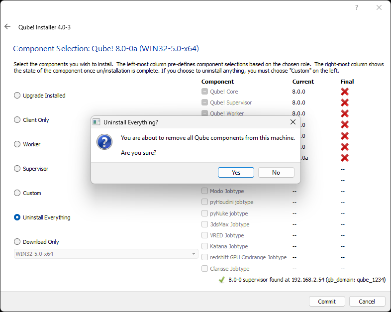

# Uninstalling Qube!

## Using the Qube Installer Utility:
Run the installer on the relevant machine, and choose "Uninstall Everything" when you get to the selection screen:

## Manual Uninstall
First, stop the services on the machine you are going to uninstall from:

Supervisor
Linux:        sudo systemctl stop supervisor 
macOS:       sudo launchctl stop com.pipelinefx.supervisor  
Win (Control Panel):    Services->qubesupervisor->stop 
Win (cmdline):  sc stop qubesupervisor

(Qube 6.x and below only) On Linux and macOS, the Supervisor's database tables are not removed by the uninstall utility. Before removing the Supervisor software, you may want to run this command:
$QBDIR/utils/upgrade_supervisor --erase

This will drop all the database tables cleanly. It is not necessary to do this on Windows, as they are stored in the Qube! install itself.

**Worker**\
Linux:
- sudo systemctl stop worker
- rpm -qa | grep -i qube
- rpm -ev package1 package2 ... 

macOS:
- sudo launchctl stop com.pipelinefx.worker
- Open a Finder and delete the /Applications/pfx/ directory

Windows:
- stop the qubeworker service:
- Use the Services control dialog
- From the command prompt:  sc stop qubeworker
- Kill the watchdog process from the Windows Task Manager
- Open the "Start-\>Control Panel-\>Add/Remove Programs" and remove the Qube! Components ("Qube! Worker Service", "Qube! Core", Qube Jobtypes, etc)..

## Additional Cleanup
A manual uninstall does not get everything - remove these additional files.

Linux
- The data (job logs, etc) directory, /var/spool/qube
- Logs (supelog, workerlog, supeproxylog, dralog, qube-system-metrics.log, and their backups) in /var/log
- The configuration files in /etc are not removed, and must be removed by hand - 
  * /etc/qb.conf \* 
  * /etc/my.cnf backups (Qube 6 and below only)
  * /etc/qb.lic
- (Qube 6.x and below) The directories in /usr/local/mysql/ are not removed by the upgrade_supervisor --erase command
  * /usr/local/mysql/qube
  * /usr/local/mysql/pfx_\*
- (Qube 7.0 and above) : the PostgreSQL database software and data
  * /usr/local/pfx/pgsql 

macOS
- The data (logs) directory, /var/spool/qube
- Logs (supelog, workerlog, supeproxylog, dralog, qube-system-metrics.log, and their backups) in /var/log
- From WranglerView, click on the menu items "Administration-\>AutoStart \_\_\_\_:Enabled-\>Disable".to remove the auto-start for Supervisor and Worker if enabled.
- From the Finder, locate the supervisor and worker folders in the /Library/StartupItems folder.
- Locate the qube-supervisor, qube-worker, and qube-core installation pkg file in the /Library/Receipts folder and drag it to the Trash
- /Applications/pfx directory
- this includes the PostgreSQL software and data, in /Applications/pfx/pgsql

Windows
- Delete these entire directories:
  * C:\Program Files\pfx
  * C:\Program Files (x86)\pfx
  * C:\ProgramData\Pfx 
