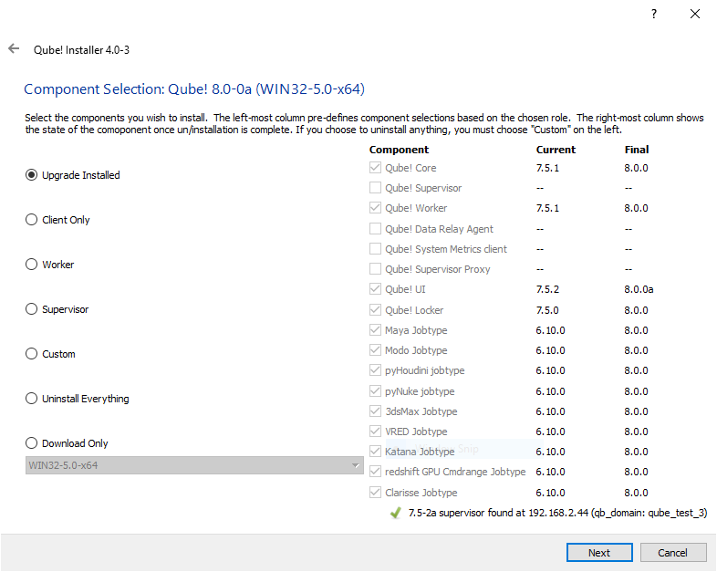

# Upgrading Qube!

:::info
**If both of the following conditions are true, you will need to take the
extra steps outlined in Transferring data from MySQL to PostgreSQL when
upgrading the supervisor:**

- **You are upgrading the supervisor from pre-7.0 to Qube! 7 (for example
from 6.10-0a to 7.0-0)**
- **You wish to bring your Qube 6 job data forward into Qube! 7 Ensure that
database_port is commented out (if present) in your supervisor's qb.conf
file**
:::

:::danger
We have seen cases with customers upgrading from Qube 6 to Qube 7 where the supervisor is attempting to connect to the PostgreSQL server on the default port for MySQL. This is due to the database_port being defined in the qb.conf file, but still set to the value for a MySQL server.
:::

Qube! versioning is indicated by major, minor, and point releases in the format major.minor.point (e.g. 5.5.0).

If you plan to upgrade the major or minor version of Qube!, you will have the best results if you upgrade all of your systems to the latest version. While it is possible to run a mix of older versions of Qube!, there are number of feature enhancements that are not strictly backwards compatible with previous versions. Point releases (5.4.x) are forwards and backwards compatible with other point releases of that minor version (ie. All 5.4 versions) unless noted otherwise.

Due to the number of possible combinations and possibilities for unexpected problems, we cannot support mixed major release environments (4.X with 5.X, etc). Mixing minor releases can sometimes be done, but is not encouraged.

:::info
It is always a good idea to back up your current installation before proceeding with an update. You should also block all Workers from picking up new jobs, and either stop all running jobs, or let all running jobs complete.
:::

To block the workers, use the WranglerView UI or the qblock command. See this page for details.

Upgrading with the Installer
The Qube Installer wizard is the recommended way to upgrade Qube!, and is available for download at https://www.pipelinefx.com/downloadversions/

The installer will take care of stopping and restarting services, and so requires very little input from the admin. Simply start the Qube! installer and run it as root or Administrator. Click through to the Selection Screen and choose "Upgrade Installed".

That's it! The installer will take care of stopping and starting services, downloading and installing software, etc.

IMPORTANT! Starting with Qube 7.0, the supervisor uses PostgreSQL instead of MySQL as its backend database server. Accordingly, when upgrading from a pre-7.0 version (such as 6.10-0a) to 7.0 or above, there are extra steps that must be taken outside of the Qube Installer, before and after running it, particularly if you require that the old data from MySQL be transferred to PostgreSQL.  Please follow the instructions provided at: Transferring data from MySQL to PostgreSQL.

 

## Upgrading Manually
You may still wish to upgrade Qube! manually. Here are the steps for doing that. You will have to either perform these actions as an Administrator (or root) or use sudo.

### Upgrade Supervisor
1. **Stop Activity on the Farm**
    It's good practice to first stop current farm activity before doing an upgrade of the Supervisor. Run the following from a command shell to block Workers from picking up new work:
    - % qblock --all\
      Wait for all activity to stop, or pause any running jobs.

2. **Stop the Supervisor service**
    - Linux:        /sbin/service supervisor stop\
    - macOS:        SystemStarter stop supervisor\
    - Win: (dialog):  Services Window->Supervisor->stop\
    - Win (cmdline): net stop qubesupervisor

3. **Uninstall the old version of Qube! and install the new version**

   **Linux:**
   - rpm -e qube-core-ver-releaseos.arch.rpm
   - rpm -e qube-supervisor-ver-release-os.arch.rpm
   - rpm -ivh qube-core-ver-releaseos.arch.rpm
   - rpm -ivh qube-supervisor-ver-release-os.arch.rpm 

   **macOS:**
   - Follow the standard installation with the .pkg/.mpkg installers (see Installation section for details). The installers will show "Update" instead of "Install" to indicate this is an update. 

   **Windows:**
   - Open the "Start->Control Panel->Add/Remove Programs" and remove the Qube Components ("Qube! Supervisor Service", "Qube! Core", etc).

4. **Install the new Qube Core and Supervisor** (see Installation section for details)
   **Windows Only:**
   - On an Administrator command prompt, run "C:\Program Files\pfx\qube\supe_postinstall.bat"

5. **Restart Services**
   - Linux Only: /sbin/service supervisor start
   - All OSes:      qbunlock --all

### Upgrade Workers

1. **Shut down the Worker daemon**\
   Linux:               /sbin/service worker stop\
   macOS:               SystemStarter stop worker\
   Win: (dialog):   Services Window->Worker->stop\
   Win (cmdline):  net stop qubeworker

2. **Uninstall the old version of Qube and install the new version**
   - Linux:\
     rpm -Uvh qube-core-ver-release-os.arch.rpm
     rpm -Uvh qube-worker-ver-release-os.arch.rpm
   - macOS:\
     Follow the standard installation with the .pkg/.mpkg installers (see Installation section for details). The installers will show "Update" instead of "Install" to indicate this is an update. 
   - Windows:\
     Open the "Start->Control Panel->Add/Remove Programs" and remove the Qube Components ("Qube! Worker Service", "Qube! Core", Qube Jobtypes, etc). Install the new Qube Core, Qube Worker, and Jobtypes (see Installation section for details). 

3. **[Linux only] Manually restart the Worker daemon**
   - /sbin/service worker start

4. **Restart activity on the farm**
   - % qbadmin supervisor --unset stop_activity
   - % qbadmin supervisor --unset reject_submit

