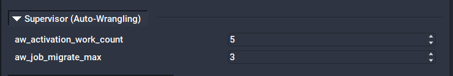

# Auto-Wrangling

There are a number of manual tasks typically performed when overseeing jobs on the renderfarm and the renderfarm itself. The header "auto-wrangling" is meant to cover automating some of those more manual tasks and calculations.

Some of the most common render wrangling tasks can now be handled automatically by the Supervisor through a set of global parameters. Qube! has added built-in logic that detects faulty jobs and workers. These parameters can be configured by modifying the Supervisor qb.conf directly or through the QubeUI "QB Config" panel.

## Automated Actions

* Automatically blocks faulty jobs and sends email to the submission user.
* Automatically locks faulty workers and sends email to the Qube Administrator.



## To enable:

* Make sure that the [supervisor_language_flags](../configuration-parameter-reference/supervisor_language_flags) includes "auto_wrangling" (it's ON by default, if supervisor_language_flags" isn't found in qb.conf).
* supervisor_language_flags, which lists the enabled callback "languages", must include "auto_wrangling" to enable auto-wrangling.
* To globally turn on auto-wrangling for all submitted jobs (recommended), include "auto_wrangling" in the [supervisor_job_flags](../configuration-parameter-reference/supervisor_job_flags) configuration parameter in the supervisor's qb.conf. Restart the supervisor if qb.conf settings were changed.
* Auto-wrangling also may be enabled on a job-by-job basis, by NOT including "auto_wrangling" in "supervisor_job_flags", and explicitly setting the "auto_wrangling" flag for jobs.
* Auto-wrangling also may be enabled on a client-to-client basis, by NOT including "auto_wrangling" in "supervisor_job_flags", but including it in the [client_job_flags](../configuration-parameter-reference/client_job_flags) on desired submission machines. This will enable auto-wrangling on all jobs submitted from those machines.

## To disable:

* Remove "auto_wrangling" from the "supervisor_language_flags", in the supervisor's qb.conf file. Have the Supervisor reload its configuration with qbadmin supe --reread. See Telling the Supervisor to Reread the qb.conf file

## Auto-Wrangling-specific qb.conf parameters:

* aw_activation_work_count : This positive integer specifies the number of agenda-items that should fail on a given worker before the auto-wrangling logic is activated. (default: 5)
* aw_job_migrate_max : This positive integer specifies the maximum number of automatic migration the auto-wrangling subsystem will perform on a job, before it decides that the job is faulty and blocks it, and notifies the submitting user. In other words, this effectively determines the number of workers on which a job will be tried, before the system "gives up". (default: 3)

## Other related qb.conf parameters:

* supervisor_job_flags may include "auto_wrangling" which will globally turn on auto_wrangling for all submitted jobs (i.e., by automatically turning on the "auto_wrangling" flag for every job when submitted).
* The email address specified in the mail_administrator parameter will receive email messages when auto-wrangling determines that a worker is faulty and locks it.

## Job parameters:

* A job's "email address" field, if set, is used as the recepient address of email notifications sent out by the auto-wrangling subsystem.

## Email
The Auto-Wrangling system will send notification emails when it takes certain actions.

* When a job is blocked because auto-wrangling determined that it's malfunctioning, an email notification is sent to the user.
* When workers are locked because auto-wrangling decided that the worker is faulty, then the qube admin is notified via email.

## Auto-wrangling Logic
Currently, the built-in auto-wrangling logic is basically an implementation of the following pseudocode:

```js
if (a worker has failed more than aw_activation_work_count agenda-items) {
    
    if (the worker hasn't completed any frame it has been assigned so far) {
    
        if (other workers are completing frames from this job) {
    
            Worker is faulty, so lock it.
            Change the status of failed frames back to "pending" so
            other workers may retry them.
            Notify admin that the worker is faulty and has been locked
         
        } else { // no other worker is completing frames.
         
            if (there is at least another worker running this job) {
                 
                if (all the other workers are also failing frames) {
    
                    Job is faulty, so block it.
                    Notify submitter.
    
                } else {
    
                    // There are other workers running this job, but there
                    // are no complete frames. All the failed frames were
                    // processed by this worker.
                    Worker is very likely faulty, so lock it.
                    Change the status of failed frames back to "pending" so
                        other workers may retry them.
                    Notify admin that the worker is faulty and has been locked
                }
            } else {
                 
                // this is the only worker that has run this job.
                // no frames are completing
                 
                if (job has not been migrated to aw_job_migrate_max workers) {
    
                    Migrate the job to another worker
    
                } else {
    
                    // job has been migrated aw_job_migrate_max times
                    Job is faulty, so block it.
                    Notify user.
                }
            }
        }
    }
}
```
