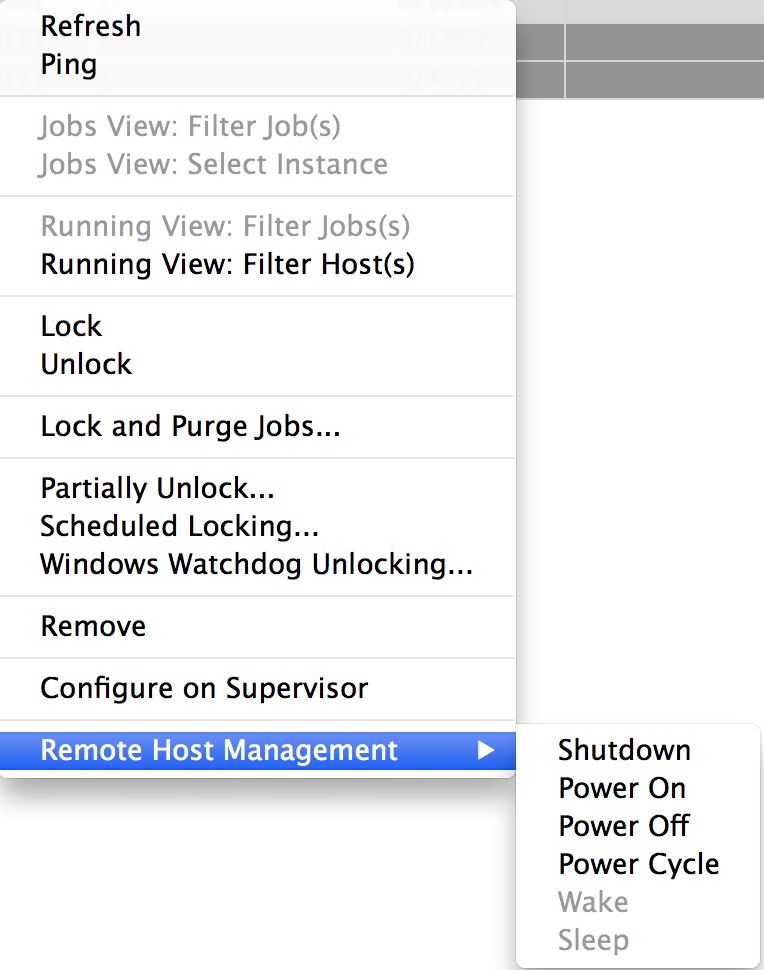
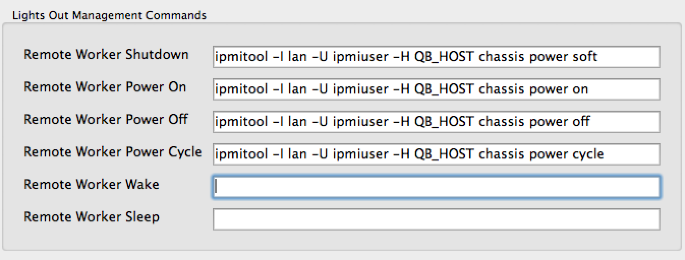

# Lights Out Management (LOM)

## Out-Of-Band Host Management
Out-of-band management (also known as Lights out management (LOM)) involves the use of a dedicated management channel for device maintenance. It allows a system administrator to monitor and manage servers and other network equipment by remote control regardless of whether the machine is powered on, or if an operating system is installed or functional.

LOM is implemented either by a vendor-specific protocol or an industry-(mostly)-standard protocol known as the Intelligent Platform Management Interface **(IPMI)**.

### IPMI Overview
The Intelligent Platform Management Interface is a standardized computer system interface used by system administrators for out-of-band management of computer systems and monitoring of their operation. It is a way to manage a computer that may be powered off or otherwise unresponsive by using a network connection to the hardware rather than to an operating system or login shell.

Many vendors have implemented their own version of IPMI support:

* HP Integrated Lights-Out  ( HP's implementation of IPMI)
* Dell DRAC (Dell's implementation of IPMI)
* IBM Remote Supervisor Adapter (IBM's out-of-band management products, including IPMI implementations)
* MegaRAC (AMI's out of band management product and OEM IPMI firmware used in
  e.g. ASUS, Tyan, Intel and Supermicro motherboards)

There is also the open-source ipmtool.

### LOM alternatives to IPMI
Intel Active Management Technology (AMT, Intel's out-of-band management product, as an alternative to IPMI)

## QubeUI uses your existing LOM framework
Since LOM is implemented in so many ways specific to particular vendors and hardware, we've elected to provide more of an agnostic approach rather than try and ship something that works with everything.

The QubeUI preferences dialog has a "Lights Out Management Commands" section where you specify the LOM/IPMI command "template" for each operation.  Specifying one or more LOM commands causes menu items to appear or be enabled.

* When at least a single LOM command is specified, a "Remote Worker Management" sub-menu will appear in the worker context menu.  
* Only LOM commands that are defined in the preferences are enabled in the "Remote Worker Management" sub-menu

:::warning
You must re-start QubeUI the first time you add a LOM command in order for the "Remote Worker Management" sub-menu to appear. Once the sub-menu is visible, adding new commands in the preferences will immediately enable the corresponding Remote Worker Management menu item.
:::

### Defining the LOM Commands
The Preferences dialog has a "Lights Out Management Commands" section where you can define LOM commands for various operations.  What you enter is specific to your particular implementation of an LOM framework.

:::warning
Use "QB_HOST" in place of the host name or IP address when specifying the LOM command template in the preferences.
:::

