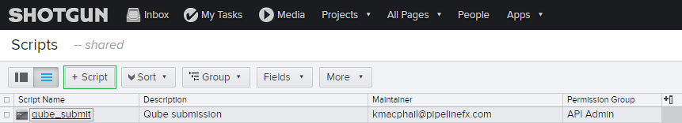
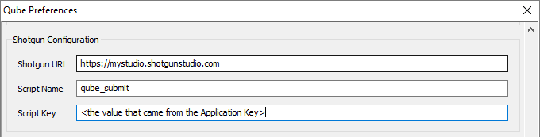
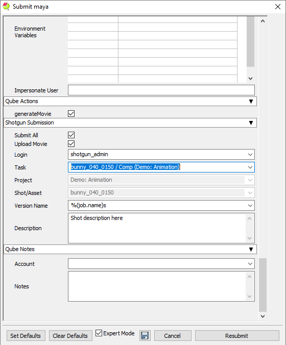

# Shotgun Integration
To enable the Shotgun Integration its configuration must be set properly in
the QubeUI preferences.  To do this you will create a 'qube submission'
"script" on the Shotgun server - the creation of the script will generate a key,
and you use that script name and key to allow Qube to authenticate with the
Shotgun server.

Here are the step-by-step instructions to set it up and submit a test job 

On the Shotgun side:
1. Login to your Shotgun server.
2. Click on your profile picture in the top right corner of the Shotgun
interface to show the Admin->Scripts menu. Once on the Scripts page click the
"+ Script" button to create a new script and fill in the Script Name to "qube_submit".
3. Click on the created Script Name link called "qube_submit", then choose
"Script Info" to find the Application Key.

In the QubeUI Preferences panel for each user, fill in the following under the
"Shotgun Configuration" section:

Shotgun URL: your Shotgun studio address like https://mystudio.shotgunstudio.com/
Script Name: qube_submit
Script Key: \<the value that came from the Application Key>

These QubeUI preferences can also be stored in a central qubegui preferences
file with other studio defaults. (File->Save Preference Defaults... and the
matching preference field "Studio Defaults Prefs")

This will enable the submit-time creation of a callback when submitting a job to
have it send information to your Shotgun server on job completion and create a
new "Version" for the asset. Fill in the username and other fields. 

 

Details: The script that is run is located under .../qube/scripts/shotgun_submitVersion.py.
This is what controls what information is sent to the Shotgun server from Qube.

## See also
Shotgun Submission section in the Job Submission Dialog
