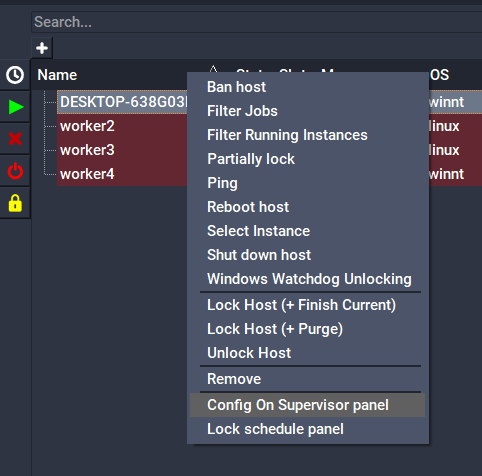
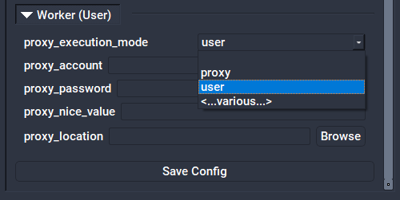
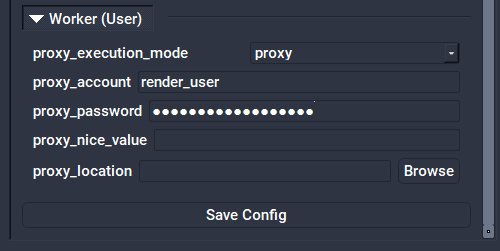
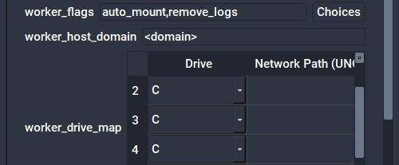

# Service Mode Authentication: User vs Proxy

With Qube! running in [Service Mode](./Service+Mode+vs+Desktop+User+Mode), you have a choice of running jobs on the Workers in one of two ways:

* In **proxy mode**, all jobs execute as the designated proxy user, regardless of who submitted them. 
* In **user mode**, all jobs execute as the user specified in the job, either the user that submitted the job, or some other specified user. All processes executed and files created would then owned by that user.

The default installation uses proxy mode with a local account called "qubeproxy" created on each Worker.

As the Admin, you have some options for configuring this. You can:

* Leave it in proxy mode, with all jobs running as a local user called "qubeproxy".
* Continue to use the "qubeproxy" user, but make it a network account (that is, one that authenticates via Active Directory, LDAP, NIS, etc).
* Continue to run jobs under a single account, but one that is different from "qubeproxy", for example, "render_user".
* Change to user mode, and have all jobs run as the user who submits them.

## Switching to User Mode
### Centrally from QubeUI

1. Launch QubeUI on the Supervisor as an Administrator
2. Click on the Host/Worker Layout tab
3. Select a worker or workers, right-click, and choose "Config on Supervisor panel"



4. Set the **proxy_execution_mode** field:



### Setting it Manually

Set the [proxy_execution_mode](../../configuration-parameter-reference/proxy_execution_mode) in the Worker qb.conf or the Supervisor qbwrk.conf:
```
proxy_execution_mode = user
```

:::warning Important - Windows Only
When a Worker is in **User mode**, all users wishing to execute jobs on **Windows** hosts will need to register their passwords with the Supervisor.  If this is not done, jobs will fail with a **"badlogin"** error.

<!--
Registering a user's Windows password can be done from QubeUI, using the menu item "Administration->Register Windows Password", or by using the qblogin command:
-->

Registering a user's Windows password can be done by using the qblogin command:

```
qblogin <user>
```

where user is an optional user name, otherwise the current user is assumed.

When executed qblogin will prompt for a password twice for verification. The encrypted password is stored with the Supervisor, which transmits it to the Worker each time it tries to run a job on a Windows host.

If a user password is changed, the user will need to run qblogin again to update the password with the Supervisor. If the password turns out to be incorrect, the job will will go into the **badlogin** state. A job in the badlogin state will need to be resubmitted after the password is updated in the Supervisor. If the [enforce_password](../../configuration-parameter-reference/supervisor_flags) flag is set in the Supervisor, the user will not be able to submit jobs until the password is updated.
:::

## Switching to Proxy Mode
### Centrally from QubeUI

1. Launch QubeUI on the Supervisor as an Administrator
2. Click on the Host/Worker Layout tab
3. Select a worker or workers, right-click, and choose "Config on Supervisor panel"


4. Set the **proxy_execution_mode**, **proxy_account** and **proxy_password** fields:



### Setting it Manually

1. Designate a proxy user account name. By default, Qube! creates a user called "qubeproxy," for example. This proxy account must exist on all workers, either as a local User Account, or as a network account, controlled by a centralized authentication domain (preferred).
2. Use qblogin with the --display option to output an encrypted password for the proxy user.

```
qblogin --display <proxy user>
```

3. Add the following settings to the Worker qb.conf or the Supervisor qbwrk.conf.

```
proxy_account = <proxy user>
proxy_password = <encrypted password> 
proxy_execution_mode = proxy
```

4. Remove [enforce_password](../../configuration-parameter-reference/supervisor_flags) from supervisor_flags setting in the Supervisor qb.conf

## Windows Domain

On Windows, when configuring the the proxy to use a user account that is part of a Windows Domain you will also need to configure the worker_host_domain setting.

### Centrally from QubeUI



### Setting it Manually

```
worker_host_domain = <domain>
```

## Default Proxy User Account
The installation of the qube-worker package creates a local user account named "qubeproxy". The default worker configuration is to run in proxy mode with the qubeproxy user name and password for the proxy user.

* Username: qubeproxy
* Password: Pip3lin3P@$$wd

## See Also

-	[proxy_account](../../configuration-parameter-reference/proxy_account)
-	[proxy_password](../../configuration-parameter-reference/proxy_password)
-	[proxy_execution_mode](../../configuration-parameter-reference/proxy_execution_mode)
-	[worker_host_domain](../../configuration-parameter-reference/worker_host_domain)
