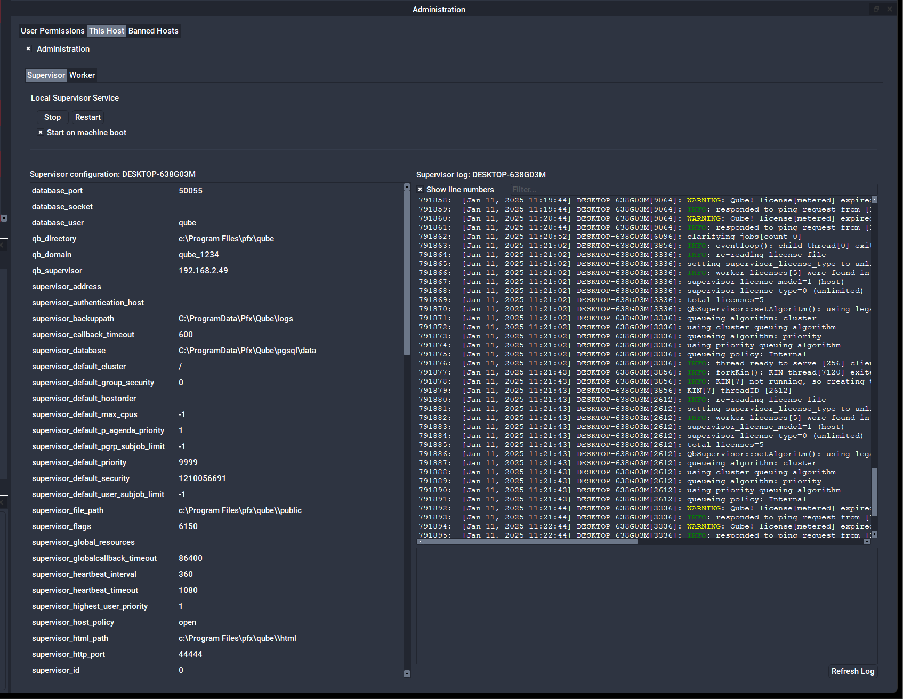

# Determining the Supervisor Configuration

Type the following in a command prompt to output the Supervisor's configuration information:

```
% qbadmin supervisor --configuration
```

Alternatively, you can display the configuration via QubeUI Administration panel by selecting the "This Host" tab, checking "Adminstration" ans selecting the Supervisor tab.


