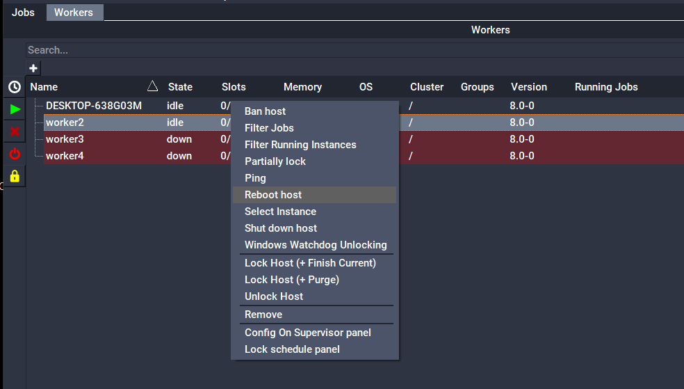

# Remote Reboot or Shutdown

Administrators are allowed the ability to reboot or shutdown hosts controlled by the farm remotely through the qbadmin command line or through QubeUI. To use this feature which you must have Qube! administrative privileges.

:::note
Keep in mind that shutting down a host will require an administrator to physically power it back on.
:::

## Command line
### Remote reboot of a Worker

```
% qbadmin worker --reboot <worker>
```

Where _worker_ is a Worker hostname or IP address.

### Remote shutdown of a Worker

```
% qbadmin worker --shutdown <workerhost>
```

## QubeUI

When right-clicking on a worker or selection of workers in the Workers tab you have the options to "Reboot host" or "Shut down host". 



