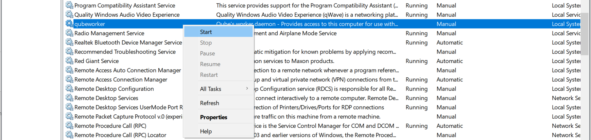

# Restarting the Worker

## Linux
```
$ sudo /usr/bin/systemctl restart worker
```

Or,

```
$ sudo /sbin/service worker restart

```

## macOS
```
$ sudo launchctl stop com.pipelinefx.worker
$ sudo launchctl start com.pipelinefx.worker
```

## Windows
Administrative Tools:

       Click on the Services icon in the Administrative Tools section of the Windows Control Panel. Then select the qubeworker service and right click to select Restart from the menu.



Command line - From a command prompt:

```
C:\> sc stop qubeworker
C:\> sc start qubeworker
```
