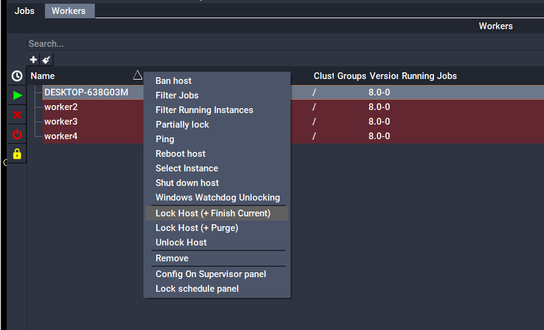

# Worker Locking

When you don't have a dedicated compute farm, it is often necessary to put user's machines into part-time service. So, for example, the hosts might be available for computing at night, but not during the day. It can be quite inconvenient to start and stop the Qube! Worker every day. It would be better if there were a way to simply tag Workers as available or not, depending upon the circumstances.

Qube! manages this tagging through a system of "locks" that effectively control the number of available subjob slots on any Worker host. Closing out one or more subjob slots is called "locking." This is controllable from either the QubeUI or by command-line calls to qblock and qbunlock.

## Locking/Unlocking with QubeUI
In QubeUI, the Host Layout provides locking/unlocking capabilities for the Workers. Right-click on a Worker or Workers and then select one of the following:

* **Lock Host (+ Finish Current):** Locks all Worker process slots and allows running work to reach a done state
* **Lock Host (+ Purge):** Locks all Worker process slots and kills currently running work
* **Unlock Host:** Unlocks all Worker process slots
* **Windows Watchdog Unlocking:** Automatically lock and unlock the Worker based on interactive computer use [Windows only]
* **Lock schedule panel:** Opens the "Lock Schedule" panel which provides a weekly calendar to set times that the Worker(s) should be locked or unlocked



## Locking/Unlocking with the command-line utilities
qblock and qbunlock can be used to lock and unlock one or more slots on the specified host(s):

```
qblock host [host,...]
qbunlock host [host,...]
```

where host is a list of one more host names.

The --all flag can be used in place of the hostname.  When using the --all flag, only hosts which match the other criteria are operated upon: 

```
qblock --all
qblock --cluster /myCluster --all
qbunlock --active --all 
```

By default, qblock locks out all of the subjob slots on the host, but you can also quantify the number of slots to lock or unlock:

```
qblock --range rangespec host
```

where rangespec is either a slot number, a comma-delimited list of slots, a range or some combination.

Example
```
% qblock myhost
% qblock --range 0, 1 sb005
```

## See Also
For more information see the qblock and qbunlock sections in the Command Line Reference section of the Qube! Render Wrangler's Guide or using the "--help" option to qblock/qbunlock.
