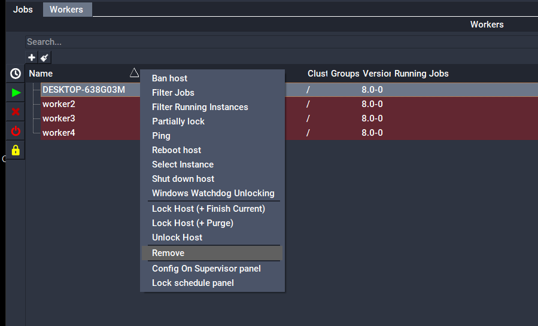
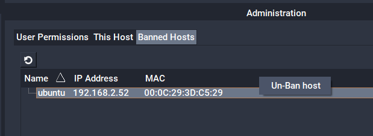

# Worker Removal

Administrators may want to permanently remove a host from the farm. This is normally required if the host is no longer being used as a Worker, or no longer exists.

Removing a Worker host places it in a list of banned hosts and the Supervisor will no longer track the host, even if auto-discovery would normally register such a host with the Supervisor.

:::warning
A banned worker will be unable to re-register with the supervisor until its ban has been cleared.
:::

## Worker Removal

### With QubeUI:


### Command-line:
% qbadmin worker --remove worker_host
Where worker_host is the hostname or IP address of a Worker.

## Clearing the ban on a worker
Qube! administrators may clear previously banned hosts so that they will be able to re-register with the Supervisor.

### With QubeUI:


### Command-line:
Clearing a single host from the banned list
```
% qbadmin worker --unremove <macaddress>
```
Where _macaddress_ is the hardware address of a Worker.

Clearing all of the banned hosts
```
% qbadmin worker --clearbanned
```
:::note
Once you clear the ban on a previously removed worker, you should just have to re-start the Worker service, at which point it will re-attempt to register with the supervisor.
:::
