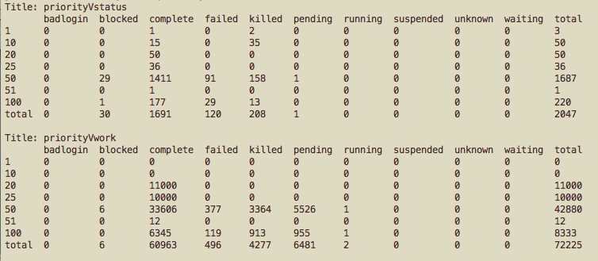
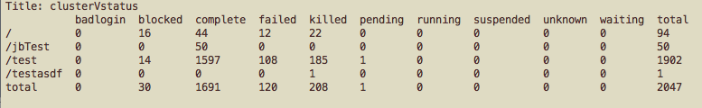
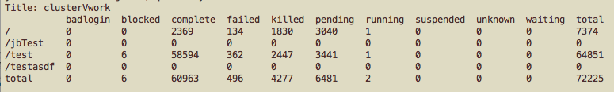
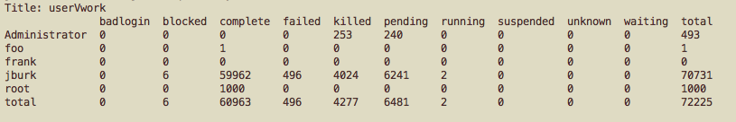

<!--
For an unknown reason Docusaurus balks at the filename qbsummary.md, but qbsummary+.md works fine.
-->

# qbsummary

## Description
qbsummary obtains a quick summary of the farm's status. By default, qbsummary shows the breakdown of subjobs at each priority level (--pvs)

## Usage 
qbsummary [options]

## Options
| Option | Description |
| ---    | ---         |
| --clusters | Cluster list |
| --long | Detailed long format |
| --width int | Set column width to int characters (default: 3) |
| --pvs | Priority Vs. Subjob Status |
| --cvs | Cluster Vs. Subjob Status |
| --uvs | User Vs. Subjob Status |
| --gvs | Group Vs. Subjob Status |
| --cpvs | Cluster/Priority Vs. Subjob Status |
| --rvs | Reservation Vs. Subjob Status |
| --avs | Account Vs. Subjob Status |
| --tvs | Type Vs. Subjob Status |
| --pvw | Priority Vs. Work Status |
| --cvw | Cluster Vs. Work Status |
| --uvw | User Vs. Work Status |
| --gvw | Group Vs. Work Status |
| --cpvw | Cluster/Priority Vs. Work Status |
| --rvw | Reservation Vs. Work Status |
| --avw | Account Vs. Work Status |
| --tvw | Type Vs. Work Status |
| --help | Command help |
| --version | Command version |

## Notes

## Examples

Breakdown by priority, for both job instances and agenda items (usually
frames, sometimes referred to as "work"):

kmac$ qbsummary -l

Breakdown by cluster and job instances:

kmakmac$ qbsummary -cvs -l

Breakdown by cluster and work (frame) counts: **Note**: you can
have blocked frames, with no blocked job instances.

kmac$ qbsummary -cvw -l

Breakdown by user and work (frame) counts:

kmac$ qbsummary --uvw -l

## See also
