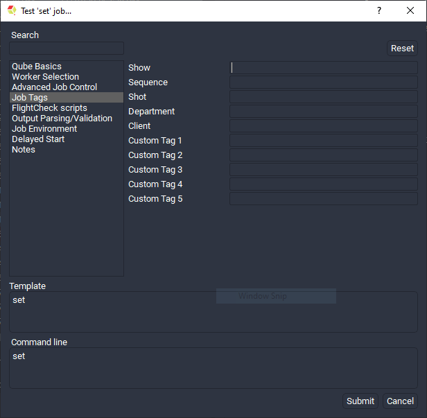
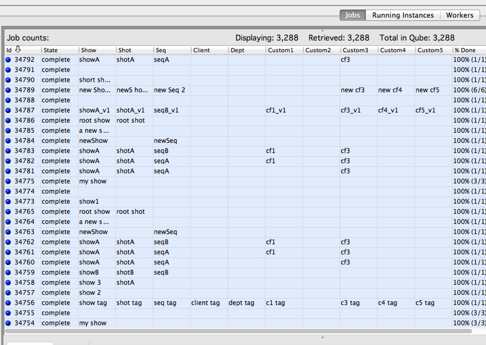
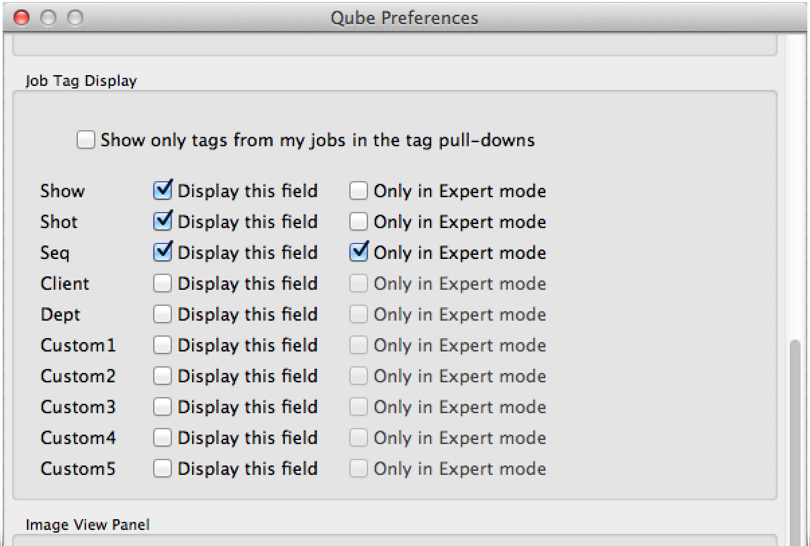
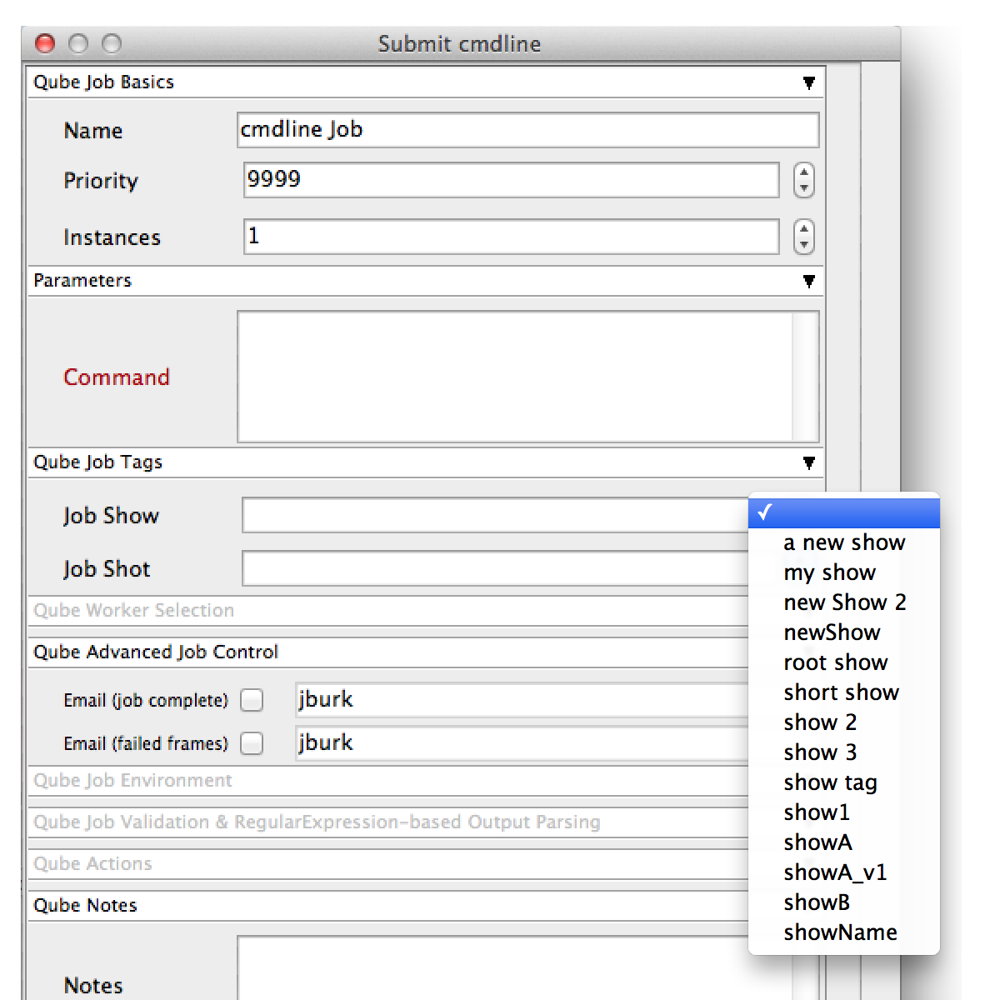

# Job Tags

## What are they and why would we use them?

Job tags allow you to "tag" your job with any combination of a Show,
Shot, Sequence, or Department name, a client code, or 5 other
"generic" fields for easier search, sorting, and cost reporting.

<!--
These tags will be available in the WranglerView job submission UIs,
and in the "Job" and "Running Instances" panes. They are not available
for jobs submitted from ArtistView, though they can be viewed as
columns in the job view there.
-->

## Basics

### Stock Tag Names

Five tags are named after common ways that studios manage their
projects:

1.  show
2.  shot
3.  seq (sequence)
4.  client
5.  dept

### Generic Tag Names

Five more are 'generic' names for those customers whose needs are not
met by 1 or more of the 5 "stock" fields. These will appear in the 
QubeUI as:

1.  Custom1
2.  Custom2
3.  Custom3
4.  Custom4
5.  Custom5

:::info

If your site elects to use the generic fields, you should ensure that
you use them consistently. If, for example, you have a "category"
value, and you decide you want your Custom1 field to store your Category
values, do not use the Custom1 field for anything else. Also do not
store the Category values in any other of the custom fields. If you do
erroneously enter a value into an incorrect field, you can always
"modify" the job at a later date to fix this.

:::

Future versions of Qube! will allow for an alternate name to be
displayed for these "generic" fields.

## Tags and Job Submission



<!--



## Tags and Job Submission

Tag fields can be displayed or suppressed in the job submission UI's by
settings in the WranglerView user preferences:



If the "Only in Expert Mode" field is checked, then the tag field will
normally be hidden, but can be exposed by ticking the "Expert mode"
checkbox at the bottom of the submission UI.

### Tag fields pull-down lists are auto-populated

The tag fields in the submission UI's can be manually filled in, or the
user can select from a list of values that already exist in the Qube job
database. Manually entering a new value and then submitting the job
will automatically enable that new tag name to be displayed in your and
other users' pull-down lists.

For those sites with a large number of tags for a given field (hundreds
of shots for example), the "Show only tags from my jobs" checkbox in
the Tags preferences can be used to filter down the size of the
pull-down list.



-->

## Tags and the Qube! API

The tags are attributes at the top level of the job object, and are all
prefaced with `prod_`.

-   `prod_show`

-   `prod_shot`

-   `prod_seq`

-   `prod_client`

-   `prod_dept`

-   `prod_custom1`

-   `prod_custom2`

-   `prod_custom3`

-   `prod_custom4`

-   `prod_custom5`

They are accessible as top-level keys in the job dictionary as:

`job['prod_show'],``` `job['prod_seq']`, etc...
