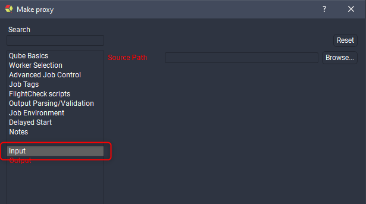
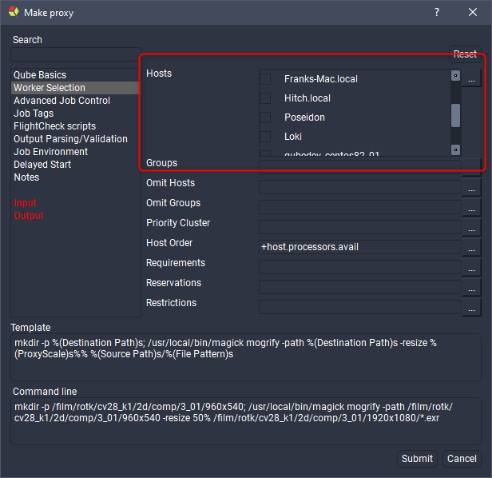

# Submission Interfaces

Like the menu and panel plugin types, the submission plugins are written in
[Python 3](https://www.python.org). Each submission plugin is executed
directly by the plugin system so, for example, you can use Python to automate
the building of parameters, pre-fill default values, or adapt to changes the
user makes.

## Creating a Submission Plugin

The best place to start when creating a new submission plugin is to copy an
existing one that's closest to what you intend to make. For the purposes of
this documentation we'll start from scratch and create a new plugin for making
proxy images using [imagemagick](http://www.imagemagick.org).

The process is as follows:

1. Add the submission type.
2. Add a new page for the input path field.
3. Add parameters.
4. Override defaults for fields in the Qube Basics page.
5. Set the command template.

### 1. Add the submission type

The first thing to do is tell the UI we're adding a new submission plugin, we
do this by calling the built-in function _add_submission_type()_. For this
example we use the following parameters:

```py
# Create a new submission type
add_submission_type('Make proxy',
                    short_name='Make Proxy',
                    type="makeProxy",
                    has_range=False,
                    can_batch=False,
                    thread_control='all',
                    prototype="cmdline",
                    group="Pipeline")
```

Argument| Type| Default| Comment  
---|---|---|---  
type| string|  | The type identifier for this submission plugin. The type identifier is used, among other reasons, to determine a job's submission type which allows the UI to open the correct submission dialog upon job resubmission.  
prototype| string| cmdline| The Qube! submission prototype.  
short_name| string|  | An alternative, shorter name for the submission plugin type, used when UI space is tight.  
has_range| boolean| False| Whether the plugin should display range related fields in the Qube Basics page.  
thread_control| string|  | An empty string or "false" hides the Threads per instance and Instances use all cores fields from the Qube Basics page. Any other value that is not "all" will hide the Instances use all cores field only.  
can_pad_frames| boolean| False| A value of True will include a Frame Padding field in the Qube Basics page.  
can_batch| boolean| False| Allows generation of partitions or chunks in the submitted job.  
pre_show_validate| Python function| on_pre_show_validate| This Python function is called before pre_dialog and should return a boolean that determines whether the submission dialog should be shown.  
pre_dialog| Python function| on_pre_dialog| This Python function is called immediately before the submission dialog is shown.  
post_dialog| Python function| on_post_dialog| This Python function is called after the job is created and the submission dialog is closed but before submission.  
post_submit| Python function| on_post_submit| This Python function is called after the job is submitted.  
install| Python function| install| This Python function is called when selecting the corresponding menu item in the File->Install App UI menu.  
  
### 2. Add a new page for the input path field

Use pages to group related fields together. We add pages by calling
`add_page()` with a single argument, the page's name.



### 3. Add parameters

After you add a page it becomes current, every field that follows is added to
that page until you add a new one. We'll add a Source Path field using
add_field().

A description of all supported field types and their arguments is included at
the end of this page so we'll just go over the arguments used in this example
here. The first argument is always the name of the parameter and is generally
shown along side the parameter in the submission dialog. The _type_ argument
is optional but recommended, it explicitly specifies what kind of parameter
this is, such as a text field, a list or in this case a directory path (if we
wanted a file path we'd use 'filename' as the parameter type). The 
_required_ argument, when True, stops the user from submitting their job
until the parameter has a valid value in the submission dialog. The 
_destination_ argument tells the UI to store the value of the parameter in
the submitted Qube! job in the specified position, in our example we store the
_Source Path_ in the job package. After submitting the job we can retrieve
the value like this:

You can also view it in the _Job Package_ section of the _Job Internals_
panel inside Qube! UI.

Let's keep going and make a parameter for the output path.

First we make a new page for our output parameters. The _Destination Path_
parameter is nearly identical to our _Source Path_ parameter so we skip
explaining it and move on.

We now add a parameter to specify the scale of the proxy as a percentage, this
parameter is also required but since it also has a default (50%) we don't need
to fill it manually, as long as we're happy with a 50% proxy that is. Notice
that we haven't specified the parameter type, the UI infers that this is a
integer spin box from the fact that we have _min_ / _max_ arguments and
their values are integers. If no type can be inferred by the arguments the UI
will use a single line text filed ( _string_ type), this would have been the
case for our source/destination path parameters if we hadn't explicitly set
the type to _path_.


Our last field is a simple single line text field that allows the user to
specify a file glob for the images to be resized, we set it's default to 
_*.exr_.

### 4. Override defaults for fields in the Qube Basics page

For our proxy submission type we only want a single worker processing the
images so we need to override some preexisting values controlling this.

To set existing fields we use their page and parameter names and pass in a new
value. Note that both page and parameter names are case sensitive.

### 5. Set the command template.

The command template is where we specify the commands to be run on a Qube!
worker during job execution. Firstly, for those new to Python you can create a
string variable like this:

The command template works in the same way, where the parameter names act as
the keys to the dictionary. In our example command template we make a new
directory and then run _magick_ to resize the images.

## Supported Parameter types

### Common arguments

Argument| Python Type| Default| Comment  
---|---|---|---  
name| str|  | The name of the parameter is used both as the label next to the parameter in the submission dialog and to refer to it elsewhere in the plugin. The name argument is required.  
type| str| string| The type of parameter, can be one of (bool, int, float, string, text, path, filename, list, combo, combo_file, combo_path, table, datetime, selectorString).  
required| bool| False| Whether the parameter must be set with a valid value before submission.  
destination| str|  | Where to store the value in the job, for example _package.mayaExecutable_.  
arg| str|  | The command line argument associated with the parameter.  
default| Parameter type specific|  | A pre-filled value.  
enabled| bool| True| Whether the value is editable or grayed out.  
quote| bool| False| Whether the value of the parameter should be surrounded by double quotes.  
set_on_resubmit| bool| True| When resubmitting a job the parameter's value is set to that of the value of the job being resubmitted.  
separator| str| ,| When a parameter has several values such as list selections this string is used as the separator.  
arg_value_separator| str| [a single space]| The string used to separate the parameter's _arg_ with its value. For example if the command line argument needs to be in the form _myArg=myValue_ the _arg_value_separator_ should be _=_.  
suppress_path_conversion| N/A| N/A| If this argument is set then the value (if it's a _path_ or _filename_ parameter) will **not** be surrounded by QB_CONVERT_PATH().  
on_change| Python function taking 0 arguments|  | The given function is called whenever the value of this parameter or any parameters in it's watch_list change.  
watch_list| list of str|  | A list of references to other parameters in this plugin. The page name and parameter names are separated by two colons, for example ["Qube Basics::Threads per instance", "Qube Basics::Instances use all cores"].  
  
### string

A simple single line text field.

Argument| Python Type| Default| Comment  
---|---|---|---  
editable| bool| True | Whether the user can change the value of the parameter.  
  
### text

A multi line text field.

### bool

A checkbox.

Argument| Python Type| Default| Comment  
---|---|---|---  
 bool_map_true| str | True |  The string value used for the parameter's value when the checkbox is checked. For example you can set this to things like _on_ , _1_ , _yes_ , etc.  
bool_map_false| str| False| The string value used for the parameter's value when the checkbox is unchecked. For example you can set this to things like _off_ , _0_ , _no_ , etc.  
  
### int

A integer spinbox.

Argument| Python Type| Default| Comment  
---|---|---|---  
 min| int | -2147483648 | The minimum value for the spinbox.   
max| int| 2147483647| The maximum value for the spinbox.  
  
### float

A floating point spinbox.

Argument| Python Type| Default| Comment  
---|---|---|---  
min| float| -1.79769e+308| The minimum value for the spinbox.  
max| float| 1.79769e+308| The maximum value for the spinbox.  
  
### combo

A drop down menu, allows for a single selection from a list of items.

Argument| Python Type| Default| Comment  
---|---|---|---  
items| list of str|  | The list of available choices in the combo.  
editable| bool| False| If True, the user can type in a custom value. If False, the user can only choose from the given items.  
  
### path

A single line text field with a browse button that opens a file dialog to
select a directory path.

Argument| Python Type| Default| Comment  
---|---|---|---  
use_native_separators| bool| False| If True, the path will use platform specific directory separators, ie / on Linux and macOS, \ on Windows.  
  
### combo_path

The same as the path parameter type but also allows for selection of paths
from a _combo_.

Argument| Python Type| Default| Comment  
---|---|---|---  
use_native_separators| bool| False| If True, the path will use platform specific directory separators, ie / on Linux and macOS, \ on Windows. If False / is used on all platforms.  
items| list of str|  | A list of paths to show in the combo.  
  
### filename

A single line text field with a browse button that opens a file dialog to
select a file path.

Argument| Python Type| Default| Comment  
---|---|---|---  
use_native_separators| bool| False| If True, the path will use platform specific directory separators, ie / on Linux and macOS, \ on Windows. If False / is used on all platforms.  
  
### combo_file

The same as the filename parameter type but also allows for selection of file
paths from a  _combo_.

Argument| Python Type| Default| Comment  
---|---|---|---  
use_native_separators| bool| False| If True, the path will use platform specific directory separators, ie / on Linux and macOS, \ on Windows. If False / is used on all platforms.  
items| list of str|  | A list of paths to show in the combo.  
  
### list

A list box where the user can select either a single or multiple values.

Argument| Python Type| Default| Comment  
---|---|---|---  
items| list of str|  | The items to display in the list.  
multi_select| bool| True| Whether the user can select multiple items in the list, or just one.  
  
### table

A table of values of given dimensions that the user can enter values.

Argument| Python Type| Default| Comment  
---|---|---|---  
dimension| (int, int)| (0, 2)| The initial number of rows and columns in the table.  
  
### datetime

A date and time selection parameter.

### selectorString

A _selectorString_ parameter uses a Python function to generate a list of
strings, take this example from the _Worker Selection_ page (found in
_python/99_qube_parameters.py_ in the standard plugin path on your system).

Here we create a Python function that takes no arguments and returns a list.
We use the Qube! Python API module _qb_ to find all Qube! workers and return
that. Here's how that looks on my Qube! network after clicking the
corresponding ... button.





Argument| Python Type| Default| Comment  
---|---|---|---  
opttype| str|  | If the opttype is radio the selectorString will use radio buttons instead of checkboxes, meaning that only a single value can be selected.  
selector| Python function taking 0 arguments and returning a list of str|  | A Python function that returns the list of items to use in the selector.  
  
