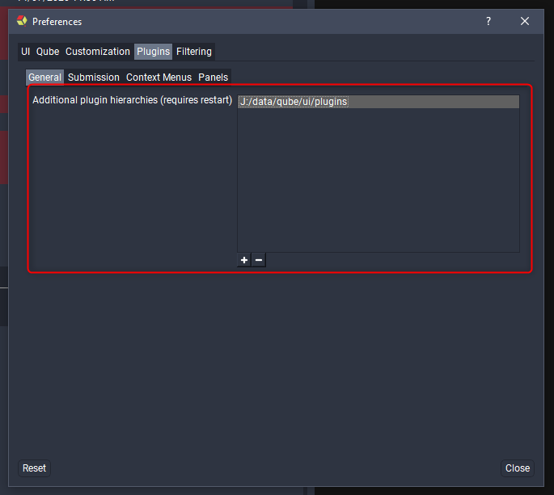

# Customizing the Qube UI

The Qube UI plugin system uses the [Python 3](https://www.python.org) language
to define new menus, panels, and submission interfaces. Custom themes are
written in a modified [QSS](https://doc.qt.io/qt-5/stylesheet-syntax.html)
format. Internally, the Qube! UI uses [PythonQt
](https://mevislab.github.io/pythonqt)to interface with Python 3, this is
exposed to the Python 3 based plugins, the entire suite of
[Qt](https://www.qt.io) is available.

Plugin files are generally found inside the Qube! UI application directory but
you can also add your own paths in the UI preferences.

Beneath each plugin directory there is a hierarchy of folders that define the
plugin type and menu structure (where applicable). For example the following
directory structure:

## Supported Plugin Types

* [Submission Interface Plugins](./Submission+Interfaces)
* [Context Menus](./Context+Menus)
* [Panels](./Panels)

