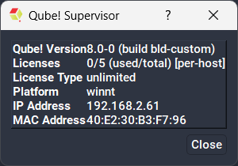

# How to obtain your MAC Address / HOST id

**Hostid (the MAC address of your supervisor):**

The ethernet MAC address of your supervisor is necessary in order to cut
keys for Qube! versions 6.0 and onwards. See
[MAC_address](http://en.wikipedia.org/wiki/MAC_address)
for more info about MAC addresses.

If you are already running a Qube! supervisor and QubeUI, you can find the MAC
address with QubeUI->Administration->Ping Supervisor.

  
If you're unable to use the UI, you can also look for the following line in
the supervisor's supelog, printing just as the service starts booting, to find
out which one it's using:

` INFO: mac address: 00:50:56:C0:00:08`

Or you can determine the MAC address via the operating system's command-line
utilities.

* Linux and macOS:   
`/sbin/ifconfig`

* Windows:   
`ipconfig /all`

