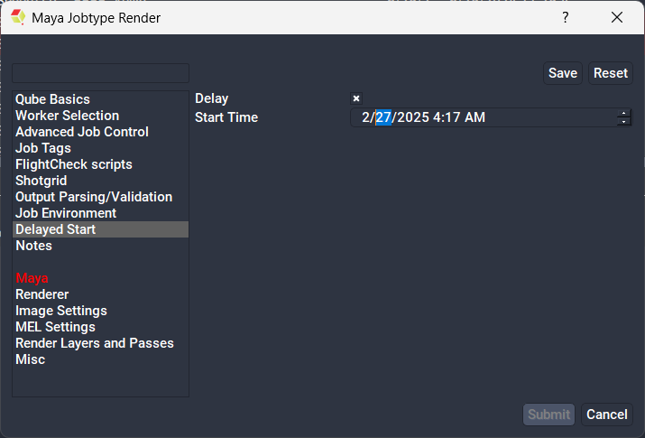

# How to submit a job that will wait until later to run

It is possible to submit a job that will remain in a "blocked" state until a
certain time on a specific day, at which time it will then automatically go
into a "pending" state and be the next job dispatched to the farm

## With QubeUI




## With the Python API

This in an example of how to submit a job that will start at a later time. 

Lines of interest are:

* line 14, where the start time is set
* line 28, where the trigger condition is set 

```py title="Submit a job that will run in 1 hour" showLineNumbers
#!/usr/bin/env python
 
import sys
import os
import time
 
sys.path.append(os.environ['QBDIR'])
import qb
 
task = []
agenda = qb.genframes('1-2')
 
now = int(time.time())
later = now + 3600 - qb.QB_TIME_EPOCH_OFFSET
 
job = {
    'prototype': 'cmdrange',
    'name': 'wait time test',
    'status': 'blocked',
    'package': {'cmdline': 'sleep 30'},
    'agenda': agenda,
    'callbacks': [],
    'hosts': 'rhel52-64,rhel53-64,rhel54-64'
}
 
cb = {
    'language': 'qube',
    'triggers': 'dummy-time-self-%d' % later,
    'code': 'unblock-self'
}
 
job['callbacks'].append(cb)
 
task.append(job)
 
submitted = qb.submit(task)
 
for job in submitted:
    print('submitted job %(id)s: %(name)s' % job)
```

