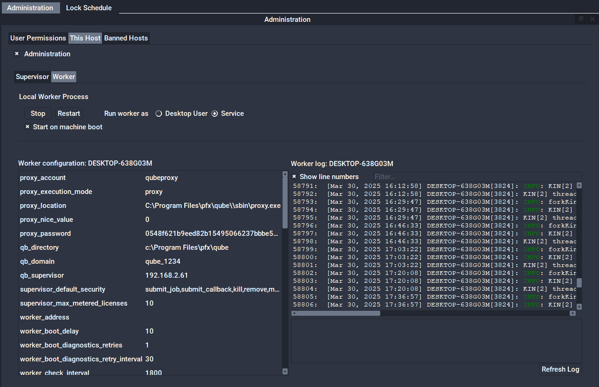

# How to switch a worker from Service mode to Desktop User mode

## Stop the worker service and disable it from auto-starting

While logged in as an admin-equivalent user (or in **Windows** , start QubeUI
with **"Run as Administrator"**), select:

* **QubeUI-->Administration Panel->Worker Tab-->Stop**
* **QubeUI-->Administration Panel-->Worker Tab-->Uncheck "Start on Machine boot"**

Verify that the Admin menu items have updated to show the worker as stopped
and will not autostart.

## Start the worker as the desktop user

Log in as the user who will run the worker process, the existing proxy user
will serve. 

(The **default** proxy user is **qubeproxy** , the password is `Pip3lin3P@$$wd
)`

* **QubeUI-->Administration Panel-->Worker Tab-->Desktop User**.

## Set the Desktop User mode worker to auto-start when this user logs in

* **QubeUI-->Admin-->Autostart Worker-->Enable Desktop Worker (on user login)**

**macOS:** This will also create a
**~/Library/LaunchAgents/com.pipelinefx.DesktopWorker.plist**  file.

**Windows** : This will create a **"DesktopWorker"** shortcut in
**Start-Programs-->_userName_-->Startup**.

:::danger[Windows only - avoid crashing the worker / proxy process]
Desktop Worker mode on Windows versions Vista and later also requires that all
jobs have the **disable_windows_job_object**  [job
flag](/knowledge-base/Job+Flags) set, otherwise the proxy.exe process may crash
when a job is started on the worker.

On the supervisor, add this flag to the
[supervisor_job_flags](/administrators-guide/configuration-parameter-reference/supervisor_job_flags) to enable this on
a global scale. The easiest way to do this is with **QubeUI-
>Administration->Configure** from the supervisor.

Symptoms of a crashed proxy process is the worker is shown as running the job,
but the job never actually gets marked as 'running'
:::

