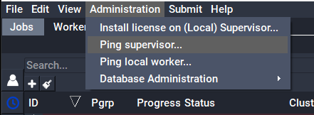

# How to troubleshoot licensing issues

Qube! licenses are node-locked, and are tied to the "hostid" value in the
license file, which is the MAC address of your supervisor.  If your license is
not installed correctly or has the wrong hostid, Qube! will show as having no 
licenses installed.  
  
You can check that your licenses are installed and working in the UI or from
the command-line.   
  
The command utility "qbping" displays the license count and MAC address:

```
>qbping  
supervisor - active - tag: 192.168.2.10 00:59:7A:3B:F6:79 7.5-2a bld-custom
linux -  - host - 0/5 unlimited licenses (metered=0/-1) - mode=0 (0).
```  
  
In the UI, the license count shows in the title bar of the UI, but will not
update on machine other than the supervisor if you've just installed a new
license. 

The best way to use the UI to check the license count and MAC is with
`QubeUI->Admin->Ping supervisor`, which will display the information in a
dialogue box:




  
If you find that you only have two licenses available, check that your
license's hostid matches your supervisor's MAC address, and that the qb.lic
license file is installed in the correct location

* Linux & macOS   
`/etc/qb.lic`

* Windows   
`C:\ProgramData\Pfx\qube\qb.lic`

Also ensure that the qb.lic file is saved in plaintext format, and has not
extra characters that were not part of the original license string.


