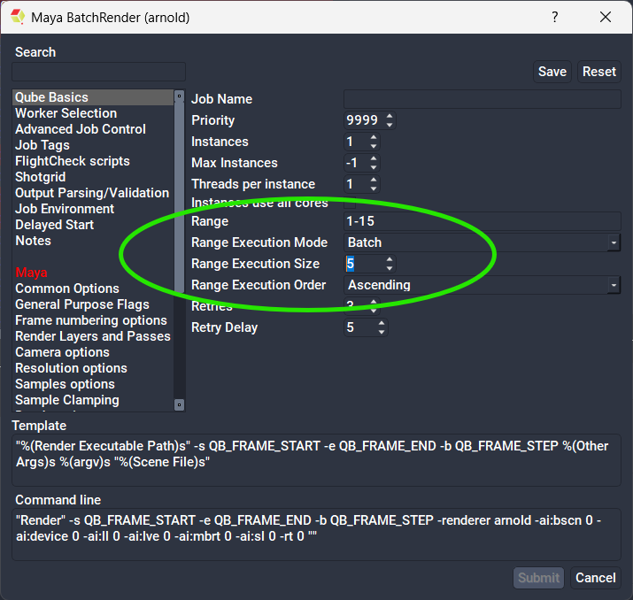

# How to use frame chunking in the submission UI

## What are frame chunks, and how to use them?

One of the best things about Qube! is Dynamic Allocation, which reduces
application startup and scene load overhead to the absolute minimum while
automatically load balancing the work to be done across different speed workers.
With Dynamic Allocation, the application is only started once on each worker for
the duration of the job, and work is sent "on demand" in the smallest units
possible.
 
But some applications do not support Dynamic Allocation, and instead must be
started each time they are sent work to be performed. When the application
startup and scene load time can contribute significantly to the processing time
of a single piece of work, it becomes advantageous to send more than 1 piece of
work to be processed each time the application is started. This is a "chunk of
frames".

## Setting the frame chunk size 

Chunk size can vary from a single piece of work up to the entire range of work
to be processed. You can specify the size of the chunks at submission time,
but it can't be changed after the job is submitted.

Qube! will default to submitting a job with a "piece of work" for each frame; a
100-frame render shows 100 separate items in the work list. You can also think
of this as having a chunk size of 1.

To set the chunk size to something greater than 1, you can set Range Execution
Mode to "Batch" and the Range Execution Size (chunk size) to n frames. The
screen shot here shows setting a Range of 1-15 frames and a Range Execution Size
of 5 frames:

## Choosing a chunk size is always a compromise

There are efficiencies to be gained by going to a larger chunk size, but there
are trade-offs

Qube! can shuttle jobs on and off workers to make room for higher priority jobs,
but the only time a job can be "preempted" in this way is when a chunk is
completed and the worker requests another chunk. If the chunks are too large,
the opportunities for preemption come too few and far between, and it can take
a long time for a higher priority job to get started.
 
Also, only the entire chunk can be retried when a single piece of work inside
the chunk has to be re-processed. This may result in the re-processing of too
many pieces of work.

## Selecting a chunk size

The trick is to pick a chunk size this is large enough to be of benefit, but
small enough to still provide some flexibility. A hint to choosing an
appropriate chunk size can be gleaned by comparing the length of time it takes
to process a single unit of work is compared to the startup overhead.
 
When the startup overhead is unknown, it can be discovered by experimentation.

1. submit a job with a chunk size of 1 and note the average to process those
single pieces of work.
2. submit another job which processes the same work, but with a chunk size of 5,
noting the time to process the larger chunks.
 
If the 5-unit chunk takes the roughly same amount of time to process as the
1-unit chunk, you have an idea that the startup overhead comprises most of the
time to process the 1-unit chunk. Keep increasing the chunk size until the
processing time is 5-10 times the startup overhead, or 3-5 minutes, whichever
is less.
 
If the 5-unit chunk takes roughly 5 times longer than the the 1-unit chunk, then
you have determined that the processing time greatly exceeds the startup overhead.
 
In this case, you should submit with a chunk size of 1 when the combined startup
overhead and processing time exceeds 30 seconds or so.
 
If the combined time is less than 30 seconds, you should build chunks large
enough so that no chunk runs faster than 30s. This will ensure that you process
work quickly, without overloading the supervisor by asking it to dispatch too
many items in a short time frame. Imagine running 1s frames across 25 8-core
workers; you would be asking the supervisor to dispatch 200 pieces of work
every second, while updating the results from the other 200 that just finished.
While Qube! is capable of handling the highest loads in demanding environments,
some simple decisions when building jobs can help keep everything running smoothly.

