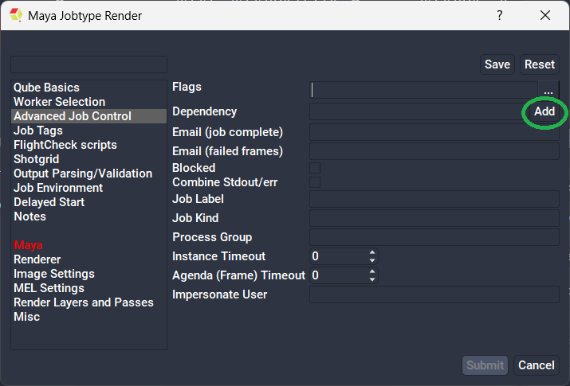
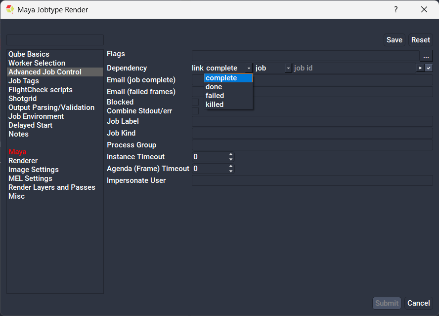

# How to use job dependancies through the submission UI

## Using Dependencies

A simple walk through of frame dependencies with Qube!

Say you're creating a multi-pass render, and, for reasons of efficiency in
your pipeline, you decide that each pass will run in its own job. When all
of the passes are complete, you want to comp the passes together for the final
image sequence for delivery to the client or to review in dailies. 

To efficiently and automatically achieve this task, Qube! offers the concept
of dependencies. By using dependencies, you can tell Qube! that a particular
job must wait for something in another job to complete before it starts. 
Unlike some other queueing systems that may only have job-based dependencies,
with Qube!, you can set dependencies on entire jobs, on subjobs, or on
individual frames. 

Let's look at our example again. Assuming all of the passes are in the queue
and rendering, create a project/script file for your favorite compositing
package that is set to read where those files *will* be when they are complete
& then composites the images together as you see fit. Now you can submit
that job, even though there may be no frames yet available to the compositing
package, as long as you submit with dependencies.

In the submission dialog, under "Advanced Job Control," there exists a
"Dependency" field with an "Add" button next to. 

**Clicking the Add button brings up the following dialog:**

 

Being that we have multiple passes/jobs that must complete before our comp
has all the parts for each frame, we can set a second dependency by simply
clicking the "Add" button again, and choosing a different jobid. Continue
until you've set dependencies for each of the jobs upon which we must wait. 
After all our dependencies are set, submit this job.

What happens now is this: When any one frame finishes on ALL of the jobs
upon which we are dependent, we will render just that one frame in this [comp]
job. This will continue for each and every frame until all jobs and frames
are complete. The order in which the frames and/or jobs complete does not
matter, Qube! will know that it can only run a frame through the comp job when
all of the other jobs have finished that same frame.

Of course, we could have set the comp job to just be dependent on one other
job rather than many. The same rules apply. We could have also made the
dependency "link-complete-job-645" which has told Qube! to wait for the entire
job to complete (rather than any one frame) before it started this job.

:::tip
Job dependencies can be a very powerful tool - useful for a variety of tasks:
compositing, watermarking, facility file transfer, web publishing,
transcoding... the list goes on.
:::

