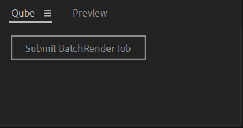

# How to add a Qube! Button to After Effects

In addition to the "File > Scripts > Qube! submit" method you can have a dock-able submit button as seen below.



To install simply put the Qube!.jsx file in the \Scripts\ScriptUI Panels\ folder in your After Effects application directory.

You can then toggle the panel from Window > Qube! in After Effects.

```jsx
{    
     function BuildAndShowUI(thisObj)
     {
       // Create and show a floating palette.
       var my_palette = (thisObj instanceof Panel) ? thisObj : new Window("palette", "", undefined, {resizeable:true});
       if (my_palette != null)
       {           
          var folderLocIcon = new Folder((new File($.fileName)).path)
          var QubeIcon= new Folder(folderLocIcon.parent)
          var QubeIconLoc = new File(QubeIcon.fsName + "/Qube.png")
          var res =
               "group { \
                  orientation:'column', alignment:['fill','top'], alignChildren:['left','top'], spacing:5, margins:[0,0,0,0], \
                           button1: Button { text:'Qube_Submit', maximumSize:[170,40], alignment:['left','top'] }, \
                           button2: Button { text:'Qube_Submit_RenderQueue', maximumSize:[170,40], alignment:['left','top'] }, \
                           optsRow: Group { \
                     orientation:'row',\
                  }, \
               }";
            
            my_palette.margins = [10,10,10,10];
            my_palette.grp = my_palette.add(res);
         my_palette.layout.layout(true);
         my_palette.layout.resize();
         my_palette.onResizing = my_palette.onResize = function () {this.layout.resize();}
          
         my_palette.grp.button1.onClick = script1fn;
         my_palette.grp.button2.onClick = script2fn;
       }
       return my_palette;
     }
   function script1fn()
   {   
     var folderLoc1 = new Folder((new File($.fileName)).path)
     var QubeScript1 = new Folder(folderLoc1.parent)
     var scriptFile = new File(QubeScript1.fsName + "/Qube_Submit_aerender.jsx");
                    if (scriptFile.exists)
                    {
                        scriptFile.open("r");
                        var scriptContent = scriptFile.read();
                        scriptFile.close();
                        eval(scriptContent);
                    }
                    else
                        alert("Qube Render Script not found please check for /Scripts/Qube_Submit_aerenderRender.jsx");
   }
    function script2fn()
   {
     var folderLoc2 = new Folder((new File($.fileName)).path)
     var QubeScript2 = new Folder(folderLoc2.parent)
     var scriptFile2 = new File(QubeScript2.fsName + "/Qube_Submit_aerender_RenderQueue.jsx");
                    if (scriptFile2.exists)
                    {
                        scriptFile2.open("r");
                        var scriptContent2 = scriptFile2.read();
                        scriptFile2.close();
                        eval(scriptContent2);
                    }
                    else
                        alert("Qube Render Script not found please check for /Scripts/Qube_Submit_aerender_RenderQueue.jsx");
   }
// The Main Script
      var my_palette = BuildAndShowUI(this);
      if (my_palette != null) {
         if (my_palette instanceof Window) {
            my_palette.center();
            my_palette.show();
         } else {
            my_palette.layout.layout(true);
         }
      } else {
         alert("Could not open the user interface.", scriptName);
      }
   
    
}

```
