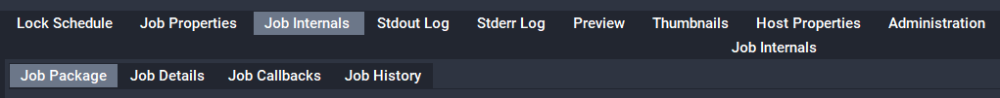
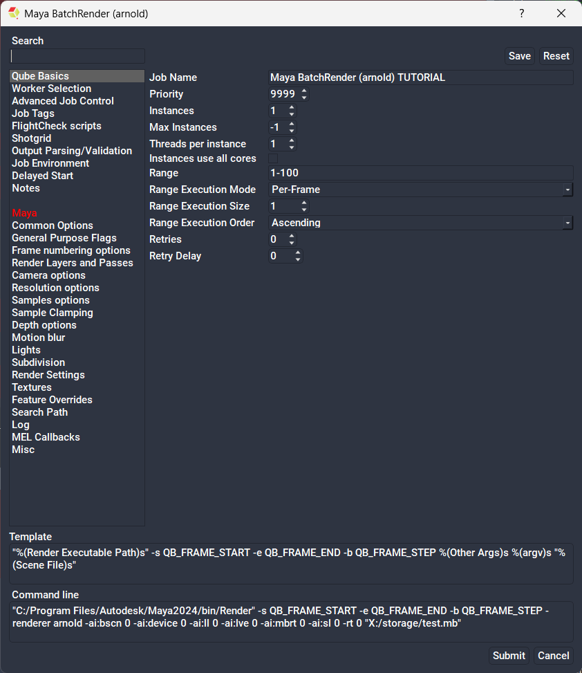
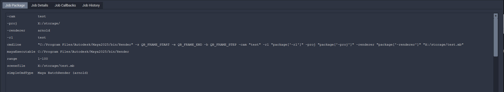

# Basic Python job submission - SimpleCmd Compatibility and Application Specific Parameters

Next, we will learn how to populate a job dictionary keeping the UI in mind.  Doing so will allow the job to be resubmitted through the UI.

In order to understand how to create a job that will properly populate a UI for resubmission, we must first know how the UIs work.  QubeUI submission happens through something called SimpleCmds. SimpleCmds are python scripts that are read by the UI during startup & can be modified or created by users.  SimpleCmd creation is outside of the scope of this document, but you can start reading up on them here: Creating a new SimpleCmd or SimpleCmd Readme or by going to Help > "SimpleCmd Developer Guide" in the UI.

In this exercise, we will work slightly backward - getting parameters from a previously submitted job.  These parameters can be found through the UI by clicking on a previously submitted job then looking in the details pane \> Job internals \> Job Package:



...or by using the API itself, using the qb.jobinfo(id=job_id) function.

## Set up a test job

We will start by submitting a job to get started. Attached is a dummy "Maya BatchRender (arnold)" 

* [Maya_Arnold_Render.xja](/python/Maya_Arnold_Render.xja)
* <a href="/python/Maya_Arnold_Render.xja" download="Maya_Arnold_Render.xja">Download Maya_Arnold_Render.xja</a>

Download the above and open it up in QubeUI by going to Submit > "Load Job From File" menu > browse to the download location and open.  You will get the following submission dialog:



Scroll through this and note the fields.  As you can see we have filled in a few of the commonly used fields. All the path parameters are for a Windows OS, but that's of no concern to us.  This job will almost certainly fail, but the point of this exercise is the parameters rather than the output of the job.  Feel free to use a different job that will work on your OS.

[Re]Submit the job.  It will fail.  That's fine. 

## Reverse Engineer to find parameters

As far as submitting through the Python API is concerned, in order for resubmission to work, we must first know which SimpleCmd to use. Above, we described how to look at the job internals. Choose your preferred method, then look for the "simpleCmdType" parameter in the job's package.  You should see:

simpleCmdType  : Maya BatchRender (arnold)
This parameter tells Qube! which submission dialog to use.  In this case, we're using one called "Maya BatchRender (arnold)".  Take note of this for later.

:::info
When a simplecmd is created, it is given a type name in its constructor.  If you're looking at the code for the simpleCmds, this comes from the line that starts with "cmdjob = SimpleCmd(..." and is the first parameter in that constructor.
:::

Next, we'll need to know each of the parameters in the submission UI that are specific to this particular job and application.  All application-specific parameters are in the job's package.  Again, we can find this info either in Job Internals (from the UI) or through the API's qb.jobinfo call.  For this job, the package parameters are as follows:



For the job to run correctly, as with the previous examples, we must only supply the "cmdline" parameter. However, for the submission UI to be properly populated for resubmission, we must also provide the other parameters.

Parameters to note:

* -cam, -proj, -renderer, -r1: these are parameters that will be passed directly.  SimpleCmds are fairly clever with options like these & will pass them directly to the command line by way of the command template to create the cmdline that we see above.  This is to say that if one were to change one of the values in the resubmitted submission UI, the cmdline paramter would change to match.
* mayaExe: much like the parameters above, the simpleCmd will use the mayaExe parameter to generate the cmdline parameter by way of the command template.
* sceneFile: same as above.  This parameter is necessary for resubmission as it will be used to generate the cmdline paramter.
* simpleCmdType: As mentioned at the beginning of this section, this will determine which submission UI will be used.

## Create the script

Using the information we've gleaned thus far, we can now generate our submission script that will properly resubmit through QubeUI. 

```py
#!/usr/bin/env python3

# As in the last example, we will need the os, sys, and qb modules:
import os
import sys
try:
    import qb
except ImportError:
    if os.environ.get("QBDIR"):
        qbdir_api = os.path.join(os.environ.get("QBDIR"),"api","python")
    for api_path in (qbdir_api,
                     "/Applications/pfx/qube/api/python/",
                     "/usr/local/pfx/qube/api/python/",
                     "C:/Program Files/pfx/qube/api/python"):
        if api_path not in sys.path and os.path.exists(api_path):
            sys.path.insert(0,api_path)
            try:
                import qb
            except:
                continue
            break
    # this should throw an exception if we've exhuasted all other possibilities
    import qb
 
 
def main():
     
    # The first few parameters are the same as the previous examples
    job = {}
    job['name'] = 'Maya BatchRender (arnold) TUTORIAL'
    job['prototype'] = 'cmdrange'
 
    job['cpus'] = 1
    job['priority'] = 9999
     
    # Below creates an empty package dictionary
    package = {}
     
    # Below instructs the Qube! GUI which submission UI to use for resubmission
    package['simpleCmdType'] = 'Maya BatchRender (arnold)'
     
    # Below defines the camera used for the render
    package['-cam'] = 'test'
     
    # Below defines the project location
    package['-proj'] = 'X:/storage/'
     
    # Below defines the maya renderer to be used
    package['-renderer'] = 'arnold'
     
    # Below defines the renderlayer to be rendered
    package['-rl'] = 'test'
     
    # Below defines the command to be run.  This is necessary for our API submission,
    # but will be re-generate based on user defined parameters upon resubmission.
    package['cmdline'] = '"C:/Program Files/Autodesk/Maya2025/bin/Render.exe" -s QB_FRAME_START -e QB_FRAME_END -b QB_FRAME_STEP -cam "test" -rl "test" -proj "X:/storage/" -renderer "arnold" "X:/storage/test.mb"'
     
    # Below defines the maya executable location
    package['mayaExecutable'] = 'C:/Program Files/Autodesk/Maya2025/bin/Render.exe'
     
    # below defines the range of the job to be rendered
    package['range'] = '1-100'
     
    # Below defines the scenefile location
    package['scenefile'] = 'X:/storage/test.mb'
     
    # Below sets the job's package to the package dictionary we just created
    job['package'] = package
 
    # Using the given range, we will create an agenda list using qb.genframes
    agenda = qb.genframes(package['range'])
  
    # Now that we have a properly formatted agenda, assign it to the job
    job['agenda'] = agenda 
 
    listOfJobsToSubmit = []
    listOfJobsToSubmit.append(job)
    
    # As before, we create a list of 1 job, then submit the list.  Again, we
    # could submit just the single job w/o the list, but submitting a list is
    # good form.
    listOfSubmittedJobs = qb.submit(listOfJobsToSubmit)
    for job in listOfSubmittedJobs:
        print(job['id'])
 
if __name__ == "__main__":
    main()
    sys.exit(0)
```

Try running this script, you will see that it pre fills all fields upon resubmission as if you had submitted the job from the UI.
