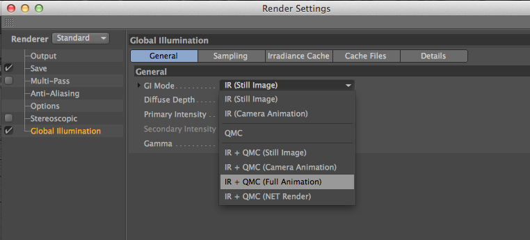
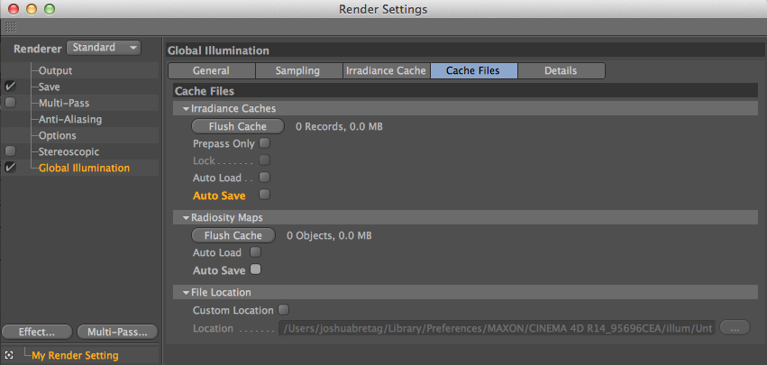

# Global Illumination (GI) Renders in C4D

## Rendering GI scenes with C4D in Qube!

To render C4D projects that use Global Illumination with Qube!, you must make
sure that C4D is not relying on cached GI files, as they will not exist on
your render nodes. To do so, follow the below steps, then render as normal.

:::tip[Cache]
When rendering GI scenes with C4D, it is best to chunk your frame range. The
larger the chunk, the more render times will decrease due to the availability
of cache created for previous frames in the chunk. Make chunks for GI renders
larger than normal, keeping in mind that if any frame in the chunk fails, the
whole chunk will have to be retried.
:::

* The "GI Mode" has to be set to "IR+QMC (full animation)" this forces c4d to
calculate the cache for each frame of the range its been given 

* Doing so makes chunking more viable for GI based jobs in c4d as we've seen at
least a 50% increase in speed when chunking 5 frames per box

.

* Unset everything in the "Cache Files" page of the Global Illumination section
of the Render settings (this is important)

.

With these settings in place, you can render as normal, as is described in
[Submitting a "Cinema 4d (AppFinder)" job](/users-guide/qube-ui/submitting-jobs/Cinema4D+Windows+Submission)

