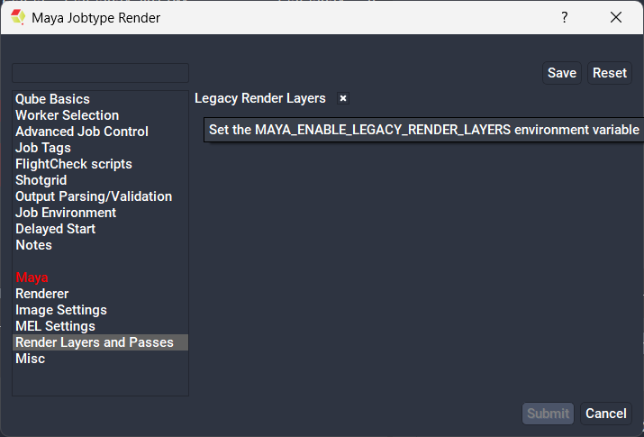
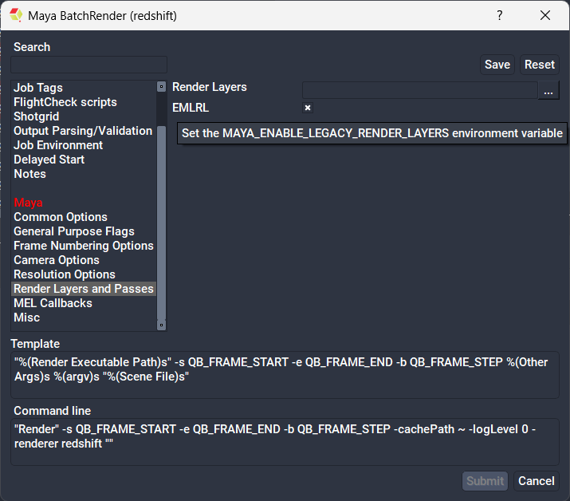

# Maya rendersetup vs render layers

If your Maya loadOnce or BatchRender job fails with an error similar to:

```
Error: line 1: UnboundLocalError: file /usr/autodesk/maya2017/lib/python2.7/site-
packages/maya/app/renderSetup/model/renderSetup.py line 270: local variable
'renderLayer' referenced before assignment
```

...it is possible you are attempting to render a scene file that contains both
legacy render layers and contemporary rendersetup layers, which according to
Autodesk is unsupported.  To make this combination work you need to add a new
Maya environment variable `MAYA_ENABLE_LEGACY_RENDER_LAYERS=1` to your
workers, or in the job submissions.





