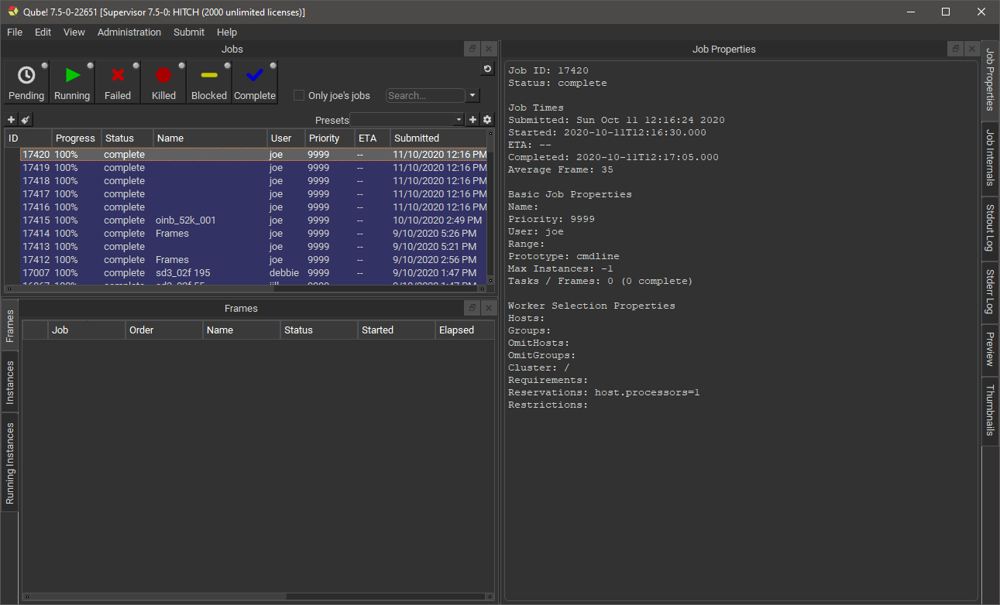
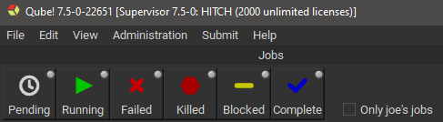
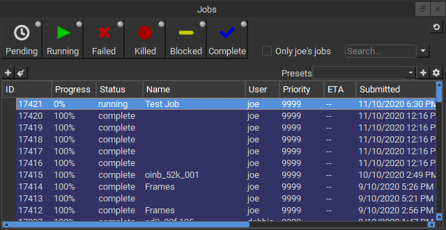
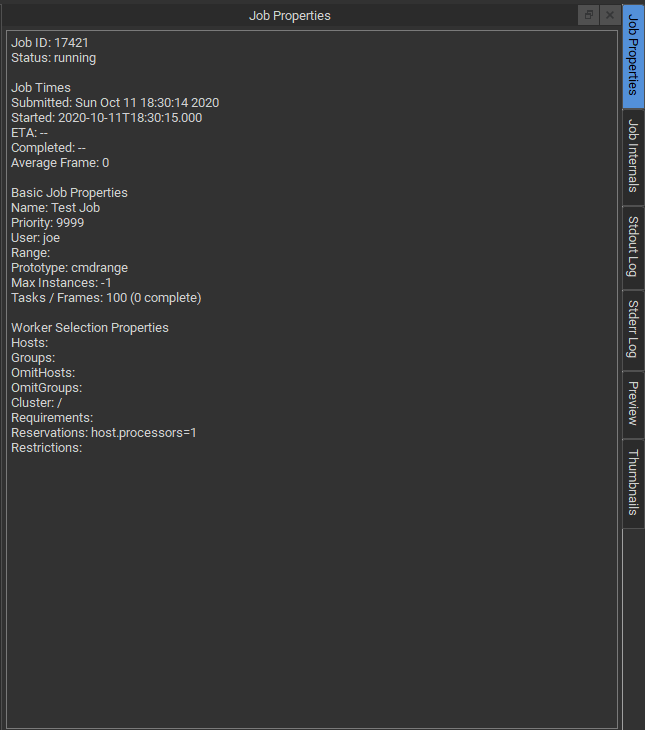
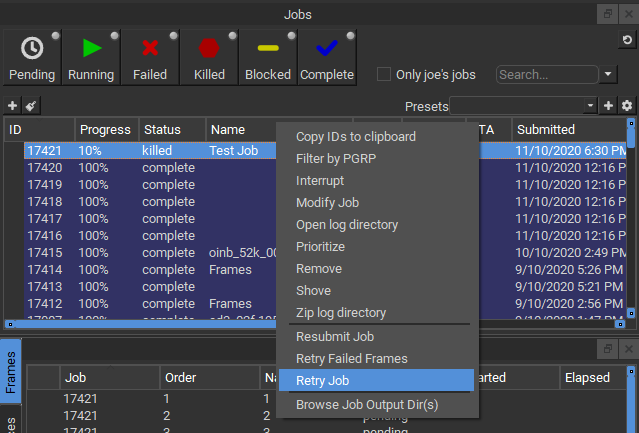
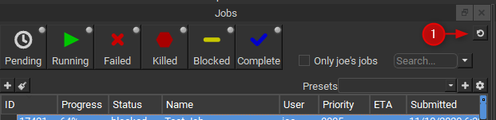

# Monitoring Jobs in the UI

Now that you have submitted some jobs, you will want to monitor them
in the Qube! UI.

If you have been working through the Qube 101 documentation in order,
you will probably be running the Wrangler View, which has a white
background. In this section we are going to skim across the surface of
the Qube! UI. Visit the for more information.

:::info

The Qube! UI package must be installed on your machine in order for
you to find and run the Qube! UI. If you cannot find the Qube! UI on
your machine, review the instructions for [Installing Qube](Installing+Qube).

:::

## Launch the Qube! UI

To launch the Qube! UI, do this:

-   Windows: Click on the PipelineFX-\>Qube! UI start menu item, or
    double click it at Program Files\\pfx\\QubeUI\\QubeUI.bat.

-   macOS: Run /Applications/pfx/qube/QubeUI.app

-   Linux: Run /usr/local/pfx/qube/qubeui/qubeui.

You should see this:

You should see the test jobs or other jobs that you have submitted.
Notice that they are color coded - if you are lucky, they will all be
blue, which is the color of a successfully completed job. Jobs which
failed are colored red. The jobs also have a status, such as
"complete", "failed" or "running." Running jobs are shown in
green. There are other colors for other statuses, which you will become
familiar with as you submit and monitor jobs.

## Overview

The row of buttons just under the Jobs tab is a set of filters which
will show or hide jobs in the Jobs Panel. An important one to know about
is the User Filter - when set, you will only see your own jobs. When
unset, you will see all jobs. Click and unclick this button to see the
difference.

Let's have a look at some simple tasks you can do from this UI. The
Jobs pane shows your job(s). By default, they are sorted by Jobid, but
you can sort them by any other column by clicking on the column header.
For example, you can sort them by Name by clicking on the "Name" label
at the top of that column. Clicking once sorts them in ascending order,
clicking again sorts them in the other direction. Now, click on one of
your test jobs in the Jobs pane.

Notice that in the Job Properties panel, you can look at the Job
Properties on one tab, and the Also output in the Stdout Log and
Stderr Log panels.

## Interact with a Job

Right-clicking on a job (or a frame, worker, or instance, for that
matter), will bring up a context menu:

The contents of that menu depend on the entity you clicked. For
example, jobs will have a different list of menu items than will frames
or workers. The menu items are dictated by plugins which can be created
or modified. A more detailed description of the creation or
modification of plugins can be found in Adding Custom Plugins **need link**.

As of version 7.5-0, the list of available actions are as follows:

-   Job

    -   Copy IDs to clipboard: Place the job ids of the selected jobs
        in your copy/paste clipboard.

    -   Filter by PGRP:Display only jobs that belong to the selected
        job's PGRP.

    -   Interrupt: Stop the job immediately, and sets the status back
        to pending. This is typically used when a high priority job is
        starved for resources - manually interrupting a lower priority
        job will free up those resources to allow the high priority job
        to start. The lower priority job to start up again as soon as
        workers become available.

    -   Modify Job: Change modifiable job properties.

    -   Open log directory: Open the directory containing the job logs
        for this job. This is only relevant if you're on the worker
        running the job or supervisor.

    -   Prioritize: Change the priority of the selected job.

    -   Remove: Stops the job immediately (if running), and
        permanently removes the job from the qube database. This cannot
        be undone.

    -   Shove: Force the supervisor to reevaluate this job for
        dispatch. This is a good way to start a job that is stuck in the
        "pending" state, even though all of its requirements can be
        met.

    -   Create a zip file of the log directory:Zip the log directory
        and open the containing folder.

    -   Block (Finish Current): Stops this job after the currently
        rendering frame(s) complete. The job will remain in a
        "blocked" state until it is manually unblocked.

    -   Block (Purge): Stops this job immediately, but sets the job
        state to "blocked". The job will not run again until it is
        manually unblocked.

    -   Unblock: Remove the "blocked" state from the job. All
        frames that have not completed will go back to a "pending"
        state. Those that have completed or failed will remain
        completed or failed.

    -   Kill Job: Stops this job immediately and sets the state to
        "killed". A job that is killed cannot be continued - it can
        only be retried, resubmitted, or removed.

    -   Preempt Job: Preempt the selected job.

    -   Resubmit Job: Submit a new job with the selected job's
        parameters. A submission dialog is opened so you can modify the
        job before submission.

    -   Retry Failed Frames: Re-render all frames marked as failed

    -   Retry Job: Start this job over, using the same job id. All
        frames will be re-rendered, regardless of whether or not they
        had previously completed.

    -   Browse Job Output Dir(s): Open a file browser for each output
        dir in this job.

-   Worker 

    -   Ban host: Ban the selected worker on the supervisor.

    -   Partially Lock: Lock a specific number of slots on the
        selected worker.

    -   Ping: Ping the selected workers and retrieve basic information
        about them.

    -   Reboot host: Reboot the selected workers.

    -   Shut down host: Shut the selected workers down.

    -   Lock Host (Finish Current): Same as above, but the currently
        rendering frames are allowed to finish.

    -   Lock Host (Purge): Stop all jobs running on this worker
        immediately, then leave the worker in a "locked" state which
        will prevent it from accepting any more work until it is
        manually unlocked.

    -   Unlock Host: Remove a worker lock.

    -   Remove: Remove the selected workers from the Qube! farm.

-   Frame 

    -   Select worker: Display the Workers Panel and select the worker
        than rendered this Frame.

    -   Complete: Change the state of this frame to "complete," even
        if it has not yet run.

    -   Retry: Re-render the selected frame(s)

    -   Block: Set the frame's state to "blocked". This will
        prevent the frame from being rendering until it (or the job) is
        manually unblocked.

    -   Unblock: Remove the block from the frame, setting it back to a
        pending state.

    -   Kill: Stop this from immediately and set the state to
        "killed".

-   Instance 

    -   Select worker: Display the Workers Panel and select the worker
        than ran this instance.

    -   Block: Stop this instance from processing work and set its
        state to "blocked". This instance will not process any more
        work until it is manually unblocked or the job is retried.

    -   Unblock: Remove a block from an instance.

    -   Complete: Mark this instance as complete.

    -   Interrupt: Stop this instance from processing any more work,
        but set its state back to "pending". As with a job's
        "interrupt" this is typically done to manually free up
        resources that could be used by higher priority jobs.

    -   Migrate: Stop this instance and set its state back to
        "pending". Default supervisor settings dictate that the next
        time this instance starts, it will start on a different
        machine.

    -   Retry: Restart this instance, regardless of its current
        state.

## Watching Progress

Once a job is running, if it takes more than a few seconds (and most
do) then you will want to keep an eye on progress. The UI will display
changes to Jobs and Workers in real-time but frames and instances are
only loaded when a job is selected. To update the frame and instance
lists double click on the job. You can force an update by simply
clicking on the job. Due to network interruption it is possible for some
jobs to become out of sync, if you suspect this has happened click the
sync button shown in 1 below.

Use the sync button sparingly as it can place undue load on the
supervisor on large farms.

## Looking at Job Properties/Internals and Output

The Job Properties Panel lists basic attributes of the job. The Job
Internals Panel shows more in-depth information such as the job package,
callbacks in use and the job history.

The output and error of the job's rendering process can be viewed in
the Stdout Log and Stderr Log Panels. You can review the image output in
the Thumbnails Panel and Preview Panels. Check the User's Guide for the
for more information on how to use these panels.

## Submitting New Jobs

The Qube! UI can be used to submit jobs to Qube! through the Submit
menu item at the top. However, in most cases you will be setting Qube up
to allow submission directly from your application, such as Maya or
3dsMax. Submitting directly from applications was covered in the
previous section. However, you can still use the UI to submit test jobs,
to make sure that things are still working as expected, and to submit
jobs for applications where you haven't installed the inApp
interface.
