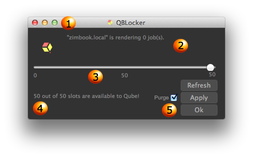

# Qube Locker

QubeLocker is a small application for locking and unlocking slots on
an artist\'s workstation.

1.  **Minimize:** QBLocker will run from your system tray, leaving
    valuable screen real estate to other applications.

2.  **Machine and Current Jobs:** This displays the hostname and list of
    the jobs your machine is running

3.  **Slider:** A slider to determine how many slots you would like to
    lock or unlock

4.  **Slots details:** The amount of slots your machine currently has
    available to Qube!

5.  **Buttons:**

    1.  **Purge:**\
        **Refresh: Updates your machines status**

        1.  **Checked: will kill the jobs that are currently running on
            your machine**

        2.  **Unchecked: Will wait for the currently running jobs to
            finish before making the slots available/locked**

    1.  **Apply: Applies the selected slider settings**

    2.  **Ok: Confirms and minimize qubelocker**
