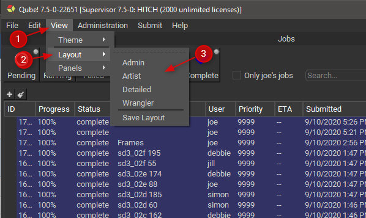
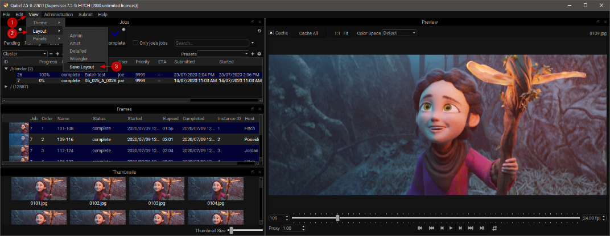
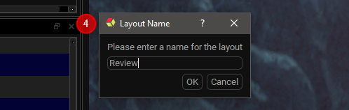
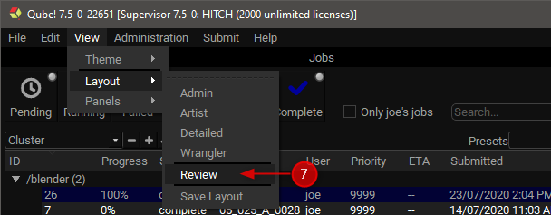

# Working with Layouts

## Qube! UI Layout Management

The layout system in Qube! UI allows you to save the currently opened
panels along with their position. You can then switch between your saved
layouts to optimize your workflow for specific tasks, for example you
may have one layout for checking the status of your jobs in Qube! and
another more focused layout when you want to review the output of a
specific job. You can clear out all unrelated panels so you can focus on
your task, but get them back quickly by switching to another layout when
your task changes.

The Qube! UI ships with four built-in layouts, they act as starting
points for customizing your own layouts.

Changing to a different layout.

1.  Click the View menu.

2.  Click the Layouts sub-menu.

3.  Choose the desired layout.

Saving the current Qube! UI panel layout.

1.  Click the View menu.

2.  Click the Layouts sub-menu.

3.  Click Save Layout.\
    

4.  *Enter your new layout\'s name.*

5.  Click OK\
    
    \
    [optional]

6.  Either switch to a different layout or move some panels around.

7.  Switch back to your saved layout.
    
