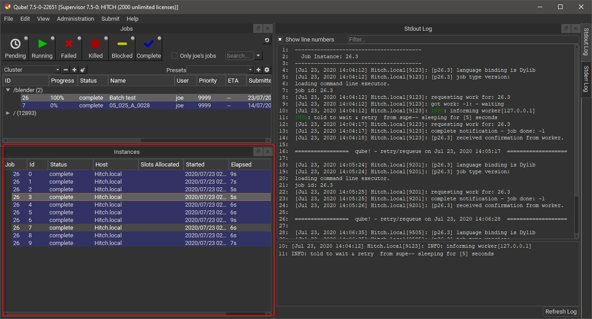

# Instances Panel

## The Qube! UI Instances Panel

When selecting a job in any , information about that job's instances
is filled into the Instances Panel. The Instances Panel doesn't update
automatically, double click on the job to refresh the list. Selecting an
instance affects other panels, for example the load the output and error
for that instance respectively.

Right-clicking on an instance allows you to perform the following
actions.

-   **Select worker**: Display the Workers Panel and select the worker
    than ran this instance.

-   **Block**: Stop this instance from processing work and set its state
    to "blocked".  This instance will not process any more work until
    it is manually unblocked or the job is retried.

-   **Unblock**: Remove a block from an instance.

-   **Complete**: Mark this instance as complete.

-   **Interrupt**: Stop this instance from processing any more work, but
    set its state back to "pending".  As with a job's "interrupt"
    this is typically done to manually free up resources that could be
    used by higher priority jobs.

-   **Migrate**: Stop this instance and set its state back to
    "pending".  Default supervisor settings dictate that the next time
    this instance starts, it will start on a different machine.

-   **Retry**: Restart this instance, regardless of its current state.
