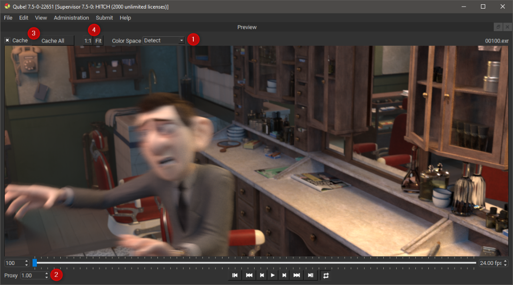

# Preview Panel

## The Qube! UI Preview Panel

The Preview Panel allows you to quickly review the results of your
render without having to open an external review tool. You can pan the
image by dragging with the left, right or middle button. Zoom in and out
using the mouse wheel and reset the view with the 'f' key or clicking
the Fit button (shown at 4 in the screen below). You can also view the
image sequence at 1:1 by using the 1:1 button (shown at 4)

## Supported image formats and color transforms

The previewer supports all formats in the [Open Image IO](https://sites.google.com/site/openimageio/home)
library and applies color transforms using the [Open Color IO](https://opencolorio.org/) library.

Ask your systems administrator to configure your machine for Open Color
IO by setting the following system environment variables.\
OCIO\
OCIO_EXECROOT\
OCIO_ROOT

Refer to the [OCIO](https://opencolorio.org/) website for more information on configuring your
workstation. By default the Previewer will use the color space
information in the image sequence to guess the correct color transform,
you can override this using the Color Space selector (shown at 1).

## Proxies

The Qube! UI Preview Panel can reduce the resolution of the image
sequence so it consumes less memory and allows for higher frame rates on
lower spec workstations by sacrificing image quality. The Proxy selector
(shown at 2) controls the proxy resolution, a value of 1 gives you the
full resolution of the image sequence, a value of 0.5 gives you half
resolution.

## Caching

By default the Previewer will store read frames in main memory so that
you can play sequences at the desired frame rate over the network or
from a slow disk. If your storage medium can keep up with the playback
rate then you can turn this off (shown at 3) to conserve memory.

