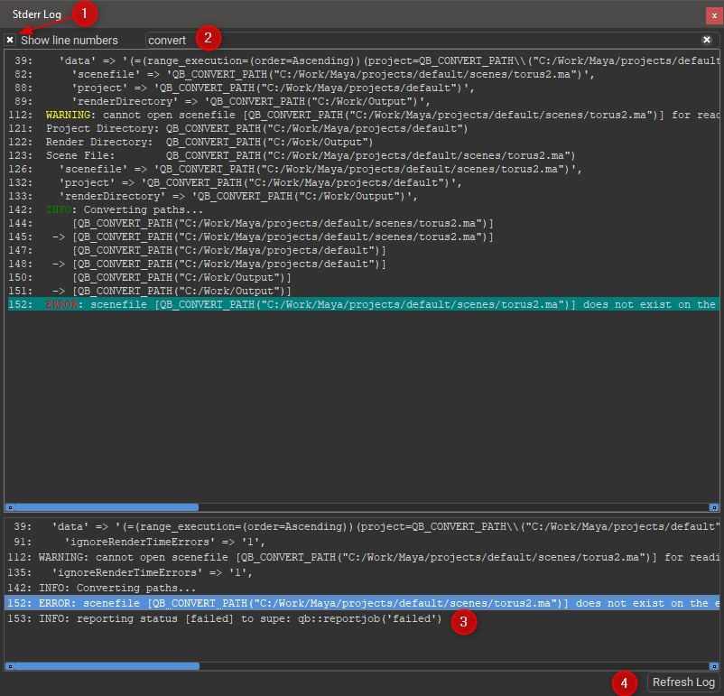

# Stdout and Stderr Panels

## The Qube! UI Stdout and Stderr Log panels

The Stdout and Stderr Log panels are where you view the output of the
render execution process. Some logs can get very large and tedious to
browse through, the Log panels have some tools to help you find what you
need quickly so you can get back to something more interesting.

1.  Show/hide line numbers.

2.  Real-time filtering. By entering filter terms into the filter field
    you can very quickly cut down the size of the log.

3.  Bookmarking. The Log panels can search for specific words in the log
    and bookmark the lines they appear on. Click on a bookmark to jump
    to that line. Configure the bookmark texts in the Qube! UI
    preferences, UI->Parsing tab.

4.  Refresh the log. Logs are not automatically updated, click the
    'Refresh Log' button to get the latest content.

