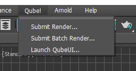
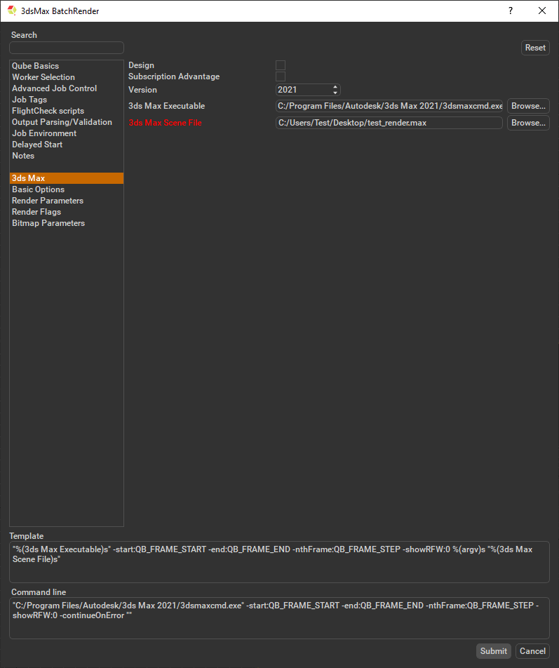
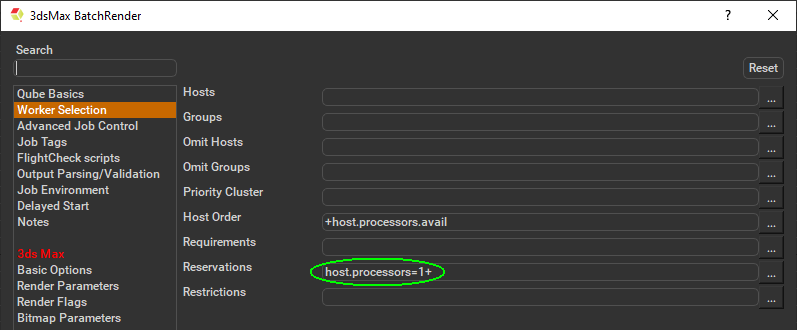

# 3DSMax Batch Submission

## Step by step instructions for submitting 3dsMax Batch jobs with Qube!

### Launch a Qube! submission UI

If you have been going through this Install Guide in order, you should
be able to locate the "Qube!" menu in 3dsMax. If you don't
have that menu item, you need to install the QubeUI 3dsMax In-App
Submission UI on the client.

With a scene loaded in 3dsMax choose "Submit Batch Render...".

Note that you could also choose "Submit Render..." depending
on your requirements. 

:::info

What's the difference?

**Submit Render** will open a instance of 3dsMax on the Worker and launch
the 3dsMax Loadonce jobtype. This picks up the job, and that instance will
render frames as assigned by the Supervisor. Since the scene file is only
being opened one time, this can be faster to generate the full sequence.

**Submit Batch Render** will use the command line to open a new
instance of the 3dsMax file for each frame that it renders. Although
this can be slower for large scenes, it can also be more flexible in
large, complex environments.

:::

### Job Submission Details

This will present a pre-filled submission UI like the one shown 
below.

:::note

Not all sections need to be filled in in order to render. Only the
fields marked in red are required.

:::

Ensure sections marked in red have the correct details.

:::tip

Because 3dsMax doesn't allow thread control, you need to
make sure that each instance of 3dsMax occupies the full Worker. By
default the "3ds Max Batch Render" submission sets the reservation to
"host.processors=1+", but to do this manually select "Worker
Selection" and click on the '...' button next to the right. Check
the box marked "All" and accept. You should end up with the parameter
"host.processors=1+" as shown here.

:::

### Submit

Click 'Submit'

