Every Qube! job submission is broken into two sections.

- The top section is common to all job submissions and is described below.

- The bottom section is specific to each submission type and will be described on a separate page.

## Qube Basics

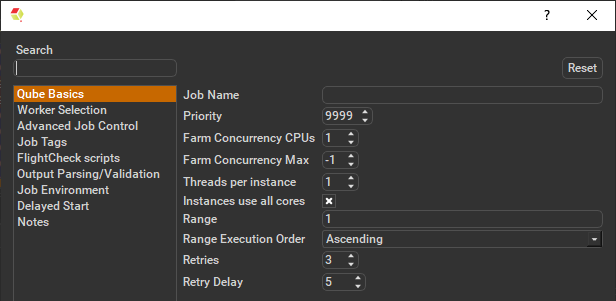

**Job Name**
This is the name of the job of the job so it can be easily identified
in the Qube! UI.

**Priority**
Every job in Qube is assigned a numeric priority. Priority 1 is higher
than priority 100. This is similar to 1st place, 2nd place, 3rd place,
etc. The default priority assigned to a job is 9999.

**Farm Concurrency CPUs**
This is the number of copies of the application that will run at the
same time across the network. The combination of "Instances=1" and
"Max Instances=-1" means that this job will take as much of the farm
as it can, and all jobs will share evenly across the farm.

------------------------------------------------------------------------------

Examples

On a 12 slot(core) machine running Maya if you set: \
"Instances" to 4 \
"Reservations" to "host.processors=3" \
Qube! will open 4 sessions of Maya on the Worker(s) simultaneously,
which may consume all slots/cores on a given Worker.

if you set: \
"Instances" to 1 \
"Reservations" to "host.processors=1+" \
Qube will open 1 session of Maya on a Worker, consuming all slots/cores
("host.processors=1+" is used for all slots/cores).

------------------------------------------------------------------------------

**Farm Concurrency Max**
If resources are available, Qube! will spawn more than 'Instances'
copies of the application, but no more than 'Max Instances'. The
default of -1 means there is no maximum. If this is set to 0, then it
won't spawn more than 'Instances' copies.

More on Instances & Reservations & SmartShare Studio Defaults **need links**

**Threads per instance**
Number of threads requested per instances.

**Instances use all cores**
This checkbox sets the instances to request all cores on a worker.

**Range**
Frame range for the job (e.g 1-100, or 1-100x3, or 1,3,7,10). Most jobs
require a frame range to execute on the Workers. You can set this range
in a few different ways :

-   "1-100" will just render the range between 1 and 100

-   "1-100x3" will render every 3rd frame in the range 1 to 100; 1, 4,
    7, \..., 94, 97, 100

-   "1,3,7,10" will only render the selected frames 1,3,7,10

**Range Execution Order**
Order to render the items.
(Ascending=1,2,3,4,5\...,Descending=10,9,8\...,Binary=first,middle,last\...) You
can set the order in which your frames are rendered. The drop down
options are:

-   "Ascending" - this will render the frames counting upwards from
    your start frame

-   "Decending" - this will render the frames counting backwards from
    your end frame

-   "Binary" - This will render the first, last, and middle frames of
    the range, then the middle frame of the first half and the middle
    frame of the second half, and so on. This is useful for sampling the
    frames in the sequence to make sure it is rendering correctly.

**Retries**
Number of times to retry a failed frame/job instance. The default value
of -1 means don't retry.

**Retry Delay**
Number of seconds between retries.

## Worker Selection

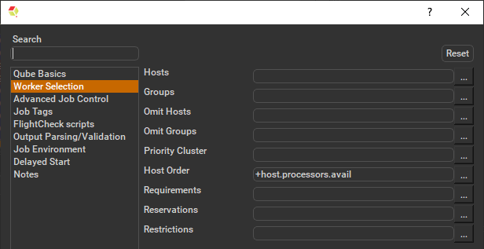

**Hosts**

Explicit list of Worker hostnames that will be allowed to run the job
(comma-separated).

**Groups**

Explicit list of Worker groups that will be allowed to run the job
(comma-separated). Groups identify machines through some attribute they
have, eg, a GPU, an amount of memory, a license to run a particular
application, etc. Jobs cannot migrate from one group to another. See .

**Omit Hosts**

Explicit list of Worker hostnames that are **not** allowed run the
job (comma-separated).

**Omit Groups**

Explicit list of Worker groups that are **not** allowed to run the
job (comma-separated).

**Priority Cluster**

Clusters are non-overlapping sets of machines. Your job will run at the
given priority in the given cluster. If that cluster is full, the job
can run in a different cluster, but at lower priority.

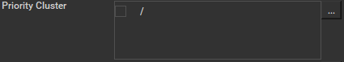

------------------------------------------------------------------------------

Examples

-   A job submitted to /showB/lighting will run with its given priority
    in /showB/lighting cluster.

-   If /showB/lighting is full, that job can run in /showB/FX, but at a
    lower priority.

-   If both /showB/lighting and /showB/FX are full, the job can run in
    /showA/\* at an even lower priority.

------------------------------------------------------------------------------

**Host Order**

Order to select Workers for running the job (comma-separated) \[+ means
ascending, - means descending\].

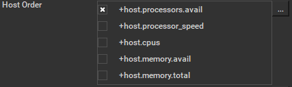

------------------------------------------------------------------------------

Host Order is a way of telling the job how to select/order workers

-   "+host.processors.avail" means prefer workers which have more
    slots available

-   "+host.memory.avail" means prefer workers which have more memory
    available

-   "+host.memory.total" means prefer workers which have more total
    memory

-   "+host.processor_speed" means prefer workers with higher cpu
    speeds

-   "+host.cpus" means prefer workers with higher total cpu slots

------------------------------------------------------------------------------

**Requirements**

:::note

Worker properties needed to be met for job to run on that Worker
(comma-separated, expression-based). Click 'Browse' to choose from a
list of Host Order Options.

:::

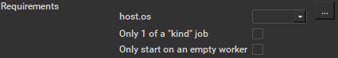

Requirements is a way to tell the workers that this job needs specific properties to be present in order to run. The drop-down menu allows a choice of OS:

- "winnt" will fill the field with "host.os=winnt" which means only run on Windows based workers

- "linux" will fill the field with "host.os=linux" which means only run on Linux based workers

- "osx" will fill the field with "host.os=osx" which means only run on macOS based workers

You can also add any other Worker properties via plain text. Some examples: 

- "host.processors.avail.=4" means only run this job on workers that have 4 or more slots available

- "host.processors.used=0" means only run this job on workers with 0 slots in use

- "host.memory.avail=400" means only run this job on workers that have 400 memory available

With integer values, you can use any numerical relationships, e.g.
=, \<, \>, \<=, \>=. This won't work for string values or floating
point values. Multiple requirements can also be combined with AND
and OR (the symbols && and \|\| will also work).

The 'Only 1 of a "kind" of job' checkbox will restrict a Worker to running only one instance with a matching "kind" field (see below). The prime example is After Effects, which will only allow a single instance of AE on a machine. Using this checkbox and the "Kind" field, you can restrict a Worker to only one running copy of After Effects, while still leaving the Worker's other slots available for other "kinds" of jobs.

**Reservations**

Worker resources to reserve when running job (comma-separated,
expression-based).

                             |

Reservations is a way to tell the workers that this job will
reserve the specific resources for this job.

Menu items:

-   "host.processors" this will fill the field with
    "host.processors=X" which means reserve X slots on the worker
    while running this job

-   "host.memory" this will fill the field with "host.memory=X"
    which means only reserve X memory on the worker while running this job

**Restrictions**

Restrict job to run only on specified clusters ("\|\|"-separated) \[+
means all below, \* means at that level\]. Click 'Browse' to choose
from a list of Restrictions Options.

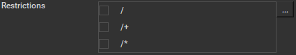

Restrictions is a way to tell the workers that this job can only
run on specific clusters. You can choose more than one cluster in
the list.

------------------------------------------------------------------------------

Examples

-   Choosing /showA would restrict the job to machines that are only in
    the /showA cluster, and no other cluster, not even those below
    /showA.

-   Choosing /showA/\* would restrict the job to the cluster(s) below
    /showA, but not including /showA

-   Choosing /showA/+ would restrict the job to /showA and all the
    clusters below it.

------------------------------------------------------------------------------

**See Also** **need links**

- Controlling Host Selection
- How to use qbwrk.conf
- worker_groups
- worker_cluster
- How to use clustering for workers

## Advanced Job Control

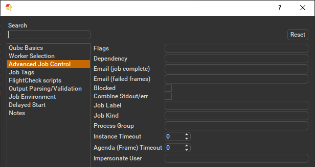

**Flags**

List of submission flag strings (comma separated).

**Dependency**

Wait for specified jobs to complete before starting this job
(comma-separated).

**Email (job complete)**

Send email on job completion (success or failure). Sends mail to the
designated user.

**Email (failed frames)**

Sends mail to the designated user if frames fail.

**Blocked**

Set initial state of job to "blocked".

**Combine Stdout/err**

Redirect and consolidate the job stderr stream to the stdout stream.
Enable this if you would like to combine your logs into one stream.

**Job Label**

Optional label to identify the job. Must be unique within a Job Process
Group. This is most useful for submitting sets of dependent jobs, where
you don't know in advance the job IDs to depend on, but you do know the
labels.

**Job Kind**

Arbitrary typing information that can be used to identify the job. It
is commonly used to make sure only one of this "kind" of job runs on a
worker at the same time by setting the job's requirements to include
"not (job.kind in host.duty.kind)". See How to restrict a host to only
one instance of a given kind of job, but still allow other jobs **need link** 

**Process Group**

Job Process Group for logically organizing dependent jobs. Defaults to
the jobid. Combination of "label" and "Process Group" must be unique
for a job. See Process group labels **need link**

**Instance Timeout**

Kill the subjob process if running for the specified time (in seconds).
Value of -1 means disabled. Use this if the acceptable instance/subjob
spawn time is known.

**Agenda (Frame) Timeout**

Kill the agenda/frame if running for the specified time (in seconds).
Value of -1 means disabled. Use this if you know how long frames should
take, so that you can automatically kill those running long.

**Impersonate User**

Users with 'Impersonate user' permissions may choose the name of
another user to submit their jobs as.

## Job Tags

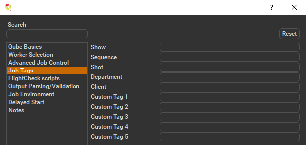

Job Tags are explained in detail on the Job Tags page. **need link**

## FlightCheck scripts

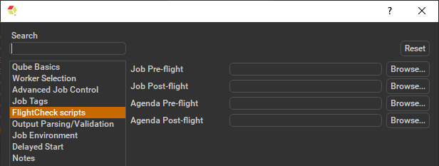

**Job Pre-flight**
Some executable (e.g. a script) that will run on the Worker before the
job runs. If the pre-flight fails, the job will not run on this Worker,
but will be moved to another. Useful for setting up environments,
copying required images, checking the existence of fonts on the Worker,
etc.

**Job Post-flight**
An executable that will run on the Worker after the job has finished on
that Worker. If this fails, the instance is failed.

**Agenda Pre-flight**
Some executable (e.g. a script) that will run on the Worker before the
frame/work runs. If this fails, the frame/work will be marked as failed
and rendering will be skipped. If there are retries configured, the
frame/work will be treated according to those settings.

**Agenda Post-flight**
An executable that will run on the Worker after the frame/work runs. If
this fails, the frame/work will be marked as failed, even if the render,
itself, was succesful. If there are retries configured, the frame/work
will be treated according to those settings.

## Job Environment

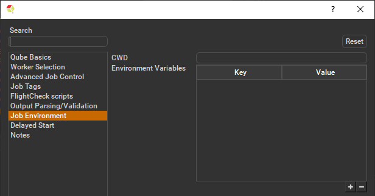

**CWD**

Current Working Directory to use when running the job.

**Environment Variables**

Environment variables override when running a job. You can specify key/value
pairs of environment variables. This is useful when you might need different
settings for your render applications based on different departments or projects.

## Delayed Start

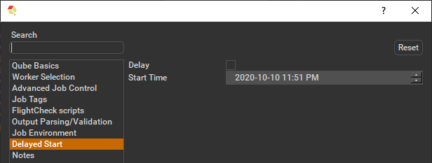

**Delay**
Set if the delay is used.

**Start Time**
The job is blocked on the Supervisor until this day and time set via
this widget.

## Notes

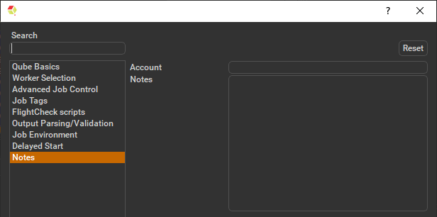

**Account**

Arbitrary accounting or project data (user-specified). This can be used
for creating tags for your job.

You can add entries by typing in the drop-down window or select already
created accounts from the drop-down.

See also Qube! Job Tags **need link**

**Notes**
Freeform text for making notes on this job. Add text about the job for
future reference. Viewable in QubeUI.

